# Виды рыб

Сто семь видов. Каждое число на этой странице взято из профиля этого вида в `data/riverfishing/fish_profiles/`, а профиль полностью переопределяется датапаком — схема описана в [`docs/FISH_PROFILES.md`](../../FISH_PROFILES.md).

Парная страница: **[Справочник по видам](species-reference.md)** — там жёсткие условия обитания, таблицы сезона / времени / погоды и статистика вываживания.

## Как это читать

- **Вес (мин. – макс.)** — весь возможный разброс вида. **Медианный улов** — это `mean` из профиля, и это действительно медиана: половина ваших рыб этого вида окажется легче. См. [расчёт веса](fishing-mechanics.md#вес).
- **Водоёмы** — все типы, в которых вид живёт, с коэффициентом присутствия. У типа, которого нет в списке, коэффициент 0, и рыбы там **никогда** не будет.
- **Уровень** — это `min_angler_level`. Ограничение мягкое: каждый недобранный уровень умножает вес поклёвки этой рыбы на 0.6, но не ниже 3 %. Новичок может вытащить трофей случайно — с правильной снастью и в правильном месте, просто редко.
- **Лучшие наживки** оцениваются от 0 до 1.3. Движок берёт из оснастки одну наживку — с лучшей оценкой. Наживка, которой нет в списке, получает 0, и **если в оснастке нет ни одной из перечисленных, рыба не возьмёт вообще**.
- Идентификаторы наживок соответствуют предметам так, как это расписано на странице [Оснастки и наживки](rigs-and-baits.md#натуральные-наживки): `pearl_barley` = Перловка, `bread` = Хлебный мякиш, `silicone` = Силиконовая приманка, `jig` = Джиг, `mormyshka` = Мормышка, `fish_strip` = Сырое филе, `livebait` = Живец.

## Семейства

Каждый вид отнесён к одному из семи семейств. Это поле `group` в профиле, и именно по нему раскладывает
свой список [электроудочка](electrofisher.md#экран) — сто семь имён одним списком — это список,
который никто не читает. Вид из датапака, не назвавший семейства, попадает в **Прочие**: виден и
доступен, но не приписан молча куда попало.

Семейство — это утверждение о рыбе, а не ярлык, выведенный из её цифр: жерех охотится как хищник,
но он карповый и берёт карповую [прикормку](groundbait.md).

| Семейство | Виды |
|---|---|
| **Карповые** (29) | Белоглазка, Белый амур, Верховка, Вьюн, Голавль, Голый карп, Горчак, Густера, Елец, Жерех, Зеркальный карп, Золотой карась, Карась, Карп, Краснопёрка, Кутум, Лещ, Линейный карп, Линь, Пескарь, Плотва, Подуст, Рыбец, Сазан, Синец, Толстолобик, Уклейка, Чехонь, Язь |
| **Хищники** (20) | Астронотус, Берш, Блюгилл, Большеротый бас, Глазчатый змееголов, Ёрш, Золотой дорадо, Канальный сомик, Краснобрюхая пиранья, Налим, Окунь, Павлиний окунь, Пирайба, Подкаменщик, Ротан, Сом, Судак, Угорь, Цихлазома майя, Щука |
| **Лососёвые** (11) | Голец, Горбуша, Корюшка, Ленок, Нельма, Радужная форель, Сёмга, Сиг, Таймень, Форель, Хариус |
| **Осетровые** (3) | Белуга, Осётр, Стерлядь |
| **Кои** (6) | Карп кои, Кои Асаги, Кои Бекко, Кои Кохаку, Кои Сёва Санке, Кои Танчо Санке |
| **Морские** (21) | Барракуда, Бычок-кругляк, Бычок-цуцик, Камбала, Каранкс, Кефаль, Лаврак, Луна-рыба, Луфарь, Минтай, Морской угорь, Морской чёрт, Полосатый лаврак, Рыба-капля, Сайда, Сарган, Сельдь, Скат, Скумбрия, Снук, Треска |
| **Большая игра** (17) | Акула-мако, Арапайма, Ваху, Голиафовый групер, Голубой марлин, Желтопёрый тунец, Китовая акула, Махи-махи, Меч-рыба, Палтус, Парусник, Плащеносная акула, Синеперый тунец, Тарпон, Тигровая акула, Тупорылая акула, Чёрный марлин |

## Все виды

| # | Вид | ID предмета | Вес (мин. – макс.) | Медианный улов | Длина | Водоёмы (коэффициент присутствия) | Уровень |
|---|---|---|---|---|---|---|---|
| 1 |  Лещ | `bream` | 300 г – 4 кг | 900 г | 25–55 см | озеро 1.1, река 1.0, пруд 0.9, болото 0.4 | — |
| 2 |  Карась | `crucian_carp` | 50 г – 1.5 кг | 250 г | 10–38 см | пруд 1.2, болото 1.1, озеро 1.0, река 0.5, лужа 0.3 | — |
| 3 |  Плотва | `roach` | 50 г – 1 кг | 120 г | 10–40 см | река 1.0, озеро 1.0, пруд 0.7, болото 0.4 | — |
| 4 |  Краснопёрка | `rudd` | 50 г – 1 кг | 110 г | 10–40 см | озеро 1.1, болото 1.0, пруд 0.9, река 0.6 | — |
| 5 |  Густера | `white_bream` | 100 г – 1.2 кг | 300 г | 12–35 см | река 1.0, озеро 1.0, пруд 0.6, болото 0.3 | — |
| 6 |  Карп | `carp` | 1 кг – 15 кг | 3.5 кг | 35–100 см | озеро 1.2, пруд 1.1, река 0.6, болото 0.4 | 3 |
| 7 |  Сом | `catfish` | 2 кг – 120 кг | 7 кг | 60–260 см | река 1.1, озеро 1.0, болото 0.3, пруд 0.2 | 6 |
| 8 |  Окунь | `perch` | 50 г – 2 кг | 250 г | 10–45 см | озеро 1.1, река 1.0, пруд 0.8, болото 0.5 | — |
| 9 |  Щука | `pike` | 500 г – 10 кг | 2 кг | 35–120 см | озеро 1.1, река 1.0, болото 0.7, пруд 0.6 | 4 |
| 10 |  Судак | `zander` | 500 г – 6 кг | 1.5 кг | 35–90 см | река 1.1, озеро 1.0, пруд 0.3, болото 0.2 | 4 |
| 11 |  Пескарь | `gudgeon` | 20 г – 150 г | 60 г | 8–20 см | река 1.2, озеро 0.3, пруд 0.2 | — |
| 12 |  Ёрш | `ruffe` | 20 г – 150 г | 60 г | 8–20 см | озеро 1.1, река 1.0, пруд 0.4, болото 0.2 | — |
| 13 |  Уклейка | `bleak` | 10 г – 100 г | 30 г | 6–18 см | река 1.1, озеро 1.0, пруд 0.5 | — |
| 14 |  Язь | `ide` | 300 г – 3 кг | 800 г | 25–60 см | река 1.2, озеро 0.7, пруд 0.2, болото 0.1 | 2 |
| 15 |  Голавль | `chub` | 200 г – 4 кг | 700 г | 20–60 см | река 1.2 | 3 |
| 16 |  Жерех | `asp` | 500 г – 8 кг | 2 кг | 30–90 см | река 1.2 | 5 |
| 17 |  Линь | `tench` | 300 г – 3.5 кг | 800 г | 20–60 см | пруд 1.2, болото 1.2, озеро 1.0, река 0.2 | 2 |
| 18 |  Налим | `burbot` | 500 г – 8 кг | 1.5 кг | 30–100 см | река 1.1, озеро 0.9, пруд 0.1 | 4 |
| 19 |  Угорь | `eel` | 300 г – 4 кг | 900 г | 40–130 см | озеро 1.1, река 0.9, пруд 0.6, болото 0.4 | 5 |
| 20 |  Хариус | `grayling` | 150 г – 2.5 кг | 500 г | 18–55 см | река 1.3, озеро 0.4 | 3 |
| 21 |  Форель | `trout` | 300 г – 5 кг | 1 кг | 25–80 см | река 1.2, озеро 0.8, пруд 0.2 | 5 |
| 22 |  Стерлядь | `sterlet` | 1 кг – 16 кг | 3 кг | 40–125 см | река 1.2 | 8 |
| 23 |  Сазан | `wild_carp` | 1.5 кг – 18 кг | 4.2 кг | 40–110 см | река 1.3, озеро 0.9, пруд 0.5, болото 0.3 | 4 |
| 24 |  Зеркальный карп | `mirror_carp` | 1 кг – 14 кг | 3.2 кг | 33–95 см | озеро 1.2, пруд 1.2, река 0.5, болото 0.4 | 3 |
| 25 |  Белый амур | `grass_carp` | 1.5 кг – 25 кг | 5 кг | 40–120 см | озеро 1.3, пруд 1.2, река 0.7, болото 0.6 | 4 |
| 26 |  Кои Кохаку | `carp_koi_kohaku` | 800 г – 8 кг | 2.5 кг | 25–90 см | пруд 1.0, озеро 1.0, река 0.4 | 3 |
| 27 |  Кои Танчо Санке | `carp_koi_tancho_sanke` | 800 г – 8 кг | 2.5 кг | 25–90 см | пруд 1.0, озеро 1.0, река 0.4 | 3 |
| 28 |  Кои Сёва Санке | `carp_koi_showa_sanke` | 800 г – 8 кг | 2.5 кг | 25–90 см | пруд 1.0, озеро 1.0, река 0.4 | 3 |
| 29 |  Кои Асаги | `carp_koi_asagi` | 800 г – 8 кг | 2.5 кг | 25–90 см | пруд 1.0, озеро 1.0, река 0.4 | 3 |
| 30 |  Кои Бекко | `carp_koi_bekko` | 800 г – 8 кг | 2.5 кг | 25–90 см | пруд 1.0, озеро 1.0, река 0.4 | 3 |
| 31 |  Блюгилл | `bluegill` | 40 г – 800 г | 150 г | 8–35 см | пруд 1.3, озеро 1.2, река 0.6, болото 0.4 | — |
| 32 |  Большеротый бас | `largemouth_bass` | 400 г – 8 кг | 1.5 кг | 25–75 см | озеро 1.3, пруд 1.1, болото 0.8, река 0.7 | 3 |
| 33 |  Радужная форель | `rainbow_trout` | 300 г – 6 кг | 1.1 кг | 25–85 см | река 1.3, озеро 0.9, пруд 0.2 | 4 |
| 34 |  Канальный сомик | `channel_catfish` | 800 г – 18 кг | 3.5 кг | 35–110 см | река 1.2, озеро 1.0, пруд 0.6, болото 0.5 | 5 |
| 35 |  Толстолобик | `silver_carp` | 2 кг – 25 кг | 6 кг | 50–120 см | озеро 1.3, пруд 0.9, река 0.8, болото 0.2 | 6 |
| 36 |  Чехонь | `sabrefish` | 150 г – 1.5 кг | 400 г | 20–60 см | река 1.3, озеро 0.8, пруд 0.1 | 2 |
| 37 |  Синец | `blue_bream` | 150 г – 800 г | 350 г | 15–45 см | река 1.1, озеро 1.0, пруд 0.3, болото 0.2 | 2 |
| 38 |  Скумбрия | `mackerel` | 300 г – 2 кг | 600 г | 25–60 см | море 1.2 | 4 |
| 39 |  Сельдь | `herring` | 100 г – 600 г | 250 г | 15–40 см | море 1.3 | 4 |
| 40 |  Сарган | `garfish` | 300 г – 1.5 кг | 600 г | 40–95 см | море 1.1 | 4 |
| 41 |  Лаврак | `seabass` | 500 г – 8 кг | 1.5 кг | 30–90 см | море 1.2 | 5 |
| 42 |  Камбала | `flounder` | 300 г – 4 кг | 900 г | 20–60 см | море 1.2 | 4 |
| 43 |  Треска | `cod` | 2 кг – 40 кг | 6 кг | 50–150 см | море 1.2 | 6 |
| 44 |  Сайда | `saithe` | 1 кг – 15 кг | 3 кг | 40–110 см | море 1.1 | 5 |
| 45 |  Морской угорь | `conger` | 3 кг – 60 кг | 9 кг | 80–250 см | море 1.1 | 7 |
| 46 |  Скат | `ray` | 2 кг – 50 кг | 8 кг | 40–180 см | море 1.1 | 6 |
| 47 |  Махи-махи | `mahi` | 2 кг – 20 кг | 5 кг | 50–160 см | море 1.1 | 7 |
| 48 |  Ваху | `wahoo` | 5 кг – 40 кг | 12 кг | 80–210 см | море 1.0 | 7 |
| 49 |  Желтопёрый тунец | `yellowfin_tuna` | 10 кг – 150 кг | 30 кг | 90–220 см | море 1.0 | 7 |
| 50 |  Барракуда | `barracuda` | 2 кг – 20 кг | 6 кг | 60–180 см | море 1.1 | 6 |
| 51 |  Голубой марлин | `blue_marlin` | 50 кг – 400 кг | 110 кг | 200–450 см | море 1.0 | 7 |
| 52 |  Парусник | `sailfish` | 20 кг – 80 кг | 35 кг | 150–320 см | море 1.0 | 7 |
| 53 |  Меч-рыба | `swordfish` | 30 кг – 300 кг | 80 кг | 150–400 см | море 1.0 | 7 |
| 54 |  Акула-мако | `mako` | 20 кг – 200 кг | 60 кг | 150–380 см | море 1.0 | 7 |
| 55 |  Ротан | `rotan` | 20 г – 600 г | 90 г | 8–35 см | пруд 1.3, болото 1.3, лужа 1.0, озеро 0.4, река 0.2 | — |
| 56 |  Подуст | `nase` | 100 г – 1 кг | 400 г | 15–45 см | река 1.3, озеро 0.1 | 2 |
| 57 |  Рыбец | `vimba` | 200 г – 1.5 кг | 700 г | 20–50 см | река 1.2, озеро 0.3, море 0.2 | 3 |
| 58 |  Корюшка | `smelt` | 20 г – 250 г | 60 г | 10–30 см | море 1.2, река 0.3, озеро 0.2 | 1 |
| 59 |  Сиг | `whitefish` | 300 г – 4 кг | 1 кг | 25–70 см | озеро 1.3, река 0.5, пруд 0.1 | 4 |
| 60 |  Голец | `char` | 300 г – 6 кг | 1.2 кг | 25–85 см | озеро 1.1, река 1.0, море 0.2, пруд 0.1 | 5 |
| 61 |  Ленок | `lenok` | 500 г – 6 кг | 1.5 кг | 30–90 см | река 1.2, озеро 0.4 | 5 |
| 62 |  Таймень | `taimen` | 3 кг – 60 кг | 11 кг | 60–180 см | река 1.3, озеро 0.4 | 8 |
| 63 |  Сёмга | `salmon` | 1.5 кг – 25 кг | 5 кг | 50–130 см | река 1.1, море 1.0, озеро 0.2 | 6 |
| 64 |  Горбуша | `pink_salmon` | 800 г – 3.5 кг | 1.4 кг | 35–70 см | море 1.1, река 1.0, озеро 0.1 | 3 |
| 65 |  Осётр | `sturgeon` | 5 кг – 150 кг | 22 кг | 80–250 см | река 1.2, озеро 0.6, море 0.3 | 9 |
| 66 |  Палтус | `halibut` | 2 кг – 200 кг | 18 кг | 50–250 см | море 1.2 | 9 |
| 67 |  Елец | `common_dace` | 20 г – 1 кг | 150 г | 15–40 см | река 1.3, озеро 0.2 | — |
| 68 |  Берш | `volga_zander` | 100 г – 2 кг | 450 г | 20–40 см | река 1.3, озеро 0.6 | 3 |
| 69 |  Белоглазка | `white_eye_bream` | 50 г – 1.3 кг | 300 г | 15–35 см | река 1.3, озеро 0.3 | 2 |
| 70 |  Бычок-кругляк | `round_goby` | 10 г – 380 г | 100 г | 10–35 см | море 1.1, река 1.0, озеро 0.6, пруд 0.2 | — |
| 71 |  Луфарь | `bluefish` | 400 г – 14 кг | 2 кг | 30–110 см | море 1.2 | 6 |
| 72 |  Глазчатый змееголов | `bullseye_snakehead` | 400 г – 8 кг | 1.5 кг | 30–90 см | озеро 1.2, пруд 1.1, река 1, болото 0.9 | 5 |
| 73 |  Каранкс | `jack_crevalle` | 800 г – 30 кг | 4.5 кг | 35–120 см | море 1.2, река 0.5, болото 0.3 | 7 |
| 74 |  Цихлазома майя | `mayan_cichlid` | 80 г – 1.2 кг | 300 г | 12–35 см | озеро 1.2, пруд 1.1, река 1, болото 0.9 | 3 |
| 75 |  Астронотус | `oscar` | 150 г – 1.6 кг | 450 г | 15–40 см | озеро 1.2, пруд 1.1, река 1, болото 0.9 | 3 |
| 76 |  Павлиний окунь | `peacock_bass` | 300 г – 12 кг | 1.8 кг | 25–75 см | озеро 1.2, пруд 1.1, река 1, болото 0.9 | 5 |
| 77 |  Снук | `snook` | 700 г – 25 кг | 3.5 кг | 35–140 см | море 1.2, река 0.5, болото 0.3 | 7 |
| 78 |  Полосатый лаврак | `striped_bass` | 500 г – 35 кг | 4 кг | 30–130 см | море 1.2, река 0.5, болото 0.3 | 6 |
| 79 |  Тарпон | `tarpon` | 5 кг – 130 кг | 30 кг | 90–250 см | море 1.2, река 0.5, болото 0.3 | 9 |
| 80 |  Арапайма | `arapaima` | 20 кг – 180 кг | 45 кг | 120–300 см | река 1.2, озеро 1.0, болото 0.9, пруд 0.3 | 10 |
| 81 |  Белуга | `beluga` | 40 кг – 600 кг | 90 кг | 150–500 см | река 1.0, море 1.0, озеро 0.3 | 12 |
| 82 |  Пирайба | `piraiba` | 15 кг – 160 кг | 32 кг | 100–280 см | река 1.3, озеро 0.5, болото 0.4, пруд 0.1 | 10 |
| 83 |  Голиафовый групер | `goliath_grouper` | 20 кг – 320 кг | 55 кг | 100–250 см | море 1.2 | 10 |
| 84 |  Тупорылая акула | `bull_shark` | 30 кг – 230 кг | 65 кг | 150–350 см | море 1.1, река 0.6, озеро 0.25 | 9 |
| 85 |  Плащеносная акула | `frilled_shark` | 8 кг – 50 кг | 16 кг | 90–200 см | море 1.0 | 11 |
| 86 |  Золотой дорадо | `golden_dorado` | 1.5 кг – 30 кг | 5.5 кг | 40–120 см | река 1.3, озеро 0.6, болото 0.3, пруд 0.2 | 6 |
| 87 |  Золотой карась | `golden_crucian` | 60 г – 3 кг | 350 г | 12–45 см | пруд 1.4, болото 1.3, озеро 0.9, лужа 0.5, река 0.3 | 2 |
| 88 |  Горчак | `gorchak` | 3 г – 30 г | 9 г | 3–9 см | пруд 1.2, озеро 1.0, река 0.9, болото 0.8, лужа 0.4 | — |
| 89 |  Верховка | `verkhovka` | 2 г – 18 г | 6 г | 3–8 см | пруд 1.4, озеро 1.0, болото 0.9, лужа 0.9, река 0.4 | — |
| 90 |  Подкаменщик | `sculpin` | 5 г – 90 г | 25 г | 5–16 см | река 1.3, озеро 0.4, пруд 0.1 | — |
| 91 |  Бычок-цуцик | `tubenose_goby` | 3 г – 30 г | 10 г | 4–11 см | река 1.1, озеро 0.7, пруд 0.5, море 0.5, болото 0.4 | — |
| 92 |  Кутум | `kutum` | 500 г – 8 кг | 1.4 кг | 30–70 см | река 1.1, море 1.0, озеро 0.4 | 4 |
| 93 |  Голый карп | `naked_carp` | 2 кг – 20 кг | 4.5 кг | 40–105 см | озеро 1.2, пруд 1.1, река 0.6, болото 0.4 | 5 |
| 94 | 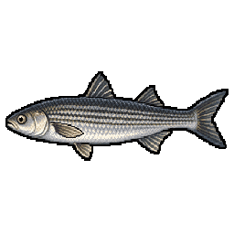 Кефаль | `mullet` | 300 г – 8 кг | 900 г | 25–80 см | море 1.2, река 0.6, озеро 0.2 | 2 |
| 95 | 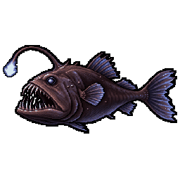 Морской чёрт | `anglerfish` | 2 кг – 40 кг | 7 кг | 40–150 см | море 1.0 | 8 |
| 96 | 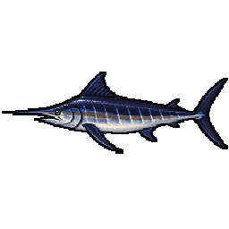 Чёрный марлин | `black_marlin` | 30 кг – 700 кг | 95 кг | 150–460 см | море 1.0 | 9 |
| 97 | 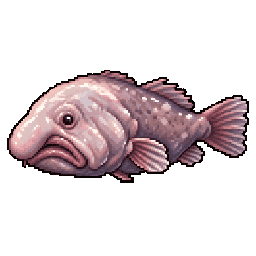 Рыба-капля | `blobfish` | 1 кг – 10 кг | 2.5 кг | 25–70 см | море 1.0 | 8 |
| 98 | 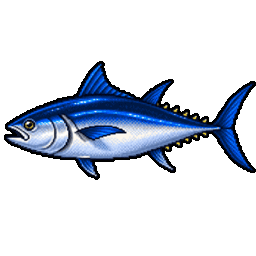 Синеперый тунец | `bluefin_tuna` | 20 кг – 400 кг | 60 кг | 100–300 см | море 1.0 | 8 |
| 99 | 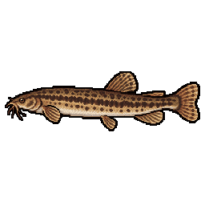 Вьюн | `loach` | 20 г – 150 г | 55 г | 10–30 см | болото 1.2, пруд 1.1, река 0.8, озеро 0.7, лужа 0.5 | — |
| 100 | 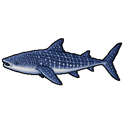 Китовая акула | `whale_shark` | 500 кг – 20000 кг | 2500 кг | 400–1200 см | море 1.0 | 12 |
| 101 | 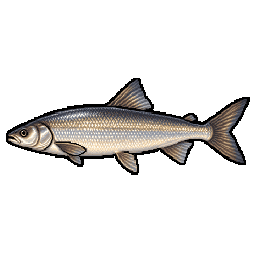 Нельма | `nelma` | 2 кг – 30 кг | 5 кг | 40–130 см | река 1.1, озеро 0.9, море 0.2 | 6 |
| 102 | 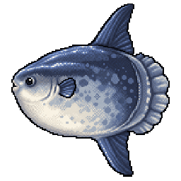 Луна-рыба | `ocean_sunfish` | 100 кг – 1000 кг | 220 кг | 100–330 см | море 1.0 | 8 |
| 103 | 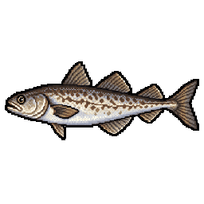 Минтай | `pollock` | 500 г – 15 кг | 1.8 кг | 25–90 см | море 1.2 | 4 |
| 104 | 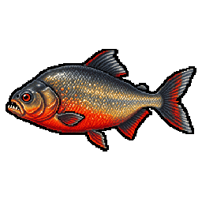 Краснобрюхая пиранья | `red_piranha` | 300 г – 4 кг | 900 г | 15–45 см | река 1.1, болото 0.9, озеро 0.8, пруд 0.5 | 4 |
| 105 | 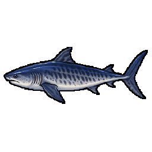 Тигровая акула | `tiger_shark` | 50 кг – 800 кг | 140 кг | 200–500 см | море 1.1 | 9 |
| 106 | 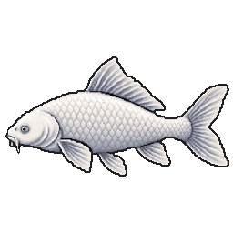 Карп кои | `koi_carp` | 800 г – 8 кг | 2.5 кг | 25–90 см | пруд 1.0, озеро 1.0, река 0.4 | 3 |
| 107 |  Линейный карп | `linear_carp` | 1 кг – 14 кг | 3.2 кг | 33–95 см | озеро 1.2, пруд 1.2, река 0.5, болото 0.4 | 3 |

## Идеальная снасть

Совпало — и вес поклёвки резко идёт вверх; чем крупнее рыба, тем резче. См. [коэффициент соответствия](fishing-mechanics.md#коэффициент-соответствия-m--твоя-снасть).

| Вид | Лучшие наживки (оценка) | Крючок | Леска | Прикормка (фракция / питательность) | Поводок |
|---|---|---|---|---|---|
| Азиатская арована | livebait 1, fish_strip 0.9, wobbler 0.9, silicone 0.85, popper 0.75, fly_streamer 0.7, wacky_worm 0.55, fly_dry_fly 0.4 | №5 | braid 0.2 ±0.06 | 0.1 / 0.24 | — |
| Акантикус адонис | worm 1, dough 0.75, boilie 0.7, fish_strip 0.7, jig 0.6, fly_pellet 0.55, silicone 0.55 | №4 | braid 0.22 ±0.06 | 0.7 / 0.75 | — |
| Акантикус гистрикс | dough 1, corn 0.9, worm 0.85, pea 0.8, fly_pellet 0.7 | №4 | braid 0.21 ±0.06 | 0.8 / 0.83 | — |
| Акула-мако | giant_spoon 1, livebait 1, octopus_jig 0.95, swimbait 0.95, fish_strip 0.9, wobbler 0.7 | №1 | braid 0.4 ±0.06 | 1 / 0.75 | **yes** |
| Акулий сом | dough 1, bread 0.9, corn 0.9, worm 0.85, fly_pellet 0.7, fish_strip 0.3 | №2 | braid 0.29 ±0.06 | 0.75 / 0.88 | — |
| Американская палия (ручьевая палия) | worm 1, fly_nymph 0.6, spinner 0.6, wobbler 0.55, fly_streamer 0.5, spoon 0.5 | №7 | fluoro 0.3 ±0.06 | 0.05 / 0.25 | — |
| Амия ильная | livebait 1, fish_strip 0.9, wobbler 0.9, silicone 0.85, crankbait 0.8, spoon 0.8, swimbait 0.8, spinnerbait 0.75, fly_streamer 0.7, chicken_liver 0.6, wacky_worm 0.55, worm 0.55 | №5 | braid 0.21 ±0.06 | 0.03 / 0.14 | **yes** |
| Амфиприон оцеллярис | bloodworm 1, maggot 0.95, worm 0.9, fly_shrimp 0.6 | №16 | fluoro 0.09 ±0.06 | 0.2 / 0.4 | — |
| Анабас | worm 1, bloodworm 0.85, maggot 0.8, fish_strip 0.7, fly_nymph 0.6, jig 0.6, silicone 0.55, fly_ant 0.5, fly_dry_fly 0.5 | №12 | mono 0.14 ±0.06 | 0.65 / 0.75 | — |
| Ангольский клариас | worm 1, dough 0.75, chicken_liver 0.7, fish_strip 0.7, livebait 0.6 | №5 | braid 0.11 ±0.06 | 0.7 / 0.8 | — |
| Арапайма | livebait 1, fish_strip 0.9, giant_spoon 0.85, swimbait 0.85, wobbler 0.75, silicone 0.6 | №1 | braid 0.45 ±0.08 | 0.95 / 0.8 | **yes** |
| Астатотиляпия каллиптера | bloodworm 1, maggot 0.95, worm 0.9, fly_nymph 0.85, silicone 0.5 | №13 | fluoro 0.12 ±0.06 | 0.25 / 0.45 | — |
| Астронотус | worm 1.2, livebait 1.1, wacky_worm 1, maggot 0.9, silicone 0.9, jig 0.8 | №8 | mono 0.16 ±0.04 | 0.47 / 0.68 | — |
| Африканская рыба-нож | worm 1, bloodworm 0.85, maggot 0.8, fish_strip 0.7, fly_nymph 0.6, jig 0.6, spinner 0.6, silicone 0.55, fly_streamer 0.5 | №9 | braid 0.1 ±0.06 | 0.1 / 0.25 | — |
| Африканская щука | livebait 1, fish_strip 0.9, wobbler 0.9, jig 0.85, spinner 0.85, fly_streamer 0.7 | №6 | braid 0.15 ±0.06 | 0 / 0.07 | **yes** |
| Африканский глазчатый нож | livebait 1, fish_strip 0.9, wobbler 0.9, silicone 0.85, spinner 0.85, spoon 0.8, fly_streamer 0.7, worm 0.55 | №6 | braid 0.15 ±0.06 | 0.05 / 0.17 | — |
| Африканский клариевый сом | worm 1, dough 0.75, boilie 0.7, chicken_liver 0.7, fish_strip 0.7, livebait 0.6, silicone 0.55, wobbler 0.55, spoon 0.5, swimbait 0.5 | №2 | braid 0.31 ±0.06 | 0.7 / 0.8 | — |
| Багрус докмак | livebait 1, fish_strip 0.9, jig 0.85, chicken_liver 0.6, worm 0.55 | №3 | braid 0.27 ±0.06 | 0.35 / 0.56 | — |
| Барракуда | giant_spoon 1.1, swimbait 1.05, wobbler 1, octopus_jig 0.9, silicone 0.9, spinner 0.7, spinnerbait 0.7, fish_strip 0.6 | №2 | braid 0.3 ±0.08 | 0.79 / 0.75 | **yes** |
| Баррамунди | livebait 1, fish_strip 0.9, wobbler 0.9, silicone 0.85, castmaster 0.8, crankbait 0.8, spoon 0.8, swimbait 0.8, popper 0.75, spinnerbait 0.75 | №2 | braid 0.32 ±0.06 | 0.03 / 0.14 | **yes** |
| Батибатес свирепый | livebait 1, fish_strip 0.9, wobbler 0.9, jig 0.85, spinner 0.85, fly_streamer 0.7 | №10 | fluoro 0.18 ±0.06 | 0.12 / 0.32 | — |
| Белоглазка | worm 1, maggot 0.95, bloodworm 0.85, pearl_barley 0.5, corn 0.4 | №12 | mono 0.18 ±0.05 | 0.42 / 0.61 | — |
| Белоточечная мурена | livebait 1, fish_strip 0.9, silicone 0.85, spoon 0.8, chicken_liver 0.6 | №4 | braid 0.19 ±0.06 | 0.07 / 0.28 | **yes** |
| Белуга | livebait 1, fish_strip 0.9, chicken_liver 0.85, worm 0.5 | №1 | braid 0.55 ±0.1 | 0.98 / 0.82 | **yes** |
| Белый американский лаврак | livebait 1, jig 0.85, silicone 0.85, spinner 0.85, castmaster 0.8, spoon 0.8 | №9 | braid 0.17 ±0.06 | 0.03 / 0.14 | — |
| Белый амур | corn 1, bread 0.9, dough 0.8, pea 0.7, boilie 0.5 | №6 | mono 0.3 ±0.08 | 0.77 / 0.66 | — |
| Белый краппи | livebait 1, jig 0.85, silicone 0.85, spinner 0.85, worm 0.55, bloodworm 0.35 | №11 | mono 0.21 ±0.06 | 0.17 / 0.32 | — |
| Белый осётр | livebait 1, fish_strip 0.9, chicken_liver 0.6, worm 0.55, bloodworm 0.35 | №1 | braid 0.52 ±0.06 | 0.28 / 0.45 | — |
| Берш | silicone 1, bladebait 0.95, jig 0.95, livebait 0.9, worm 0.7, crankbait 0.6, wobbler 0.55 | №6 | braid 0.1 ±0.04 | 0.47 / 0.7 | — |
| Бестер | worm 1, bloodworm 0.85, dough 0.75, fish_strip 0.7, fly_pellet 0.55 | №2 | braid 0.27 ±0.06 | 0.55 / 0.65 | — |
| Блюгилл | worm 1, maggot 0.9, bloodworm 0.8, corn 0.5 | №12 | mono 0.12 ±0.05 | 0.34 / 0.61 | — |
| Большая тигровая рыба | livebait 1, fish_strip 0.9, wobbler 0.9, jig 0.85, spoon 0.8, swimbait 0.8 | №3 | braid 0.3 ±0.06 | 0 / 0.07 | **yes** |
| Большеротый бас | popper 1.2, spinnerbait 1.1, wacky_worm 1.05, swimbait 1, wobbler 1, silicone 0.95, crankbait 0.9, jig 0.9, livebait 0.8, spinner 0.7 | №4 | braid 0.16 ±0.05 | 0.62 / 0.5 | — |
| Бородатый тёмный горбыль | livebait 1, fish_strip 0.9, silicone 0.85, castmaster 0.8, spoon 0.8, chicken_liver 0.6, worm 0.55 | №3 | braid 0.3 ±0.06 | 0.15 / 0.39 | — |
| Бурый паку | dough 1, bread 0.9, corn 0.9, boilie 0.85, worm 0.85 | №5 | mono 0.38 ±0.06 | 0.92 / 0.94 | — |
| Бурый протоптер | livebait 1, fish_strip 0.9, chicken_liver 0.6, worm 0.55 | №4 | braid 0.18 ±0.06 | 0.17 / 0.42 | **yes** |
| Бычеголовый голец | fish_strip 1, wobbler 1, jig 0.95, spinner 0.95, spoon 0.9, fly_streamer 0.8 | №6 | fluoro 0.32 ±0.06 | 0.03 / 0.17 | — |
| Бычок-кругляк | worm 1, fish_strip 0.9, bloodworm 0.7, maggot 0.6, silicone 0.5 | №8 | mono 0.2 ±0.06 | 0.29 / 0.62 | — |
| Бычок-цуцик | worm 1, bloodworm 0.95, maggot 0.9, fish_strip 0.4 | №16 | mono 0.12 ±0.04 | 0.12 / 0.5 | — |
| Ваху | giant_spoon 1.15, octopus_jig 1, swimbait 1, wobbler 1, castmaster 0.8, silicone 0.7 | №1 | braid 0.4 ±0.08 | 0.88 / 0.5 | **yes** |
| Верховка | maggot 1, bread 0.95, bloodworm 0.85, dough 0.8 | №16 | mono 0.1 ±0.03 | 0.08 / 0.38 | — |
| Веслонос | jig 1, castmaster 0.85, giant_spoon 0.7 | №2 | braid 0.33 ±0.06 | 0 / 0 | — |
| Вьюн | bloodworm 1.1, worm 1, maggot 0.8, mormyshka 0.6, dough 0.4 | №16 | mono 0.12 ±0.04 | 0.2 / 0.5 | — |
| Гибрид американской палии и бычьей форели | worm 1, fly_nymph 0.6, spinner 0.6, fly_streamer 0.5, spoon 0.5 | №7 | fluoro 0.27 ±0.06 | 0.05 / 0.25 | — |
| Гибрид большеротого и малоротого окуня | jig 1, silicone 0.95, crankbait 0.85, swimbait 0.85, wacky_worm 0.85, spinnerbait 0.7 | №7 | fluoro 0.26 ±0.06 | 0.05 / 0.2 | — |
| Гибрид калуги и стерляди (калужско-стерляжий гибрид) | worm 1, bloodworm 0.85, dough 0.75, chicken_liver 0.7, fish_strip 0.7 | №2 | braid 0.28 ±0.06 | 0.55 / 0.65 | — |
| Гибрид канального и голубого сомика | worm 1, dough 0.75, chicken_liver 0.7, fish_strip 0.7, livebait 0.6 | №3 | braid 0.25 ±0.06 | 0.75 / 0.8 | — |
| Гибрид красноухого и зелёного солнечника | worm 1, maggot 0.8, bread 0.7, jig 0.6, silicone 0.55 | №14 | mono 0.19 ±0.06 | 0.45 / 0.55 | — |
| Гибрид лабео гониус и катли | dough 1, corn 0.9, worm 0.85, fly_pellet 0.7 | №5 | mono 0.31 ±0.06 | 0.98 / 0.94 | — |
| Гибрид леща и плотвы (плотвещ) | dough 1, bread 0.9, corn 0.9, worm 0.85, pearl_barley 0.8, maggot 0.7 | №10 | mono 0.22 ±0.06 | 0.98 / 0.88 | — |
| Гибрид мальмы и бычьей форели | fish_strip 1, spinner 0.95, spoon 0.9, fly_streamer 0.8, worm 0.6 | №7 | fluoro 0.29 ±0.06 | 0.03 / 0.17 | — |
| Гибрид панцирной щуки и миссисипского панцирника | livebait 1, fish_strip 0.9, wobbler 0.9, jig 0.85, fly_streamer 0.7 | №2 | braid 0.3 ±0.06 | 0 / 0.03 | **yes** |
| Гибрид плотвы и краснопёрки | dough 1, bread 0.9, corn 0.9, worm 0.85, maggot 0.7 | №10 | mono 0.2 ±0.06 | 0.98 / 0.88 | — |
| Гибрид роху и катли | dough 1, corn 0.9, worm 0.85, fly_pellet 0.7 | №4 | mono 0.34 ±0.06 | 0.98 / 0.94 | — |
| Гибрид роху и лабео гониус | dough 1, corn 0.9, worm 0.85, fly_pellet 0.7 | №5 | mono 0.3 ±0.06 | 0.98 / 0.94 | — |
| Гибрид синежаберного и зелёного солнечника | corn 1, bread 0.95, worm 0.9, maggot 0.75, jig 0.25, silicone 0.25 | №14 | mono 0.18 ±0.06 | 0.52 / 0.61 | — |
| Гибрид синежаберного и красногрудого солнечника | worm 1, maggot 0.8, bread 0.7, jig 0.6, silicone 0.55 | №15 | mono 0.16 ±0.06 | 0.45 / 0.55 | — |
| Гибрид синежаберного и красноухого солнечника | corn 1, bread 0.95, worm 0.9, maggot 0.75, jig 0.25 | №14 | mono 0.19 ±0.06 | 0.52 / 0.61 | — |
| Гибрид синежаберного и обыкновенного солнечника | corn 1, bread 0.95, worm 0.9, maggot 0.75, jig 0.25, silicone 0.25 | №15 | mono 0.17 ±0.06 | 0.52 / 0.61 | — |
| Гибрид чавычи и горбуши | jig 1, spinner 1, wobbler 0.95, spoon 0.9, fly_streamer 0.85 | №6 | braid 0.21 ±0.06 | 0 / 0.1 | — |
| Гибрид чавычи и кижуча | fish_strip 1, wobbler 1, spinner 0.95, spoon 0.9, fly_streamer 0.8 | №5 | braid 0.25 ±0.06 | 0 / 0.07 | — |
| Гибрид чёрного и белого краппи | livebait 1, jig 0.85, silicone 0.85, spinner 0.85, worm 0.55 | №11 | mono 0.21 ±0.06 | 0.17 / 0.32 | — |
| Гибридная тиляпия (голубая × мозамбикская) | dough 1, bread 0.9, corn 0.9, worm 0.85, pea 0.8, fly_pellet 0.7 | №10 | mono 0.22 ±0.06 | 0.8 / 0.83 | — |
| Гибридная тиляпия (нильская х голубая) | dough 1, bread 0.9, corn 0.9, worm 0.85, pea 0.8, pearl_barley 0.8 | №9 | mono 0.24 ±0.06 | 0.8 / 0.83 | — |
| Гибридный полосатый лаврак (вайпер) | livebait 1, jig 0.85, silicone 0.85, castmaster 0.8, crankbait 0.8, spoon 0.8 | №6 | braid 0.22 ±0.06 | 0.03 / 0.14 | — |
| Гигантская цихлида | livebait 1, fish_strip 0.9, wobbler 0.9, jig 0.85, spinner 0.85, worm 0.55 | №7 | fluoro 0.26 ±0.06 | 0.12 / 0.32 | — |
| Гигантский гурами | dough 1, bread 0.9, corn 0.9, worm 0.85, pea 0.8, maggot 0.7, fly_ant 0.45, fly_dry_fly 0.45, fish_strip 0.3 | №8 | mono 0.29 ±0.06 | 0.75 / 0.83 | — |
| Гигантский змееголов | livebait 1, fish_strip 0.9, wobbler 0.9, silicone 0.85, castmaster 0.8, crankbait 0.8, spoon 0.8, swimbait 0.8, popper 0.75, spinnerbait 0.75, chicken_liver 0.6, wacky_worm 0.55 | №4 | braid 0.25 ±0.06 | 0 / 0.03 | **yes** |
| Гигантский меконгский сом | dough 1, bread 0.9, corn 0.9, boilie 0.85, pea 0.8, pearl_barley 0.8 | №1 | braid 0.43 ±0.06 | 0.75 / 0.88 | — |
| Гигантский пресноводный скат | livebait 1, fish_strip 0.9, chicken_liver 0.6, worm 0.55 | №1 | braid 0.49 ±0.06 | 0.28 / 0.49 | **yes** |
| Глазчатый змееголов | livebait 1.2, silicone 1.05, popper 1, spinnerbait 1, swimbait 0.95, wobbler 0.95, jig 0.85, worm 0.6 | №2 | braid 0.22 ±0.06 | 0.62 / 0.7 | — |
| Глазчатый хвостокол | livebait 1, fish_strip 0.9, silicone 0.85, spoon 0.8, chicken_liver 0.6, worm 0.55 | №3 | braid 0.27 ±0.06 | 0.28 / 0.49 | **yes** |
| Гнатонем Петерса | bloodworm 1, maggot 0.95, worm 0.9, fly_nymph 0.85 | №10 | fluoro 0.16 ±0.06 | 0.4 / 0.6 | — |
| Голавль | popper 1, wobbler 0.9, bread 0.8, spinner 0.8, crankbait 0.75, castmaster 0.7, spinnerbait 0.7, worm 0.7, bladebait 0.6, wacky_worm 0.6, corn 0.5 | №8 | mono 0.16 ±0.05 | 0.53 / 0.56 | — |
| Голец | spinner 1, castmaster 0.9, spoon 0.9, wobbler 0.7, worm 0.6 | №8 | fluoro 0.2 ±0.05 | 0.59 / 0.7 | — |
| Голиафовый групер | livebait 1, fish_strip 0.95, octopus_jig 0.8, swimbait 0.8, giant_spoon 0.5 | №1 | braid 0.55 ±0.1 | 0.97 / 0.78 | **yes** |
| Голубая тиляпия | dough 1, bread 0.9, corn 0.9, worm 0.85, pea 0.8, pearl_barley 0.8, bloodworm 0.7, maggot 0.7, fish_strip 0.3, jig 0.25 | №10 | mono 0.21 ±0.06 | 0.8 / 0.83 | — |
| Голубой марлин | fish_strip 1.1, octopus_jig 1, wobbler 1, giant_spoon 0.95, silicone 0.6 | №1 | braid 0.4 ±0.06 | 1 / 0.75 | — |
| Голубой сом | worm 1, dough 0.75, chicken_liver 0.7, fish_strip 0.7, livebait 0.6 | №2 | braid 0.31 ±0.06 | 0.75 / 0.8 | — |
| Голубой хирург | bloodworm 1, maggot 0.95, worm 0.9, fly_shrimp 0.6 | №13 | fluoro 0.17 ±0.06 | 0.2 / 0.4 | — |
| Голый карп | boilie 1, corn 0.85, pea 0.6, pearl_barley 0.55, dough 0.5 | №4 | mono 0.35 ±0.08 | 0.75 / 0.88 | — |
| Горбуша | spoon 1, spinner 0.9, castmaster 0.8, fish_strip 0.5 | №6 | braid 0.18 ±0.05 | 0.61 / 0.75 | — |
| Горчак | bloodworm 1, maggot 1, bread 0.8, dough 0.7 | №16 | mono 0.1 ±0.03 | 0.1 / 0.4 | — |
| Густера | maggot 1, worm 0.9, bloodworm 0.7 | №12 | braid 0.1 ±0.04 | 0.42 / 0.57 | — |
| Дистиходус шестиполосый | dough 1, bread 0.9, corn 0.9, worm 0.85, pea 0.8, fly_pellet 0.7 | №6 | mono 0.24 ±0.06 | 0.92 / 0.94 | — |
| Длинноносый дистиходус | dough 1, bread 0.9, corn 0.9, pea 0.8, fly_pellet 0.7 | №8 | mono 0.18 ±0.06 | 0.92 / 0.94 | — |
| Дьявольский карпозубик | bloodworm 1, maggot 0.95, worm 0.9, fly_nymph 0.85 | №16 | mono 0.06 ±0.06 | 0.4 / 0.5 | — |
| Елец | maggot 1, worm 0.9, bread 0.7, bloodworm 0.65, dough 0.6, spinner 0.4 | №14 | mono 0.14 ±0.04 | 0.34 / 0.52 | — |
| Желтопёрый тунец | giant_spoon 1.05, octopus_jig 1, swimbait 1, livebait 0.9, wobbler 0.9, fish_strip 0.8, silicone 0.7 | №1 | braid 0.4 ±0.08 | 0.99 / 0.75 | — |
| Жерех | spoon 1, castmaster 0.9, wobbler 0.9, popper 0.85, spinnerbait 0.85, spinner 0.8, bladebait 0.7, crankbait 0.7, swimbait 0.7, wacky_worm 0.5 | №6 | braid 0.12 ±0.04 | 0.66 / 0.5 | — |
| Жёлтый американский лаврак | livebait 1, jig 0.85, silicone 0.85, spinner 0.85, worm 0.55 | №9 | braid 0.14 ±0.06 | 0.03 / 0.14 | — |
| Жёлтый окунь | livebait 1, jig 0.85, silicone 0.85, worm 0.55, mormyshka 0.45, bloodworm 0.35 | №8 | fluoro 0.21 ±0.06 | 0.05 / 0.21 | — |
| Звёздчатый иглобрюх | fish_strip 1, jig 0.95, octopus_jig 0.8, fly_shrimp 0.6 | №6 | fluoro 0.36 ±0.06 | 0.12 / 0.32 | **yes** |
| Зелёный солнечник | worm 1, maggot 0.8, bread 0.7, jig 0.6, silicone 0.55 | №14 | mono 0.18 ±0.06 | 0.45 / 0.55 | — |
| Зеркальный карп | boilie 1, corn 0.8, pea 0.6, pearl_barley 0.5 | №6 | mono 0.3 ±0.08 | 0.72 / 0.85 | — |
| Золотой дорадо | wobbler 1, swimbait 0.95, spinner 0.9, spinnerbait 0.9, spoon 0.9, popper 0.85, crankbait 0.8, silicone 0.8, livebait 0.7 | №2 | braid 0.28 ±0.06 | 0.6 / 0.7 | **yes** |
| Золотой карась | worm 1, bread 0.9, dough 0.9, maggot 0.85, corn 0.7, pearl_barley 0.6 | №12 | mono 0.18 ±0.05 | 0.35 / 0.6 | — |
| Золотой махсир | dough 1, boilie 0.95, fish_strip 0.95, livebait 0.85, spinner 0.75, wobbler 0.75, spoon 0.7, castmaster 0.65, crankbait 0.65, fly_streamer 0.65, swimbait 0.65, bladebait 0.55 | №2 | braid 0.39 ±0.06 | 0.65 / 0.8 | — |
| Каламоихт | worm 1, bloodworm 0.85, maggot 0.8, fish_strip 0.7, jig 0.6, silicone 0.55, fly_streamer 0.5 | №9 | mono 0.14 ±0.06 | 0.3 / 0.55 | — |
| Калуга | livebait 1, fish_strip 0.9, wobbler 0.9, silicone 0.85, spoon 0.8, swimbait 0.8, giant_spoon 0.75, chicken_liver 0.6 | №1 | braid 0.54 ±0.06 | 0.28 / 0.45 | — |
| Камбала | fish_strip 1, worm 0.9, maggot 0.5 | №6 | mono 0.3 ±0.08 | 0.56 / 0.71 | — |
| Кампиломормирус хоботконосый | bloodworm 1, maggot 0.95, worm 0.9, fly_nymph 0.85 | №11 | fluoro 0.12 ±0.06 | 0.4 / 0.6 | — |
| Канадский судак | livebait 1, jig 0.85, silicone 0.85, crankbait 0.8, worm 0.55 | №6 | fluoro 0.25 ±0.06 | 0.05 / 0.21 | **yes** |
| Канальный сомик | livebait 1.1, chicken_liver 1, worm 0.8, swimbait 0.7, maggot 0.6, boilie 0.5 | №2 | mono 0.35 ±0.08 | 0.73 / 0.77 | — |
| Каранкс | popper 1.25, giant_spoon 1.15, castmaster 1.1, spoon 1.1, swimbait 1.1, livebait 1, silicone 1, wobbler 0.95, spinnerbait 0.8 | №1 | braid 0.35 ±0.08 | 0.76 / 0.5 | — |
| Карась | worm 1, dough 0.9, maggot 0.8, corn 0.6, bread 0.5 | №12 | mono 0.18 ±0.06 | 0.4 / 0.63 | — |
| Карп | boilie 1, corn 0.8, pea 0.6, pearl_barley 0.5 | №6 | mono 0.3 ±0.08 | 0.73 / 0.85 | — |
| Карп кои | boilie 1, corn 0.8, bread 0.6, pea 0.6 | №6 | mono 0.3 ±0.08 | 0.69 / 0.75 | — |
| Карпокарась | dough 1, bread 0.9, corn 0.9, boilie 0.85, worm 0.85, pearl_barley 0.8 | №9 | mono 0.27 ±0.06 | 0.98 / 0.88 | — |
| Картографический аротрон | fish_strip 1, jig 0.95, silicone 0.9, worm 0.6 | №8 | fluoro 0.26 ±0.06 | 0.12 / 0.32 | **yes** |
| Катбоу (гибрид радужной форели и лосося Кларка) | worm 1, fly_nymph 0.6, spinner 0.6, fly_dry_fly 0.5, spoon 0.5 | №6 | braid 0.22 ±0.06 | 0 / 0.1 | — |
| Катля | dough 1, bread 0.9, corn 0.9, boilie 0.85, worm 0.85, fly_pellet 0.7, fly_dry_fly 0.45 | №4 | mono 0.45 ±0.06 | 0.98 / 0.94 | — |
| Кета | jig 1, spinner 1, wobbler 0.95, spoon 0.9, fly_streamer 0.85 | №6 | braid 0.23 ±0.06 | 0 / 0.1 | — |
| Кефаль | bread 1, dough 0.95, maggot 0.7, worm 0.6, corn 0.4, pea 0.3 | №12 | mono 0.18 ±0.05 | 0.45 / 0.55 | — |
| Кижуч | fish_strip 1, wobbler 1, spinner 0.95, spoon 0.9, fly_streamer 0.8 | №5 | braid 0.23 ±0.06 | 0 / 0.07 | — |
| Китайский махсир | livebait 1, wobbler 0.9, jig 0.85, spinner 0.85, spoon 0.8, fly_streamer 0.7, worm 0.55, fly_nymph 0.4 | №7 | braid 0.15 ±0.06 | 0.33 / 0.56 | — |
| Китовая акула | fish_strip 0.35, livebait 0.3 | №1 | braid 0.6 ±0.05 | 1 / 1 | — |
| Кои Асаги | boilie 1, corn 0.8, bread 0.6, pea 0.6 | №6 | mono 0.3 ±0.08 | 0.69 / 0.75 | — |
| Кои Бекко | boilie 1, corn 0.8, bread 0.6, pea 0.6 | №6 | mono 0.3 ±0.08 | 0.69 / 0.75 | — |
| Кои Кохаку | boilie 1, corn 0.8, bread 0.6, pea 0.6 | №6 | mono 0.3 ±0.08 | 0.69 / 0.75 | — |
| Кои Сёва Санке | boilie 1, corn 0.8, bread 0.6, pea 0.6 | №6 | mono 0.3 ±0.08 | 0.69 / 0.75 | — |
| Кои Танчо Санке | boilie 1, corn 0.8, bread 0.6, pea 0.6 | №6 | mono 0.3 ±0.08 | 0.69 / 0.75 | — |
| Колючий аротрон | fish_strip 1, jig 0.95, octopus_jig 0.8, fly_shrimp 0.6 | №9 | fluoro 0.22 ±0.06 | 0.12 / 0.32 | **yes** |
| Короткохвостый речной хвостокол | livebait 1, fish_strip 0.9, chicken_liver 0.6, worm 0.55 | №1 | braid 0.4 ±0.06 | 0.28 / 0.49 | **yes** |
| Корюшка | bloodworm 1, mormyshka 0.9, fish_strip 0.8, worm 0.7 | №16 | mono 0.12 ±0.05 | 0.22 / 0.56 | — |
| Красная тиляпия (гибрид нильской и мозамбикской тиляпии) | dough 1, bread 0.9, corn 0.9, worm 0.85, pea 0.8, fly_pellet 0.7 | №9 | mono 0.24 ±0.06 | 0.8 / 0.83 | — |
| Краснобрюхая пиранья | fish_strip 1.1, chicken_liver 1, livebait 0.95, worm 0.7, silicone 0.6, spinner 0.5 | №8 | mono 0.2 ±0.06 | 0.55 / 0.85 | **yes** |
| Краснобрюхий солнечник | bloodworm 1, maggot 0.95, worm 0.9, fly_nymph 0.85, jig 0.55 | №15 | mono 0.17 ±0.06 | 0.45 / 0.55 | — |
| Красноглазый каменный окунь | livebait 1, jig 0.85, silicone 0.85, spinner 0.85, worm 0.55 | №13 | mono 0.19 ±0.06 | 0.23 / 0.39 | — |
| Краснопёрка | bread 1, dough 0.9, maggot 0.8 | №14 | mono 0.14 ±0.04 | 0.3 / 0.49 | — |
| Краснопёрый махсир | worm 1, dough 0.75, boilie 0.7, fish_strip 0.7, livebait 0.6, spinner 0.6, wobbler 0.55, castmaster 0.5, crankbait 0.5, fly_streamer 0.5, spoon 0.5 | №3 | braid 0.31 ±0.06 | 0.65 / 0.8 | — |
| Красноухий солнечник | worm 1, bloodworm 0.85, maggot 0.8, corn 0.7, jig 0.6 | №13 | mono 0.22 ±0.06 | 0.45 / 0.55 | — |
| Краснохвостый сом | livebait 1, fish_strip 0.9, wobbler 0.9, silicone 0.85, spoon 0.8, swimbait 0.8, giant_spoon 0.75, chicken_liver 0.6 | №2 | braid 0.32 ±0.06 | 0.28 / 0.52 | — |
| Красный горбыль | livebait 1, wobbler 0.9, jig 0.85, silicone 0.85, spoon 0.8, worm 0.55 | №3 | braid 0.29 ±0.06 | 0.15 / 0.39 | — |
| Крымский усач | worm 1, bloodworm 0.85, maggot 0.8, dough 0.75, bread 0.7, fly_nymph 0.6, jig 0.6, fly_ant 0.5 | №7 | mono 0.24 ±0.06 | 0.8 / 0.8 | — |
| Кутум | worm 1, bloodworm 0.9, maggot 0.8, fish_strip 0.5, pea 0.4 | №8 | mono 0.25 ±0.06 | 0.6 / 0.7 | — |
| Лабео мелкочешуйчатый | dough 1, bread 0.9, corn 0.9, worm 0.85, pearl_barley 0.8, bloodworm 0.7, maggot 0.7, jig 0.25 | №4 | mono 0.36 ±0.06 | 0.98 / 0.94 | — |
| Лабеобарбус кимберлейский | worm 1, corn 0.7, fish_strip 0.7, livebait 0.6, spinner 0.6, fly_streamer 0.5 | №5 | braid 0.25 ±0.06 | 0.65 / 0.8 | — |
| Лаврак | wobbler 1, silicone 0.95, livebait 0.9, popper 0.8, swimbait 0.8, fish_strip 0.7 | №4 | braid 0.25 ±0.06 | 0.62 / 0.75 | — |
| Ленок | wobbler 1, spinner 0.9, spoon 0.9, crankbait 0.8, worm 0.5 | №6 | braid 0.14 ±0.05 | 0.62 / 0.7 | — |
| Леопардовая мурена | livebait 1, fish_strip 0.9, jig 0.85, octopus_jig 0.7 | №2 | braid 0.27 ±0.06 | 0.07 / 0.28 | **yes** |
| Лепидиолампрологус удлинённый | livebait 1, fish_strip 0.9, jig 0.85, silicone 0.85, spinner 0.85, fly_streamer 0.7 | №11 | fluoro 0.16 ±0.06 | 0.12 / 0.32 | — |
| Лещ | maggot 1, worm 0.9, pearl_barley 0.8, mormyshka 0.7, corn 0.6, bread 0.4, boilie 0.3 | №10 | braid 0.1 ±0.04 | 0.56 / 0.68 | — |
| Линейный карп | boilie 1, corn 0.8, pea 0.6, pearl_barley 0.5 | №6 | mono 0.3 ±0.08 | 0.72 / 0.85 | — |
| Линь | worm 1, dough 0.8, corn 0.7, bread 0.6, maggot 0.6 | №10 | mono 0.2 ±0.05 | 0.54 / 0.63 | — |
| Лосось Кларка | worm 1, fly_nymph 0.6, spinner 0.6, fly_dry_fly 0.5, fly_streamer 0.5, spoon 0.5 | №6 | braid 0.24 ±0.06 | 0 / 0.1 | — |
| Луна-рыба | octopus_jig 1, silicone 0.85, fish_strip 0.6, livebait 0.35 | №2 | braid 0.4 ±0.1 | 0.9 / 0.5 | — |
| Луфарь | giant_spoon 1.2, spoon 1.2, castmaster 1.15, fish_strip 1.1, swimbait 1.1, wobbler 1, livebait 0.9, silicone 0.9 | №2 | braid 0.28 ±0.07 | 0.66 / 0.75 | **yes** |
| Малайский махсир | dough 1, boilie 0.95, fish_strip 0.95, livebait 0.85, fly_nymph 0.75, spinner 0.75, wobbler 0.75, fly_dry_fly 0.7, spoon 0.7, crankbait 0.65, fly_streamer 0.65 | №4 | braid 0.24 ±0.06 | 0.65 / 0.8 | — |
| Малоротый окунь | worm 1, jig 0.6, spinner 0.6, silicone 0.55, crankbait 0.5, wacky_worm 0.5 | №7 | fluoro 0.26 ±0.06 | 0.05 / 0.2 | — |
| Мальма | fish_strip 1, wobbler 1, spinner 0.95, spoon 0.9, fly_streamer 0.8, worm 0.6 | №6 | fluoro 0.34 ±0.06 | 0.03 / 0.17 | — |
| Махи-махи | livebait 1.05, giant_spoon 1, octopus_jig 1, swimbait 1, wobbler 1, popper 0.9, silicone 0.8, fish_strip 0.6 | №2 | braid 0.3 ±0.08 | 0.77 / 0.75 | — |
| Меч-рыба | livebait 1, octopus_jig 1, fish_strip 0.9, giant_spoon 0.85, wobbler 0.6 | №1 | braid 0.45 ±0.08 | 1 / 0.75 | — |
| Минмаут (гибрид малоротого и пятнистого окуня) | jig 1, silicone 0.95, crankbait 0.85, wacky_worm 0.85, spinnerbait 0.7 | №8 | fluoro 0.25 ±0.06 | 0.05 / 0.2 | — |
| Минтай | jig 1.05, livebait 1, fish_strip 0.95, bladebait 0.85, octopus_jig 0.85, silicone 0.85, castmaster 0.8, swimbait 0.75, giant_spoon 0.7 | №4 | braid 0.22 ±0.06 | 0.7 / 0.7 | — |
| Миссисипский панцирник | livebait 1, fish_strip 0.9, wobbler 0.9, silicone 0.85, castmaster 0.8, crankbait 0.8, spoon 0.8, swimbait 0.8, giant_spoon 0.75, popper 0.75, chicken_liver 0.6 | №1 | braid 0.37 ±0.06 | 0 / 0.03 | **yes** |
| Многопёр Эндлихера | livebait 1, fish_strip 0.9, wobbler 0.9, silicone 0.85, spoon 0.8, chicken_liver 0.6, worm 0.55 | №7 | mono 0.24 ±0.06 | 0.15 / 0.39 | — |
| Мозамбикская тиляпия | dough 1, bread 0.9, corn 0.9, worm 0.85, pea 0.8, pearl_barley 0.8, bloodworm 0.7, maggot 0.7, fish_strip 0.3, jig 0.25 | №11 | mono 0.18 ±0.06 | 0.8 / 0.83 | — |
| Мормиропс угревидный | livebait 1, fish_strip 0.9, jig 0.85, worm 0.55, bloodworm 0.35 | №5 | fluoro 0.32 ±0.06 | 0.2 / 0.42 | **yes** |
| Морской угорь | fish_strip 1, livebait 1, worm 0.4 | №1 | mono 0.5 ±0.1 | 0.84 / 0.74 | **yes** |
| Морской чёрт | livebait 1.1, fish_strip 1 | №1 | braid 0.3 ±0.08 | 0.72 / 0.8 | **yes** |
| Мраморный протоптер | worm 1, dough 0.75, chicken_liver 0.7, fish_strip 0.7, livebait 0.6 | №3 | braid 0.24 ±0.06 | 0.35 / 0.6 | **yes** |
| Мраморный угорь | livebait 1, fish_strip 0.9, chicken_liver 0.6, worm 0.55, bloodworm 0.35 | №3 | braid 0.25 ±0.06 | 0.23 / 0.45 | **yes** |
| Налим | livebait 1, chicken_liver 0.9, worm 0.9, bladebait 0.8, jig 0.75, swimbait 0.6 | №6 | mono 0.3 ±0.08 | 0.62 / 0.75 | — |
| Наннохаракс Анзорга | bloodworm 1, maggot 0.95, worm 0.9, fly_nymph 0.85 | №16 | mono 0.06 ±0.06 | 0.5 / 0.6 | — |
| Нельма | spoon 1.1, spinner 1, castmaster 0.95, livebait 0.95, swimbait 0.85, wobbler 0.85, jig 0.7, silicone 0.7 | №4 | braid 0.2 ±0.05 | 0.7 / 0.6 | — |
| Нерка | livebait 1, fish_strip 0.9, wobbler 0.9, silicone 0.85, spinner 0.85, castmaster 0.8, spoon 0.8, swimbait 0.8, fly_streamer 0.7, worm 0.55, fly_nymph 0.4 | №6 | braid 0.2 ±0.06 | 0 / 0.07 | — |
| Нильская тиляпия | dough 1, bread 0.9, corn 0.9, worm 0.85, pea 0.8, pearl_barley 0.8, bloodworm 0.7, maggot 0.7, fly_nymph 0.45, fish_strip 0.3, jig 0.25 | №9 | mono 0.24 ±0.06 | 0.8 / 0.83 | — |
| Нильский гетеротис | dough 1, bread 0.9, corn 0.9, worm 0.85, pea 0.8, fly_pellet 0.7 | №5 | braid 0.21 ±0.06 | 0.23 / 0.39 | — |
| Нильский гимнарх | livebait 1, fish_strip 0.9, wobbler 0.9, jig 0.85, worm 0.55 | №4 | fluoro 0.34 ±0.06 | 0.2 / 0.42 | **yes** |
| Нильский многопёр | livebait 1, fish_strip 0.9, jig 0.85, chicken_liver 0.6, worm 0.55 | №7 | mono 0.22 ±0.06 | 0.15 / 0.39 | — |
| Нильский окунь | livebait 1, fish_strip 0.9, wobbler 0.9, jig 0.85, swimbait 0.8, giant_spoon 0.75 | №2 | braid 0.39 ±0.06 | 0.03 / 0.14 | **yes** |
| Обыкновенная тигровая рыба | livebait 1, fish_strip 0.9, wobbler 0.9, jig 0.85, spinner 0.85, spoon 0.8 | №4 | braid 0.26 ±0.06 | 0 / 0.07 | **yes** |
| Обыкновенная цитарина | dough 1, bread 0.9, corn 0.9, pea 0.8, fly_pellet 0.7 | №7 | mono 0.27 ±0.06 | 0.92 / 0.94 | — |
| Обыкновенный лопатонос | worm 1, bloodworm 0.85, dough 0.75, chicken_liver 0.7, fish_strip 0.7 | №3 | braid 0.19 ±0.06 | 0.55 / 0.65 | — |
| Обыкновенный усач | dough 1, bread 0.9, corn 0.9, boilie 0.85, worm 0.85, pea 0.8, pearl_barley 0.8, bloodworm 0.7, maggot 0.7, fish_strip 0.3, silicone 0.2 | №5 | mono 0.32 ±0.06 | 0.92 / 0.88 | — |
| Озёрная форель | livebait 1, fish_strip 0.9, wobbler 0.9, silicone 0.85, spinner 0.85, castmaster 0.8, spoon 0.8, swimbait 0.8, giant_spoon 0.75, bladebait 0.7, fly_streamer 0.7, mormyshka 0.45 | №5 | fluoro 0.4 ±0.06 | 0.03 / 0.17 | — |
| Озёрный осётр | worm 1, bloodworm 0.85, dough 0.75, chicken_liver 0.7, fish_strip 0.7 | №1 | braid 0.35 ±0.06 | 0.55 / 0.65 | — |
| Окунь | crankbait 1, bladebait 0.95, silicone 0.95, livebait 0.9, mormyshka 0.9, spinner 0.9, wacky_worm 0.85, jig 0.8, popper 0.7, spinnerbait 0.7, worm 0.6 | №8 | braid 0.1 ±0.04 | 0.4 / 0.7 | — |
| Осётр | chicken_liver 1, worm 0.9, livebait 0.7, boilie 0.5 | №1 | braid 0.45 ±0.1 | 0.95 / 0.79 | — |
| Павлиний окунь | wobbler 1.2, popper 1.15, swimbait 1.05, crankbait 1, silicone 0.95, spinner 0.9, spinnerbait 0.9, wacky_worm 0.9, livebait 0.85, jig 0.8 | №4 | braid 0.2 ±0.05 | 0.64 / 0.5 | — |
| Палтус | fish_strip 1, octopus_jig 1, livebait 0.9, swimbait 0.9, silicone 0.8, giant_spoon 0.7, jig 0.7 | №1 | braid 0.5 ±0.1 | 0.93 / 0.75 | — |
| Панцирная щука (обыкновенный панцирник) | livebait 1, fish_strip 0.9, wobbler 0.9, spinner 0.85 | №2 | braid 0.25 ±0.06 | 0 / 0.03 | **yes** |
| Папирокранус конголезский | livebait 1, fish_strip 0.9, jig 0.85, worm 0.55, bloodworm 0.35 | №9 | braid 0.12 ±0.06 | 0.05 / 0.17 | — |
| Парусник | livebait 1.1, octopus_jig 1, wobbler 1, giant_spoon 0.95, popper 0.8, silicone 0.7 | №1 | braid 0.3 ±0.08 | 1 / 0.5 | — |
| Пескарь | bloodworm 1, mormyshka 0.9, worm 0.9, maggot 0.8 | №16 | mono 0.14 ±0.04 | 0.22 / 0.54 | — |
| Пирайба | livebait 1, fish_strip 0.95, chicken_liver 0.85, swimbait 0.7, worm 0.5 | №1 | braid 0.5 ±0.08 | 0.96 / 0.8 | **yes** |
| Плащеносная акула | fish_strip 1, octopus_jig 0.95, livebait 0.85 | №1 | braid 0.4 ±0.08 | 0.9 / 0.7 | **yes** |
| Плоскоголовый сом | livebait 1, fish_strip 0.9, jig 0.85, chicken_liver 0.6, worm 0.55 | №3 | braid 0.3 ±0.06 | 0.38 / 0.56 | — |
| Плотва | maggot 1, bloodworm 0.9, mormyshka 0.9, dough 0.7, bread 0.5 | №14 | mono 0.14 ±0.04 | 0.31 / 0.47 | — |
| Подкаменщик | worm 1, bloodworm 0.9, maggot 0.8, livebait 0.3 | №14 | mono 0.14 ±0.04 | 0.12 / 0.5 | — |
| Подуст | maggot 1, bloodworm 0.8, worm 0.8, pearl_barley 0.7 | №12 | mono 0.16 ±0.05 | 0.46 / 0.59 | — |
| Полосатый лаврак | livebait 1.2, swimbait 1.15, fish_strip 1.1, giant_spoon 1.05, bladebait 1, wobbler 1, silicone 0.95, spoon 0.9, jig 0.85 | №2 | braid 0.3 ±0.08 | 0.74 / 0.75 | — |
| Пустынный карпозубик | bloodworm 1, maggot 0.95, worm 0.9, fly_nymph 0.85 | №16 | mono 0.07 ±0.06 | 0.4 / 0.5 | — |
| Пятнистый панцирник | livebait 1, fish_strip 0.9, wobbler 0.9, silicone 0.85, spoon 0.8, swimbait 0.8, spinnerbait 0.75, fly_streamer 0.7, worm 0.55 | №3 | braid 0.18 ±0.06 | 0 / 0.03 | **yes** |
| Пятнистый судачий горбыль | livebait 1, fish_strip 0.9, wobbler 0.9, jig 0.85, silicone 0.85, popper 0.75 | №4 | braid 0.2 ±0.06 | 0.15 / 0.39 | — |
| Пятнистый чёрный окунь | livebait 1, wobbler 0.9, jig 0.85, silicone 0.85, crankbait 0.8, spinnerbait 0.75 | №8 | fluoro 0.26 ±0.06 | 0.03 / 0.14 | — |
| Радужная форель | spinner 1, castmaster 0.95, wobbler 0.85, crankbait 0.8, silicone 0.7, worm 0.6 | №8 | fluoro 0.18 ±0.05 | 0.58 / 0.7 | — |
| Рипонский усач | worm 1, maggot 0.8, dough 0.75, boilie 0.7, corn 0.7, fish_strip 0.7, spinner 0.6, spoon 0.5 | №6 | mono 0.29 ±0.06 | 0.8 / 0.8 | — |
| Ротан | worm 1, bloodworm 0.9, maggot 0.8, livebait 0.7, chicken_liver 0.6, silicone 0.6 | №12 | mono 0.18 ±0.08 | 0.27 / 0.6 | — |
| Роху | dough 1, bread 0.9, corn 0.9, boilie 0.85, worm 0.85, pea 0.8, pearl_barley 0.8, bloodworm 0.7, fly_pellet 0.7 | №3 | mono 0.45 ±0.06 | 0.98 / 0.94 | — |
| Рыба-капля | fish_strip 0.9, worm 0.8, bloodworm 0.7, chicken_liver 0.5 | №6 | braid 0.25 ±0.08 | 0.55 / 0.45 | — |
| Рыбец | worm 1, maggot 0.9, bloodworm 0.8, pea 0.5 | №10 | mono 0.2 ±0.05 | 0.53 / 0.6 | — |
| Сазан | boilie 1, corn 0.85, pea 0.7, pearl_barley 0.55 | №4 | mono 0.3 ±0.07 | 0.75 / 0.84 | — |
| Сайда | jig 1, octopus_jig 0.95, giant_spoon 0.9, bladebait 0.8, silicone 0.8, swimbait 0.8, castmaster 0.7, fish_strip 0.7 | №4 | braid 0.25 ±0.06 | 0.71 / 0.75 | — |
| Сарган | fish_strip 1, castmaster 0.7, spinner 0.7, silicone 0.5 | №8 | mono 0.2 ±0.06 | 0.51 / 0.75 | — |
| Светлопёрый судак | livebait 1, wobbler 0.9, jig 0.85, silicone 0.85, spinner 0.85, worm 0.55 | №5 | fluoro 0.31 ±0.06 | 0.05 / 0.21 | **yes** |
| Сельдь | fish_strip 0.8, bloodworm 0.7, maggot 0.6, castmaster 0.5 | №10 | mono 0.18 ±0.06 | 0.4 / 0.57 | — |
| Сенегальский многопёр | livebait 1, fish_strip 0.9, worm 0.55, bloodworm 0.35 | №7 | mono 0.19 ±0.06 | 0.15 / 0.39 | — |
| Сиг | bloodworm 1, mormyshka 0.9, maggot 0.8, worm 0.6 | №10 | fluoro 0.18 ±0.05 | 0.57 / 0.52 | — |
| Синеперый тунец | livebait 1.1, giant_spoon 1, swimbait 1, fish_strip 0.9, octopus_jig 0.9, castmaster 0.8, silicone 0.6 | №1 | braid 0.4 ±0.06 | 1 / 0.85 | — |
| Синец | bloodworm 1, maggot 0.85, worm 0.7, pearl_barley 0.5 | №12 | mono 0.14 ±0.05 | 0.44 / 0.55 | — |
| Синодонтис ангельский | worm 1, bloodworm 0.85, dough 0.75, chicken_liver 0.7, fish_strip 0.7 | №12 | mono 0.2 ±0.06 | 0.6 / 0.7 | — |
| Скат | fish_strip 1, worm 0.7, livebait 0.6 | №2 | mono 0.5 ±0.1 | 0.83 / 0.73 | — |
| Скумбриевидный гидролик | livebait 1, fish_strip 0.9, wobbler 0.9, jig 0.85, spoon 0.8 | №4 | braid 0.24 ±0.06 | 0 / 0.07 | **yes** |
| Скумбрия | castmaster 1, spinner 0.9, silicone 0.8, fish_strip 0.6 | №6 | braid 0.2 ±0.06 | 0.51 / 0.75 | — |
| Снук | livebait 1.25, swimbait 1.15, silicone 1.1, wobbler 1.05, popper 1, jig 0.9, fish_strip 0.85, spinnerbait 0.8 | №2 | braid 0.3 ±0.08 | 0.73 / 0.75 | — |
| Согай (гибрид судака) | livebait 1, jig 0.85, silicone 0.85, crankbait 0.8, bladebait 0.7, worm 0.55 | №6 | fluoro 0.27 ±0.06 | 0.05 / 0.21 | **yes** |
| Солнечный окунь | worm 1, bloodworm 0.85, maggot 0.8, dough 0.75, bread 0.7, corn 0.7, fish_strip 0.7, fly_nymph 0.6, jig 0.6, spinner 0.6, mormyshka 0.55, silicone 0.55, fly_ant 0.5, fly_dry_fly 0.5, fly_streamer 0.5 | №13 | mono 0.16 ±0.06 | 0.45 / 0.55 | — |
| Солоноватоводный карпозубик | bloodworm 1, maggot 0.95, worm 0.9, fly_nymph 0.85 | №16 | mono 0.07 ±0.06 | 0.4 / 0.5 | — |
| Сом | chicken_liver 1, livebait 1, swimbait 0.9, jig 0.85, worm 0.7, boilie 0.6 | №4 | braid 0.18 ±0.04 | 0.81 / 0.81 | — |
| Сом валлаго | livebait 1, fish_strip 0.9, wobbler 0.9, silicone 0.85, spoon 0.8, swimbait 0.8, chicken_liver 0.6 | №2 | braid 0.29 ±0.06 | 0.33 / 0.56 | **yes** |
| Сом вунду | worm 1, dough 0.75, chicken_liver 0.7, fish_strip 0.7, jig 0.6, livebait 0.6 | №3 | braid 0.3 ±0.06 | 0.7 / 0.8 | — |
| Сом тапах | livebait 1, fish_strip 0.9, silicone 0.85, spoon 0.8, swimbait 0.8, giant_spoon 0.75, chicken_liver 0.6 | №2 | braid 0.34 ±0.06 | 0.33 / 0.56 | **yes** |
| Сомик-перевёртыш | bloodworm 1, maggot 0.95, worm 0.9, fly_nymph 0.85 | №16 | mono 0.07 ±0.06 | 0.6 / 0.7 | — |
| Сплейк | worm 1, jig 0.6, spinner 0.6, fly_streamer 0.5, spoon 0.5 | №7 | fluoro 0.3 ±0.06 | 0.05 / 0.25 | — |
| Стерлядь | worm 1, bloodworm 0.7, maggot 0.5 | №6 | braid 0.14 ±0.04 | 0.71 / 0.56 | — |
| Судак | bladebait 1, silicone 1, jig 0.95, livebait 0.95, crankbait 0.85, swimbait 0.8, wobbler 0.8, spinnerbait 0.6 | №4 | braid 0.12 ±0.04 | 0.62 / 0.5 | **yes** |
| Сёмга | spoon 1, wobbler 0.9, spinner 0.8, fish_strip 0.5 | №4 | braid 0.25 ±0.06 | 0.77 / 0.75 | — |
| Таймень | wobbler 1, swimbait 0.95, spoon 0.9, popper 0.85, crankbait 0.8, livebait 0.8 | №2 | braid 0.35 ±0.08 | 0.87 / 0.5 | **yes** |
| Тарпон | livebait 1.3, fish_strip 1.1, swimbait 1.1, popper 1, silicone 1, jig 0.9, giant_spoon 0.85 | №1 | braid 0.45 ±0.1 | 0.99 / 0.75 | — |
| Терский усач | worm 1, bloodworm 0.85, maggot 0.8, dough 0.75, bread 0.7, fly_nymph 0.6, jig 0.6, fly_ant 0.5 | №8 | mono 0.2 ±0.06 | 0.8 / 0.8 | — |
| Тигровая акула | fish_strip 1.15, livebait 1.1, swimbait 0.9, chicken_liver 0.85, octopus_jig 0.7, giant_spoon 0.6 | №1 | braid 0.45 ±0.08 | 1 / 0.95 | **yes** |
| Тигровый маскинонг | livebait 1, wobbler 0.9, spoon 0.8, swimbait 0.8, giant_spoon 0.75, spinnerbait 0.75 | №3 | braid 0.25 ±0.06 | 0 / 0 | **yes** |
| Толстолобик | pearl_barley 0.5, corn 0.4, boilie 0.3 | №6 | mono 0.4 ±0.08 | 0.79 / 0.81 | — |
| Трахира | livebait 1, fish_strip 0.9, wobbler 0.9, silicone 0.85, crankbait 0.8, spoon 0.8, swimbait 0.8, popper 0.75, spinnerbait 0.75, fly_streamer 0.7 | №5 | braid 0.18 ±0.06 | 0 / 0.07 | **yes** |
| Треска | fish_strip 1, octopus_jig 1, jig 0.95, livebait 0.9, bladebait 0.85, giant_spoon 0.8, swimbait 0.8, silicone 0.7 | №2 | braid 0.3 ±0.08 | 0.79 / 0.75 | — |
| Тупорылая акула | fish_strip 1, livebait 1, swimbait 0.9, octopus_jig 0.75, giant_spoon 0.7 | №1 | braid 0.5 ±0.08 | 1 / 0.76 | **yes** |
| Угорь | worm 1, livebait 0.8, chicken_liver 0.7, jig 0.7 | №8 | mono 0.25 ±0.06 | 0.56 / 0.74 | — |
| Уклейка | maggot 1, bread 0.9, dough 0.8, mormyshka 0.8, bloodworm 0.7 | №16 | mono 0.14 ±0.04 | 0.14 / 0.46 | — |
| Усач Валецкого | worm 1, bloodworm 0.85, maggot 0.8, dough 0.75, bread 0.7, fly_nymph 0.6, jig 0.6, fly_ant 0.5 | №8 | mono 0.2 ±0.06 | 0.8 / 0.8 | — |
| Ушастый окунь | worm 1, bloodworm 0.85, maggot 0.8, dough 0.75, bread 0.7, fish_strip 0.7, fly_nymph 0.6, jig 0.6, spinner 0.6, mormyshka 0.55, silicone 0.55, fly_ant 0.5, fly_dry_fly 0.5, fly_streamer 0.5 | №15 | mono 0.16 ±0.06 | 0.45 / 0.55 | — |
| Флоридский панцирник | livebait 1, fish_strip 0.9, jig 0.85, spinner 0.85, worm 0.55 | №3 | braid 0.21 ±0.06 | 0 / 0.03 | **yes** |
| Форель | castmaster 1, spinner 0.95, wobbler 0.9, crankbait 0.85, silicone 0.7, worm 0.6 | №8 | fluoro 0.2 ±0.05 | 0.57 / 0.7 | — |
| Хариус | spinner 0.95, worm 0.9, castmaster 0.8, maggot 0.8, bloodworm 0.7, crankbait 0.6 | №12 | mono 0.16 ±0.04 | 0.49 / 0.57 | — |
| Хилоглянис многоусый | bloodworm 1, maggot 0.95, worm 0.9, fly_nymph 0.85 | №16 | mono 0.06 ±0.06 | 0.6 / 0.7 | — |
| Цифотиляпия фронтоза | livebait 1, fish_strip 0.9, jig 0.85, worm 0.55, bloodworm 0.35 | №11 | fluoro 0.2 ±0.06 | 0.12 / 0.32 | — |
| Цихлазома майя | worm 1.2, bloodworm 1, maggot 1, wacky_worm 0.9, silicone 0.8, bread 0.7 | №10 | mono 0.14 ±0.04 | 0.42 / 0.5 | — |
| Цихлида-форель | livebait 1, fish_strip 0.9, wobbler 0.9, jig 0.85, spinner 0.85, fly_streamer 0.7 | №11 | fluoro 0.16 ±0.06 | 0.12 / 0.32 | — |
| Чавыча | fish_strip 1, wobbler 1, spinner 0.95, spoon 0.9, fly_streamer 0.8 | №4 | braid 0.31 ±0.06 | 0 / 0.07 | — |
| Чернохвостый луциан | livebait 1, fish_strip 0.9, wobbler 0.9, silicone 0.85, castmaster 0.8, spoon 0.8 | №12 | fluoro 0.2 ±0.06 | 0.1 / 0.28 | — |
| Чехонь | castmaster 1, maggot 0.9, spinner 0.8, worm 0.8, bloodworm 0.7, silicone 0.6 | №10 | mono 0.16 ±0.05 | 0.46 / 0.56 | — |
| Читала Блана | livebait 1, fish_strip 0.9, wobbler 0.9, jig 0.85, swimbait 0.8 | №5 | braid 0.22 ±0.06 | 0.05 / 0.17 | — |
| Читала гигантская | livebait 1, fish_strip 0.9, wobbler 0.9, jig 0.85, spinner 0.85 | №4 | braid 0.23 ±0.06 | 0.05 / 0.17 | — |
| Чёрная щука | livebait 1, wobbler 0.9, jig 0.85, silicone 0.85, spinner 0.85, spoon 0.8 | №3 | braid 0.18 ±0.06 | 0 / 0 | **yes** |
| Чёрный краппи | livebait 1, fish_strip 0.9, wobbler 0.9, jig 0.85, silicone 0.85, spinner 0.85, castmaster 0.8, crankbait 0.8, spoon 0.8, fly_streamer 0.7, worm 0.55, mormyshka 0.45, bloodworm 0.35, maggot 0.3 | №12 | mono 0.22 ±0.06 | 0.17 / 0.32 | — |
| Чёрный марлин | giant_spoon 1.05, octopus_jig 1, swimbait 0.95, fish_strip 0.9, wobbler 0.9, silicone 0.5 | №1 | braid 0.45 ±0.06 | 1 / 0.75 | **yes** |
| Чёрный махсир | worm 1, dough 0.75, boilie 0.7, fish_strip 0.7, livebait 0.6, spinner 0.6, wobbler 0.55, crankbait 0.5, fly_streamer 0.5, spoon 0.5 | №4 | braid 0.24 ±0.06 | 0.65 / 0.8 | — |
| Чёрный солнечник | livebait 1, jig 0.85, silicone 0.85, worm 0.55, maggot 0.3 | №14 | mono 0.18 ±0.06 | 0.23 / 0.39 | — |
| Шильб серебристый | livebait 1, fish_strip 0.9, spinner 0.85, worm 0.55, bloodworm 0.35 | №4 | braid 0.14 ±0.06 | 0.35 / 0.56 | — |
| Щука | swimbait 1, wobbler 1, spoon 0.95, crankbait 0.9, livebait 0.9, spinner 0.9, spinnerbait 0.9, jig 0.85, bladebait 0.7, popper 0.7 | №4 | braid 0.14 ±0.04 | 0.66 / 0.5 | **yes** |
| Щука обыкновенная | livebait 1, wobbler 0.9, jig 0.85, silicone 0.85, spinner 0.85, spoon 0.8 | №3 | braid 0.26 ±0.06 | 0 / 0 | **yes** |
| Щука-маскинонг | livebait 1, fish_strip 0.9, wobbler 0.9, silicone 0.85, spinner 0.85, castmaster 0.8, crankbait 0.8, spoon 0.8, swimbait 0.8, giant_spoon 0.75, popper 0.75, spinnerbait 0.75, bladebait 0.7, fly_streamer 0.7 | №2 | braid 0.27 ±0.06 | 0 / 0 | **yes** |
| Электрический сом | worm 1, dough 0.75, chicken_liver 0.7, fish_strip 0.7, livebait 0.6 | №3 | braid 0.25 ±0.06 | 0.7 / 0.8 | — |
| Электрический угорь | livebait 1, fish_strip 0.9, jig 0.85, worm 0.55 | №2 | braid 0.25 ±0.06 | 0.05 / 0.21 | **yes** |
| Язь | worm 1, popper 0.9, corn 0.8, maggot 0.8, bread 0.7, crankbait 0.7, bladebait 0.6, pea 0.6, spinnerbait 0.6, wacky_worm 0.6 | №10 | mono 0.18 ±0.05 | 0.54 / 0.66 | — |
| Ёрш | bloodworm 1, mormyshka 1, worm 1, maggot 0.7 | №14 | mono 0.14 ±0.04 | 0.22 / 0.54 | — |

## Заметки по видам

### Пятеро кои

Кои Кохаку, Кои Танчо Санке, Кои Сёва Санке, Кои Асаги и Кои Бекко — это **скрытая коллекция**, а не обычная рыба. В их профиле `base` равен **0.0**, поэтому из обычного пула поклёвок они не выпадают никогда.

Вместо этого каждый раз, когда вы берёте **карпа, зеркального карпа или сазана на карповую оснастку**, есть шанс, что улов окажется кои:

- **0.5 %** где угодно
- **35 %** в биоме вишнёвой рощи

Единственная указанная у них группа биомов — `cherry`, так что пруд в вишнёвой роще — единственное место, где им вообще положено быть. У всех пятерых характеристики одинаковые (800 г – 8 кг, медиана 2.5 кг, 25–90 см, манера боя `burst`, уровень 3).

Кои **не идут в зачёт по числу видов**: ни в ступенчатых достижениях на «N видов», ни в *Полном бестиарии* — у них свои испытания, *Живая драгоценность* и *Коллекционер кои*. Пустить кои на филе можно: ваше имя уйдёт в чат сервера с подписью *«ты серьёзно её на филе пустил?»*, а следом придёт достижение *Бессердечный повар*.

### Легендарные экземпляры

У восьми видов спрятан один именной экземпляр — один на весь сервер. Вся механика — в [Механике рыбалки](fishing-mechanics.md#легендарные-рыбы).

| Вид | Имя | Вес | Шанс |
|---|---|---|---|
| Щука | Царица Коряг | 14 кг | 0.6 % |
| Сазан | Дед Сазан | 17.5 кг | 0.6 % |
| Сом | Хозяин Ямы | 150 кг | 0.5 % |
| Желтопёрый тунец | Старый Хребет | 140 кг | 0.6 % |
| Голубой марлин | Левиафан | 380 кг | 0.8 % |
| Осётр | Царь-рыба | 145 кг | 0.4 % |
| Акула-мако | Мегалодон | 390 кг | 0.4 % |
| Палтус | Демон Бездны | 250 кг | 0.4 % |
| Арапайма | — | 175 кг | 0.4 % |
| Белуга | — | 580 кг | 0.3 % |
| Пирайба | — | 155 кг | 0.4 % |
| Голиафовый групер | — | 310 кг | 0.4 % |
| Тупорылая акула | — | 225 кг | 0.4 % |
| Плащеносная акула | — | 48 кг | 0.3 % |

Четыре из них **тяжелее обычного максимума своего вида**: щука (14 кг против потолка в 10 кг), сом (150 кг против 120 кг), палтус (250 кг против 200 кг) и особенно мако (390 кг против 200 кг). Легендарная рыба и правда выходит за тот размер, до которого иначе не добраться.

### Необычные профили

**Толстолобик** — планктонофаг-фильтратор и единственный вид, у которого *лучшая* наживка оценена всего в **0.5** (перловка). Скорость поклёвки напрямую зависит от оценки наживки, так что толстолобик берёт медленно всегда, что бы вы ни делали; решают сыпучая прикормка и тонкая леска. Уровень 6 и неутомимый боец на 25 кг.

**Ротан** и **Корюшка** — единственные два вида, у которых идеальный `reel_size` равен **0**: они прямо предпочитают удочку без катушки. С катушкой соответствующий компонент даёт 0.6 вместо 1.0. Ротан вдобавок единственный вид с реальным присутствием в **луже** (1.0) — он и правда живёт в любой канаве, потому с него все и начинают. У корюшки — единственный в моде порог в **1 уровень**.

**Налим** — самая зажатая условиями рыба в моде: `summer: 0.0` **и** `day: 0.0`. Он существует только холодными ночами, с пиком зимой (1.6) и ночью (1.5). Собственное достижение *Король зимней ночи* появилось именно из-за этого.

**Уклейка** и **Пескарь** — `night: 0.0`. С темнотой они перестают клевать полностью.

**Скат** — два рывка, манера `active_then_passive` и агрессия 0.2, но сила 0.95 на диапазоне 2–50 кг. Он не борется, он просто тяжёлый. В профиле это описано как подъём плиты морского дна.

**У семнадцати видов** оценка наживки выше 1.0: любимая наживка даёт небольшой бонус сверх идеального совпадения, и движок ставит этому бонусу потолок 1.3. На самом потолке — **Тарпон** (livebait 1.3), следом **Каранкс** (popper 1.25) и **Снук** (livebait 1.25).

**Голавль, Жерех, Стерлядь** живут **только в реке** (`river` 1.2, все остальные водоёмы — 0). В озере их не будет, что бы вы ни делали.

**Бычок-кругляк** — единственный вид, которому одинаково хорошо в солёной и в пресной воде: `sea` 1.1 и `river` 1.0, плюс озеро 0.6 и пруд 0.2.

**Полупроходные и проходные** — у четырнадцати видов рядом с пресной водой стоит ненулевой коэффициент `sea`: Рыбец (0.2), Корюшка (1.2 море / 0.3 река), Голец (0.2), Сёмга (1.1 река / 1.0 море), Горбуша (1.1 море / 1.0 река), Осётр (0.3), Белуга (1.0 море / 1.0 река), Тупорылая акула (1.1 море / 0.6 река), Каранкс (1.2 море / 0.5 река), Бычок-кругляк (1.1 море / 1.0 река), Снук (1.2 море / 0.5 река), Полосатый лаврак (1.2 море / 0.5 река), Тарпон (1.2 море / 0.5 река) и Бычок-цуцик (0.5 море / 1.1 река). Настоящие ходовые рыбы тут — сёмга и горбуша: у сёмги пик осенью (1.4), у горбуши летом (1.5).

**Белый амур** — гигант-вегетарианец: corn 1.0, bread 0.9, dough 0.8, и единственный «карп», который держится вполводы (`mid`), а не у дна. Манера `relentless`: у подсачека он упирается ровно так же, как на подсечке.

**Виды под зимнюю удочку** — зимняя удочка стоит в идеальной снасти только у **Корюшки** и **Сига**, и только у них указана зимняя оснастка. Всё остальное, что берут со льда, берут на снасть, которую рыба, строго говоря, не выбирала.

**Виды под удочку из палки** — Пескарь, Уклейка, Ротан, Елец, Блюгилл, Горчак, Золотой карась, Подкаменщик, Верховка и Бычок-цуцик: десять рыб, у которых самый простой бланк указан как идеальный. **Бамбуковая удочка** встречается всего у трёх — у Блюгилла, Синца и Золотого карася.

**Виды с нулевой зимой** — у Карася, Краснопёрки, Уклейки, Голавля, Линя, Сома, Угря, Горчака и Верховки стоит `winter: 0.0`; Белый амур, Карп, Зеркальный карп, Сазан и Толстолобик закрыты фактически тоже (0.02–0.05). Зима — это по-настоящему другая игра.

## Смотрите также

- [Справочник по видам](species-reference.md) — жёсткие условия обитания, таблицы условий, статистика вываживания
- [Вода и условия](water-and-conditions.md) · [Механика рыбалки](fishing-mechanics.md)
- [Морская рыбалка](sea-fishing.md) · [Подлёдная рыбалка](ice-fishing.md)
- [Житель](villager.md) — какие виды покупает рыбак и за сколько
