# Виды рыб

Семьдесят девять видов. Каждое число на этой странице взято из профиля этого вида в `data/riverfishing/fish_profiles/`, а профиль полностью переопределяется датапаком — схема описана в [`docs/FISH_PROFILES.md`](../../FISH_PROFILES.md).

Парная страница: **[Справочник по видам](species-reference.md)** — там жёсткие условия обитания, таблицы сезона / времени / погоды и статистика вываживания.

## Как это читать

- **Вес (мин. – макс.)** — весь возможный разброс вида. **Медианный улов** — это `mean` из профиля, и это действительно медиана: половина ваших рыб этого вида окажется легче. См. [расчёт веса](fishing-mechanics.md#вес).
- **Водоёмы** — все типы, в которых вид живёт, с коэффициентом присутствия. У типа, которого нет в списке, коэффициент 0, и рыбы там **никогда** не будет.
- **Уровень** — это `min_angler_level`. Ограничение мягкое: каждый недобранный уровень умножает вес поклёвки этой рыбы на 0.6, но не ниже 3 %. Новичок может вытащить трофей случайно — с правильной снастью и в правильном месте, просто редко.
- **Лучшие наживки** оцениваются от 0 до ~1.2. Движок берёт из оснастки одну наживку — с лучшей оценкой. Наживка, которой нет в списке, получает 0, и **если в оснастке нет ни одной из перечисленных, рыба не возьмёт вообще**.
- Идентификаторы наживок соответствуют предметам так, как это расписано на странице [Оснастки и наживки](rigs-and-baits.md#натуральные-наживки): `pearl_barley` = Перловка, `bread` = Хлебный мякиш, `silicone` = Силиконовая приманка, `jig` = Джиг, `mormyshka` = Мормышка, `fish_strip` = Сырое филе, `livebait` = Живец.

## Семейства

Каждый вид отнесён к одному из семи семейств. Это поле `group` в профиле, и именно по нему раскладывает
свой список [электроудочка](electrofisher.md#экран) — семьдесят девять имён одним списком — это список,
который никто не читает. Вид из датапака, не назвавший семейства, попадает в **Прочие**: виден и
доступен, но не приписан молча куда попало.

Семейство — это утверждение о рыбе, а не ярлык, выведенный из её цифр: жерех охотится как хищник,
но он карповый и берёт карповую [прикормку](groundbait.md).

| Семейство | Виды |
|---|---|
| **Карповые** (22) | Белоглазка, Белый амур, Голавль, Густера, Елец, Жерех, Зеркальный карп, Карась, Карп, Краснопёрка, Лещ, Линь, Пескарь, Плотва, Подуст, Рыбец, Сазан, Синец, Толстолобик, Уклейка, Чехонь, Язь |
| **Хищники** (16) | Астронотус, Берш, Блюгилл, Большеротый бас, Глазчатый змееголов, Ёрш, Канальный сомик, Налим, Окунь, Павлиний окунь, Ротан, Сом, Судак, Угорь, Цихлазома майя, Щука |
| **Лососёвые** (10) | Голец, Горбуша, Корюшка, Ленок, Радужная форель, Сёмга, Сиг, Таймень, Форель, Хариус |
| **Осетровые** (2) | Осётр, Стерлядь |
| **Кои** (5) | Кои Асаги, Кои Бекко, Кои Кохаку, Кои Сёва Санке, Кои Танчо Санке |
| **Морские** (15) | Барракуда, Бычок-кругляк, Камбала, Каранкс, Лаврак, Луфарь, Морской угорь, Полосатый лаврак, Сайда, Сарган, Сельдь, Скат, Скумбрия, Снук, Треска |
| **Большая игра** (9) | Акула-мако, Ваху, Голубой марлин, Желтопёрый тунец, Махи-махи, Меч-рыба, Палтус, Парусник, Тарпон |

## Все виды

| # | Вид | ID предмета | Вес (мин. – макс.) | Медианный улов | Длина | Водоёмы (коэффициент присутствия) | Уровень |
|---|---|---|---|---|---|---|---|
| 1 | 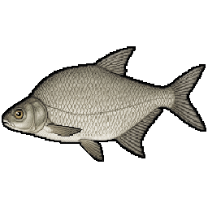 Лещ | `bream` | 300 г – 4 кг | 900 г | 25–55 см | озеро 1.1, река 1.0, пруд 0.9, болото 0.4 | — |
| 2 | 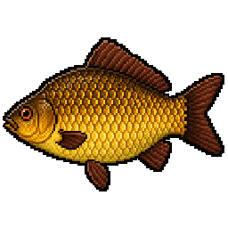 Карась | `crucian_carp` | 50 г – 1.5 кг | 250 г | 10–38 см | пруд 1.2, болото 1.1, озеро 1.0, река 0.5, лужа 0.3 | — |
| 3 | 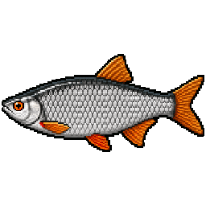 Плотва | `roach` | 50 г – 1 кг | 120 г | 10–40 см | река 1.0, озеро 1.0, пруд 0.7, болото 0.4 | — |
| 4 | 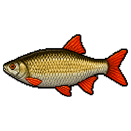 Краснопёрка | `rudd` | 50 г – 1 кг | 110 г | 10–40 см | озеро 1.1, болото 1.0, пруд 0.9, река 0.6 | — |
| 5 | 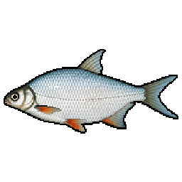 Густера | `white_bream` | 100 г – 1.2 кг | 300 г | 12–35 см | река 1.0, озеро 1.0, пруд 0.6, болото 0.3 | — |
| 6 | 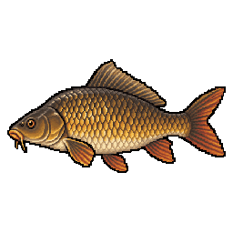 Карп | `carp` | 1 кг – 15 кг | 3.5 кг | 35–100 см | озеро 1.2, пруд 1.1, река 0.6, болото 0.4 | 3 |
| 7 | 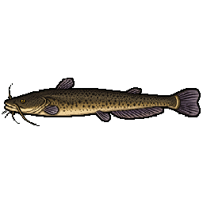 Сом | `catfish` | 2 кг – 120 кг | 7 кг | 60–260 см | река 1.1, озеро 1.0, болото 0.3, пруд 0.2 | 6 |
| 8 | 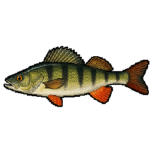 Окунь | `perch` | 50 г – 2 кг | 250 г | 10–45 см | озеро 1.1, река 1.0, пруд 0.8, болото 0.5 | — |
| 9 | 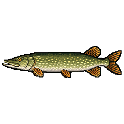 Щука | `pike` | 500 г – 10 кг | 2 кг | 35–120 см | озеро 1.1, река 1.0, болото 0.7, пруд 0.6 | 4 |
| 10 | 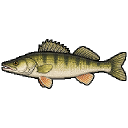 Судак | `zander` | 500 г – 6 кг | 1.5 кг | 35–90 см | река 1.1, озеро 1.0, пруд 0.3, болото 0.2 | 4 |
| 11 | 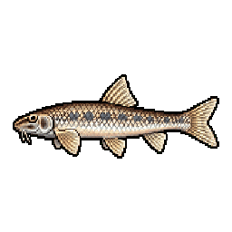 Пескарь | `gudgeon` | 20 г – 150 г | 60 г | 8–20 см | река 1.2, озеро 0.3, пруд 0.2 | — |
| 12 | 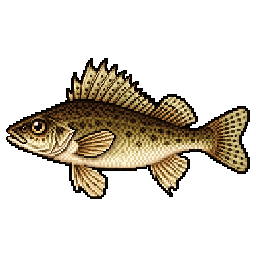 Ёрш | `ruffe` | 20 г – 150 г | 60 г | 8–20 см | озеро 1.1, река 1.0, пруд 0.4, болото 0.2 | — |
| 13 | 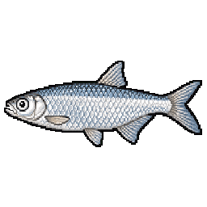 Уклейка | `bleak` | 10 г – 100 г | 30 г | 6–18 см | река 1.1, озеро 1.0, пруд 0.5 | — |
| 14 | 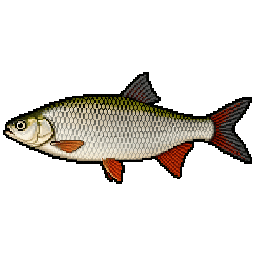 Язь | `ide` | 300 г – 3 кг | 800 г | 25–60 см | река 1.2, озеро 0.7, пруд 0.2, болото 0.1 | 2 |
| 15 | 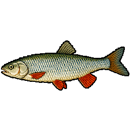 Голавль | `chub` | 200 г – 4 кг | 700 г | 20–60 см | река 1.2 | 3 |
| 16 | 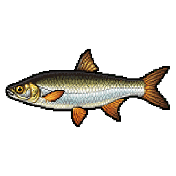 Жерех | `asp` | 500 г – 8 кг | 2 кг | 30–90 см | река 1.2 | 5 |
| 17 | 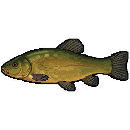 Линь | `tench` | 300 г – 3.5 кг | 800 г | 20–60 см | пруд 1.2, болото 1.2, озеро 1.0, река 0.2 | 2 |
| 18 | 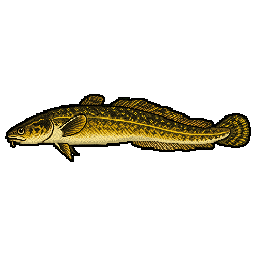 Налим | `burbot` | 500 г – 8 кг | 1.5 кг | 30–100 см | река 1.1, озеро 0.9, пруд 0.1 | 4 |
| 19 | 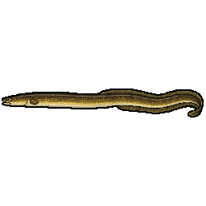 Угорь | `eel` | 300 г – 4 кг | 900 г | 40–130 см | озеро 1.1, река 0.9, пруд 0.6, болото 0.4 | 5 |
| 20 | 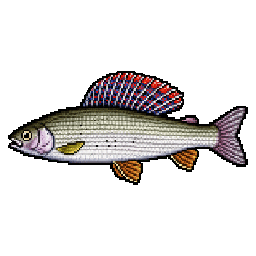 Хариус | `grayling` | 150 г – 2.5 кг | 500 г | 18–55 см | река 1.3, озеро 0.4 | 3 |
| 21 | 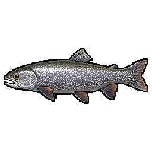 Форель | `trout` | 300 г – 5 кг | 1 кг | 25–80 см | река 1.2, озеро 0.8, пруд 0.2 | 5 |
| 22 | 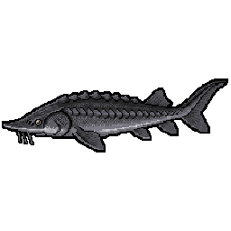 Стерлядь | `sterlet` | 1 кг – 16 кг | 3 кг | 40–125 см | река 1.2 | 8 |
| 23 | 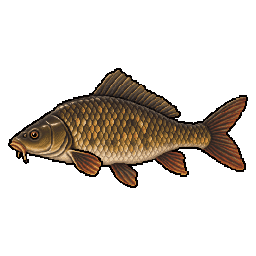 Сазан | `wild_carp` | 1.5 кг – 18 кг | 4.2 кг | 40–110 см | река 1.3, озеро 0.9, пруд 0.5, болото 0.3 | 4 |
| 24 | 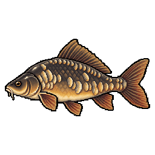 Зеркальный карп | `mirror_carp` | 1 кг – 14 кг | 3.2 кг | 33–95 см | озеро 1.2, пруд 1.2, река 0.5, болото 0.4 | 3 |
| 25 | 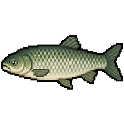 Белый амур | `grass_carp` | 1.5 кг – 25 кг | 5 кг | 40–120 см | озеро 1.3, пруд 1.2, река 0.7, болото 0.6 | 4 |
| 26 | 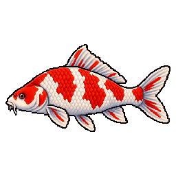 Кои Кохаку | `carp_koi_kohaku` | 800 г – 8 кг | 2.5 кг | 25–90 см | пруд 1.0, озеро 1.0, река 0.4 | 3 |
| 27 | 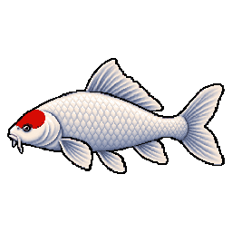 Кои Танчо Санке | `carp_koi_tancho_sanke` | 800 г – 8 кг | 2.5 кг | 25–90 см | пруд 1.0, озеро 1.0, река 0.4 | 3 |
| 28 | 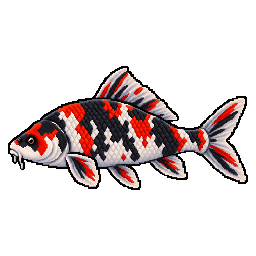 Кои Сёва Санке | `carp_koi_showa_sanke` | 800 г – 8 кг | 2.5 кг | 25–90 см | пруд 1.0, озеро 1.0, река 0.4 | 3 |
| 29 | 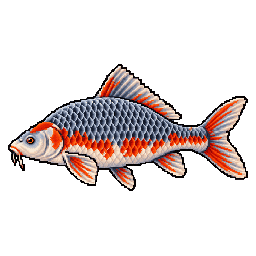 Кои Асаги | `carp_koi_asagi` | 800 г – 8 кг | 2.5 кг | 25–90 см | пруд 1.0, озеро 1.0, река 0.4 | 3 |
| 30 | 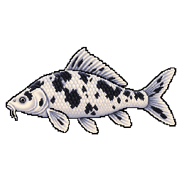 Кои Бекко | `carp_koi_bekko` | 800 г – 8 кг | 2.5 кг | 25–90 см | пруд 1.0, озеро 1.0, река 0.4 | 3 |
| 31 | 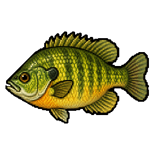 Блюгилл | `bluegill` | 40 г – 800 г | 150 г | 8–35 см | пруд 1.3, озеро 1.2, река 0.6, болото 0.4 | — |
| 32 | 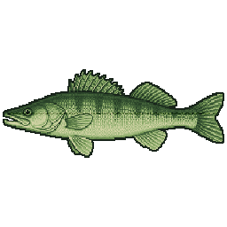 Большеротый бас | `largemouth_bass` | 400 г – 8 кг | 1.5 кг | 25–75 см | озеро 1.3, пруд 1.1, болото 0.8, река 0.7 | 3 |
| 33 | 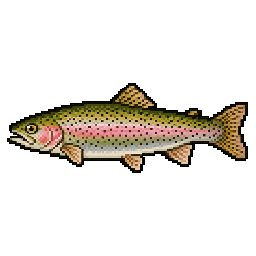 Радужная форель | `rainbow_trout` | 300 г – 6 кг | 1.1 кг | 25–85 см | река 1.3, озеро 0.9, пруд 0.2 | 4 |
| 34 | 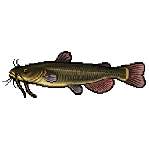 Канальный сомик | `channel_catfish` | 800 г – 18 кг | 3.5 кг | 35–110 см | река 1.2, озеро 1.0, пруд 0.6, болото 0.5 | 5 |
| 35 | 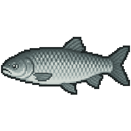 Толстолобик | `silver_carp` | 2 кг – 25 кг | 6 кг | 50–120 см | озеро 1.3, пруд 0.9, река 0.8, болото 0.2 | 6 |
| 36 | 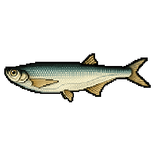 Чехонь | `sabrefish` | 150 г – 1.5 кг | 400 г | 20–60 см | река 1.3, озеро 0.8, пруд 0.1 | 2 |
| 37 | 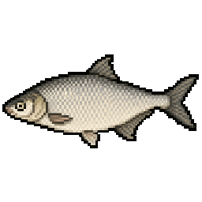 Синец | `blue_bream` | 150 г – 800 г | 350 г | 15–45 см | река 1.1, озеро 1.0, пруд 0.3, болото 0.2 | 2 |
| 38 | 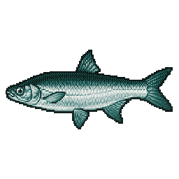 Скумбрия | `mackerel` | 300 г – 2 кг | 600 г | 25–60 см | море 1.2 | 4 |
| 39 | 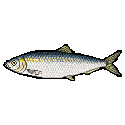 Сельдь | `herring` | 100 г – 600 г | 250 г | 15–40 см | море 1.3 | 4 |
| 40 | 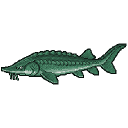 Сарган | `garfish` | 300 г – 1.5 кг | 600 г | 40–95 см | море 1.1 | 4 |
| 41 | 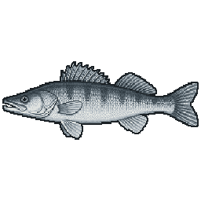 Лаврак | `seabass` | 500 г – 8 кг | 1.5 кг | 30–90 см | море 1.2 | 5 |
| 42 | 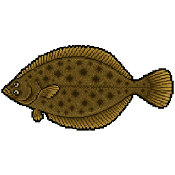 Камбала | `flounder` | 300 г – 4 кг | 900 г | 20–60 см | море 1.2 | 4 |
| 43 | 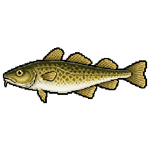 Треска | `cod` | 2 кг – 40 кг | 6 кг | 50–150 см | море 1.2 | 6 |
| 44 | 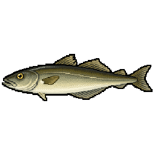 Сайда | `saithe` | 1 кг – 15 кг | 3 кг | 40–110 см | море 1.1 | 5 |
| 45 | 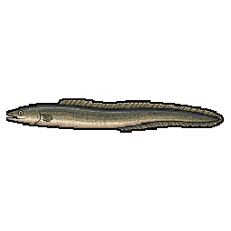 Морской угорь | `conger` | 3 кг – 60 кг | 9 кг | 80–250 см | море 1.1 | 7 |
| 46 | 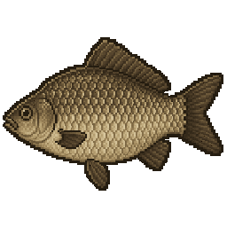 Скат | `ray` | 2 кг – 50 кг | 8 кг | 40–180 см | море 1.1 | 6 |
| 47 | 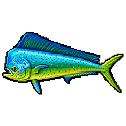 Махи-махи | `mahi` | 2 кг – 20 кг | 5 кг | 50–160 см | море 1.1 | 7 |
| 48 | 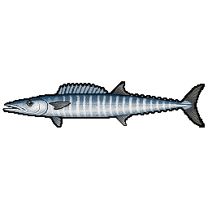 Ваху | `wahoo` | 5 кг – 40 кг | 12 кг | 80–210 см | море 1.0 | 7 |
| 49 | 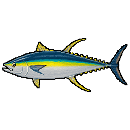 Желтопёрый тунец | `yellowfin_tuna` | 10 кг – 150 кг | 30 кг | 90–220 см | море 1.0 | 7 |
| 50 | 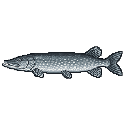 Барракуда | `barracuda` | 2 кг – 20 кг | 6 кг | 60–180 см | море 1.1 | 6 |
| 51 |  Голубой марлин | `blue_marlin` | 50 кг – 400 кг | 110 кг | 200–450 см | море 1.0 | 7 |
| 52 |  Парусник | `sailfish` | 20 кг – 80 кг | 35 кг | 150–320 см | море 1.0 | 7 |
| 53 |  Меч-рыба | `swordfish` | 30 кг – 300 кг | 80 кг | 150–400 см | море 1.0 | 7 |
| 54 |  Акула-мако | `mako` | 20 кг – 200 кг | 60 кг | 150–380 см | море 1.0 | 7 |
| 55 |  Ротан | `rotan` | 20 г – 600 г | 90 г | 8–35 см | пруд 1.3, болото 1.3, лужа 1.0, озеро 0.4, река 0.2 | — |
| 56 |  Подуст | `nase` | 100 г – 1 кг | 400 г | 15–45 см | река 1.3, озеро 0.1 | 2 |
| 57 |  Рыбец | `vimba` | 200 г – 1.5 кг | 700 г | 20–50 см | река 1.2, озеро 0.3, море 0.2 | 3 |
| 58 |  Корюшка | `smelt` | 20 г – 250 г | 60 г | 10–30 см | море 1.2, река 0.3, озеро 0.2 | 1 |
| 59 |  Сиг | `whitefish` | 300 г – 4 кг | 1 кг | 25–70 см | озеро 1.3, река 0.5, пруд 0.1 | 4 |
| 60 |  Голец | `char` | 300 г – 6 кг | 1.2 кг | 25–85 см | озеро 1.1, река 1.0, море 0.2, пруд 0.1 | 5 |
| 61 |  Ленок | `lenok` | 500 г – 6 кг | 1.5 кг | 30–90 см | река 1.2, озеро 0.4 | 5 |
| 62 |  Таймень | `taimen` | 3 кг – 60 кг | 11 кг | 60–180 см | река 1.3, озеро 0.4 | 8 |
| 63 |  Сёмга | `salmon` | 1.5 кг – 25 кг | 5 кг | 50–130 см | река 1.1, море 1.0, озеро 0.2 | 6 |
| 64 |  Горбуша | `pink_salmon` | 800 г – 3.5 кг | 1.4 кг | 35–70 см | море 1.1, река 1.0, озеро 0.1 | 3 |
| 65 |  Осётр | `sturgeon` | 5 кг – 150 кг | 22 кг | 80–250 см | река 1.2, озеро 0.6, море 0.3 | 9 |
| 66 |  Палтус | `halibut` | 2 кг – 200 кг | 18 кг | 50–250 см | море 1.2 | 9 |
| 67 |  Елец | `common_dace` | 20 г – 1 кг | 150 г | 15–40 см | река 1.3, озеро 0.2 | — |
| 68 |  Берш | `volga_zander` | 100 г – 2 кг | 450 г | 20–40 см | река 1.3, озеро 0.6 | 3 |
| 69 |  Белоглазка | `white_eye_bream` | 50 г – 1.3 кг | 300 г | 15–35 см | река 1.3, озеро 0.3 | 2 |
| 70 |  Бычок-кругляк | `round_goby` | 10 г – 380 г | 100 г | 10–35 см | море 1.1, река 1.0, озеро 0.6, пруд 0.2 | — |
| 71 |  Луфарь | `bluefish` | 400 г – 14 кг | 2 кг | 30–110 см | море 1.2 | 6 |
| 72 |  Глазчатый змееголов | `bullseye_snakehead` | 400 г – 8 кг | 1.5 кг | 30–90 см | озеро 1.2, пруд 1.1, река 1, болото 0.9 | 5 |
| 73 |  Каранкс | `jack_crevalle` | 800 г – 30 кг | 4.5 кг | 35–120 см | море 1.2, река 0.5, болото 0.3 | 7 |
| 74 |  Цихлазома майя | `mayan_cichlid` | 80 г – 1.2 кг | 300 г | 12–35 см | озеро 1.2, пруд 1.1, река 1, болото 0.9 | 3 |
| 75 |  Астронотус | `oscar` | 150 г – 1.6 кг | 450 г | 15–40 см | озеро 1.2, пруд 1.1, река 1, болото 0.9 | 3 |
| 76 |  Павлиний окунь | `peacock_bass` | 300 г – 12 кг | 1.8 кг | 25–75 см | озеро 1.2, пруд 1.1, река 1, болото 0.9 | 5 |
| 77 |  Снук | `snook` | 700 г – 25 кг | 3.5 кг | 35–140 см | море 1.2, река 0.5, болото 0.3 | 7 |
| 78 |  Полосатый лаврак | `striped_bass` | 500 г – 35 кг | 4 кг | 30–130 см | море 1.2, река 0.5, болото 0.3 | 6 |
| 79 |  Тарпон | `tarpon` | 5 кг – 130 кг | 30 кг | 90–250 см | море 1.2, река 0.5, болото 0.3 | 9 |

## Идеальная снасть

Совпало — и вес поклёвки резко идёт вверх; чем крупнее рыба, тем резче. См. [коэффициент соответствия](fishing-mechanics.md#коэффициент-соответствия-m--твоя-снасть).

| Вид | Лучшие наживки (оценка) | Идеальные удилища | Идеальные оснастки | Крючок | Катушка | Леска | Прикормка | Поводок |
|---|---|---|---|---|---|---|---|---|
| Лещ | maggot 1.0, worm 0.9, pearl_barley 0.8, mormyshka 0.7, corn 0.6, bread 0.4, boilie 0.3 | bottom, feeder | feeder, flat_feeder, float | №10 ±2 | 4000 ±1000 | braid 0.1 ±0.04 | cake, grain, powder | — |
| Карась | worm 1.0, dough 0.9, maggot 0.8, corn 0.6, bread 0.5 | feeder, pole | feeder, float | №12 ±2 | 2000 ±1000 | mono 0.18 ±0.06 | cake, grain | — |
| Плотва | maggot 1.0, mormyshka 0.9, bloodworm 0.9, dough 0.7, bread 0.5 | pole, ultralight | float | №14 ±2 | 2000 ±1000 | mono 0.14 ±0.04 | cake, powder | — |
| Краснопёрка | bread 1.0, dough 0.9, maggot 0.8 | pole | float | №14 ±2 | 1000 ±1000 | mono 0.14 ±0.04 | cake, powder | — |
| Густера | maggot 1.0, worm 0.9, bloodworm 0.7 | feeder | feeder, float | №12 ±2 | 3000 ±1000 | braid 0.1 ±0.04 | cake, powder | — |
| Карп | boilie 1.0, corn 0.8, pea 0.6, pearl_barley 0.5 | carp | carp, flat_feeder | №6 ±2 | 6000 ±1000 | mono 0.3 ±0.08 | cake, pellet | — |
| Сом | livebait 1.0, chicken_liver 1.0, jig 0.85, worm 0.7, boilie 0.6 | bottom | catfish, grusha | №4 ±2 | 7000 ±1000 | braid 0.18 ±0.04 | cake | — |
| Окунь | crankbait 1.0, silicone 0.95, mormyshka 0.9, livebait 0.9, spinner 0.9, jig 0.8, popper 0.7, worm 0.6 | spinning, ultralight | predator | №8 ±3 | 3000 ±1000 | braid 0.1 ±0.04 | — | — |
| Щука | wobbler 1.0, spoon 0.95, livebait 0.9, crankbait 0.9, spinner 0.9, jig 0.85, popper 0.7 | spinning | predator | №4 ±2 | 3000 ±1000 | braid 0.14 ±0.04 | — | **да** |
| Судак | silicone 1.0, livebait 0.95, jig 0.95, crankbait 0.85, wobbler 0.8 | spinning | predator | №4 ±2 | 3000 ±1000 | braid 0.12 ±0.04 | — | **да** |
| Пескарь | bloodworm 1.0, mormyshka 0.9, worm 0.9, maggot 0.8 | pole, stick, ultralight | float, primitive | №16 ±2 | 1000 ±1000 | mono 0.14 ±0.04 | powder | — |
| Ёрш | mormyshka 1.0, worm 1.0, bloodworm 1.0, maggot 0.7 | feeder, pole | feeder, float | №14 ±2 | 2000 ±1000 | mono 0.14 ±0.04 | powder | — |
| Уклейка | maggot 1.0, bread 0.9, mormyshka 0.8, dough 0.8, bloodworm 0.7 | pole, stick, ultralight | float, primitive | №16 ±2 | 1000 ±1000 | mono 0.14 ±0.04 | powder | — |
| Язь | worm 1.0, popper 0.9, maggot 0.8, corn 0.8, bread 0.7, crankbait 0.7, pea 0.6 | feeder, pole, ultralight | feeder, float | №10 ±2 | 3000 ±1000 | mono 0.18 ±0.05 | cake, grain | — |
| Голавль | popper 1.0, wobbler 0.9, bread 0.8, spinner 0.8, crankbait 0.75, worm 0.7, castmaster 0.7, corn 0.5 | pole, spinning, ultralight | float, predator | №8 ±3 | 2000 ±1000 | mono 0.16 ±0.05 | cake | — |
| Жерех | spoon 1.0, castmaster 0.9, wobbler 0.9, popper 0.85, spinner 0.8, crankbait 0.7 | spinning | predator | №6 ±2 | 4000 ±1000 | braid 0.12 ±0.04 | — | — |
| Линь | worm 1.0, dough 0.8, corn 0.7, bread 0.6, maggot 0.6 | feeder, pole | feeder, float | №10 ±2 | 3000 ±1000 | mono 0.2 ±0.05 | cake, grain | — |
| Налим | livebait 1.0, worm 0.9, chicken_liver 0.9, jig 0.75 | bottom, feeder | feeder, ground | №6 ±2 | 4000 ±1000 | mono 0.3 ±0.08 | — | — |
| Угорь | worm 1.0, livebait 0.8, chicken_liver 0.7, jig 0.7 | bottom, feeder | feeder, ground | №8 ±2 | 4000 ±1000 | mono 0.25 ±0.06 | — | — |
| Хариус | spinner 0.95, worm 0.9, maggot 0.8, castmaster 0.8, bloodworm 0.7, crankbait 0.6 | ultralight | float, predator | №12 ±2 | 2000 ±1000 | mono 0.16 ±0.04 | — | — |
| Форель | castmaster 1.0, spinner 0.95, wobbler 0.9, crankbait 0.85, silicone 0.7, worm 0.6 | spinning, ultralight | float, predator | №8 ±2 | 2000 ±1000 | fluoro 0.2 ±0.05 | — | — |
| Стерлядь | worm 1.0, bloodworm 0.7, maggot 0.5 | bottom, carp | catfish, ground | №6 ±2 | 6000 ±1000 | braid 0.14 ±0.04 | cake | — |
| Сазан | boilie 1.0, corn 0.85, pea 0.7, pearl_barley 0.55 | bottom, carp | carp, flat_feeder | №4 ±2 | 6000 ±1000 | mono 0.3 ±0.07 | cake, pellet | — |
| Зеркальный карп | boilie 1.0, corn 0.8, pea 0.6, pearl_barley 0.5 | carp | carp, flat_feeder | №6 ±2 | 6000 ±1000 | mono 0.3 ±0.08 | cake, pellet | — |
| Белый амур | corn 1.0, bread 0.9, dough 0.8, pea 0.7, boilie 0.5 | carp, feeder | carp, flat_feeder | №6 ±2 | 6000 ±1000 | mono 0.3 ±0.08 | cake, pellet | — |
| Кои Кохаку | boilie 1.0, corn 0.8, pea 0.6, bread 0.6 | carp | carp | №6 ±2 | 6000 ±1000 | mono 0.3 ±0.08 | cake, pellet | — |
| Кои Танчо Санке | boilie 1.0, corn 0.8, pea 0.6, bread 0.6 | carp | carp | №6 ±2 | 6000 ±1000 | mono 0.3 ±0.08 | cake, pellet | — |
| Кои Сёва Санке | boilie 1.0, corn 0.8, pea 0.6, bread 0.6 | carp | carp | №6 ±2 | 6000 ±1000 | mono 0.3 ±0.08 | cake, pellet | — |
| Кои Асаги | boilie 1.0, corn 0.8, pea 0.6, bread 0.6 | carp | carp | №6 ±2 | 6000 ±1000 | mono 0.3 ±0.08 | cake, pellet | — |
| Кои Бекко | boilie 1.0, corn 0.8, pea 0.6, bread 0.6 | carp | carp | №6 ±2 | 6000 ±1000 | mono 0.3 ±0.08 | cake, pellet | — |
| Блюгилл | worm 1.0, maggot 0.9, bloodworm 0.8, corn 0.5 | bamboo, pole, stick, ultralight | float | №12 ±3 | 1000 ±1000 | mono 0.12 ±0.05 | grain | — |
| Большеротый бас | popper 1.2, wobbler 1.0, silicone 0.95, jig 0.9, crankbait 0.9, livebait 0.8, spinner 0.7 | spinning, ultralight | predator | №4 ±3 | 3000 ±1000 | braid 0.16 ±0.05 | — | — |
| Радужная форель | spinner 1.0, castmaster 0.95, wobbler 0.85, crankbait 0.8, silicone 0.7, worm 0.6 | spinning, ultralight | float, predator | №8 ±2 | 2000 ±1000 | fluoro 0.18 ±0.05 | — | — |
| Канальный сомик | livebait 1.1, chicken_liver 1.0, worm 0.8, maggot 0.6, boilie 0.5 | bottom, carp, feeder | catfish, grusha | №2 ±2 | 5000 ±1000 | mono 0.35 ±0.08 | pellet | — |
| Толстолобик | pearl_barley 0.5, corn 0.4, boilie 0.3 | bottom, carp | carp, flat_feeder | №6 ±2 | 6000 ±1000 | mono 0.4 ±0.08 | powder | — |
| Чехонь | castmaster 1.0, maggot 0.9, worm 0.8, spinner 0.8, bloodworm 0.7, silicone 0.6 | feeder, spinning, ultralight | float, predator | №10 ±3 | 3000 ±1000 | mono 0.16 ±0.05 | — | — |
| Синец | bloodworm 1.0, maggot 0.85, worm 0.7, pearl_barley 0.5 | bamboo, feeder, pole | flat_feeder, float | №12 ±3 | 3000 ±1000 | mono 0.14 ±0.05 | grain, powder | — |
| Скумбрия | castmaster 1.0, spinner 0.9, silicone 0.8, fish_strip 0.6 | sea_spin, spinning | predator | №6 ±3 | 5000 ±2000 | braid 0.2 ±0.06 | — | — |
| Сельдь | fish_strip 0.8, bloodworm 0.7, maggot 0.6, castmaster 0.5 | sea_spin, spinning, surf | float, predator | №10 ±3 | 5000 ±2000 | mono 0.18 ±0.06 | — | — |
| Сарган | fish_strip 1.0, spinner 0.7, castmaster 0.7, silicone 0.5 | sea_spin | predator | №8 ±3 | 5000 ±2000 | mono 0.2 ±0.06 | — | — |
| Лаврак | wobbler 1.0, silicone 0.95, livebait 0.9, popper 0.8, fish_strip 0.7 | sea_spin, surf | predator | №4 ±2 | 6000 ±2000 | braid 0.25 ±0.06 | — | — |
| Камбала | fish_strip 1.0, worm 0.9, maggot 0.5 | boat, bottom, surf | catfish, grusha | №6 ±2 | 8000 ±2000 | mono 0.3 ±0.08 | — | — |
| Треска | fish_strip 1.0, jig 0.95, livebait 0.9, silicone 0.7 | boat, surf | catfish, grusha | №2 ±2 | 10000 ±2000 | braid 0.3 ±0.08 | — | — |
| Сайда | jig 1.0, silicone 0.8, fish_strip 0.7, castmaster 0.7 | boat, sea_spin | predator | №4 ±2 | 10000 ±2000 | braid 0.25 ±0.06 | — | — |
| Морской угорь | fish_strip 1.0, livebait 1.0, worm 0.4 | boat, surf | catfish | №1 ±2 | 12000 ±2000 | mono 0.5 ±0.1 | — | **да** |
| Скат | fish_strip 1.0, worm 0.7, livebait 0.6 | boat, surf | catfish, grusha | №2 ±2 | 12000 ±2000 | mono 0.5 ±0.1 | — | — |
| Махи-махи | wobbler 1.0, popper 0.9, silicone 0.8, fish_strip 0.6 | sea_spin, trolling | predator | №2 ±2 | 10000 ±2000 | braid 0.3 ±0.08 | — | — |
| Ваху | wobbler 1.0, castmaster 0.8, silicone 0.7 | trolling | predator | №1 ±2 | 12000 ±2000 | braid 0.4 ±0.08 | — | **да** |
| Желтопёрый тунец | wobbler 0.9, livebait 0.9, fish_strip 0.8, silicone 0.7 | boat, trolling | predator | №1 ±1 | 14000 ±2000 | braid 0.4 ±0.08 | — | — |
| Барракуда | wobbler 1.0, silicone 0.9, spinner 0.7, fish_strip 0.6 | sea_spin, trolling | predator | №2 ±2 | 9000 ±2000 | braid 0.3 ±0.08 | — | **да** |
| Голубой марлин | wobbler 1.0, silicone 0.6 | trolling | predator | №1 ±1 | 14000 ±1000 | braid 0.4 ±0.06 | — | — |
| Парусник | wobbler 1.0, popper 0.8, silicone 0.7 | sea_spin, trolling | predator | №1 ±2 | 12000 ±2000 | braid 0.3 ±0.08 | — | — |
| Меч-рыба | livebait 1.0, fish_strip 0.9, wobbler 0.6 | boat, trolling | catfish, predator | №1 ±1 | 14000 ±1000 | mono 0.5 ±0.08 | — | — |
| Акула-мако | livebait 1.0, fish_strip 0.9, wobbler 0.7 | boat, trolling | catfish, predator | №1 ±1 | 14000 ±1000 | braid 0.4 ±0.06 | — | **да** |
| Ротан | worm 1.0, bloodworm 0.9, maggot 0.8, livebait 0.7, silicone 0.6, chicken_liver 0.6 | pole, stick, ultralight | float, primitive | №12 ±4 | без катушки | mono 0.18 ±0.08 | — | — |
| Подуст | maggot 1.0, worm 0.8, bloodworm 0.8, pearl_barley 0.7 | feeder, pole | feeder, float | №12 ±3 | 2500 ±1500 | mono 0.16 ±0.05 | powder | — |
| Рыбец | worm 1.0, maggot 0.9, bloodworm 0.8, pea 0.5 | bottom, feeder | feeder, float | №10 ±3 | 3500 ±1500 | mono 0.2 ±0.05 | grain | — |
| Корюшка | bloodworm 1.0, mormyshka 0.9, fish_strip 0.8, worm 0.7 | pole, ultralight, winter | float, winter | №16 ±4 | без катушки | mono 0.12 ±0.05 | — | — |
| Сиг | bloodworm 1.0, mormyshka 0.9, maggot 0.8, worm 0.6 | feeder, ultralight, winter | feeder, float, winter | №10 ±3 | 2500 ±1500 | fluoro 0.18 ±0.05 | — | — |
| Голец | spinner 1.0, spoon 0.9, castmaster 0.9, wobbler 0.7, worm 0.6 | spinning, ultralight | predator | №8 ±2 | 2500 ±1000 | fluoro 0.2 ±0.05 | — | — |
| Ленок | wobbler 1.0, spinner 0.9, spoon 0.9, crankbait 0.8, worm 0.5 | spinning, ultralight | predator | №6 ±2 | 3000 ±1000 | braid 0.14 ±0.05 | — | — |
| Таймень | wobbler 1.0, spoon 0.9, popper 0.85, livebait 0.8, crankbait 0.8 | spinning, trolling | predator | №2 ±2 | 6000 ±2000 | braid 0.35 ±0.08 | — | **да** |
| Сёмга | spoon 1.0, wobbler 0.9, spinner 0.8, fish_strip 0.5 | sea_spin, spinning | predator | №4 ±2 | 5000 ±2000 | braid 0.25 ±0.06 | — | — |
| Горбуша | spoon 1.0, spinner 0.9, castmaster 0.8, fish_strip 0.5 | sea_spin, spinning, ultralight | predator | №6 ±2 | 3500 ±1500 | braid 0.18 ±0.05 | — | — |
| Осётр | chicken_liver 1.0, worm 0.9, livebait 0.7, boilie 0.5 | bottom, carp | catfish, grusha | №1 ±2 | 9000 ±3000 | braid 0.45 ±0.1 | pellet | — |
| Палтус | fish_strip 1.0, livebait 0.9, silicone 0.8, jig 0.7 | boat, surf | catfish, predator | №1 ±3 | 11000 ±3000 | braid 0.5 ±0.1 | — | — |
| Елец | maggot 1.0, worm 0.9, bread 0.7, bloodworm 0.65, dough 0.6, spinner 0.4 | pole, stick, ultralight | float, primitive | №14 ±2 | 1000 ±1000 | mono 0.14 ±0.04 | powder | — |
| Берш | silicone 1.0, jig 0.95, livebait 0.9, worm 0.7, crankbait 0.6, wobbler 0.55 | spinning, ultralight | predator | №6 ±2 | 2000 ±1000 | braid 0.1 ±0.04 | — | — |
| Белоглазка | worm 1.0, maggot 0.95, bloodworm 0.85, pearl_barley 0.5, corn 0.4 | bottom, feeder | feeder, float | №12 ±3 | 3500 ±1500 | mono 0.18 ±0.05 | grain, powder | — |
| Бычок-кругляк | worm 1.0, fish_strip 0.9, bloodworm 0.7, maggot 0.6, silicone 0.5 | bottom, feeder, ultralight | feeder, primitive | №8 ±3 | 3000 ±2000 | mono 0.2 ±0.06 | — | — |
| Павлиний окунь | wobbler 1.2, popper 1.15, crankbait 1, silicone 0.95, spinner 0.9, livebait 0.85, jig 0.8 | spinning, ultralight | predator | №4 ±3 | 3000 ±1000 | braid 0.2 ±0.05 | — | — |
| Глазчатый змееголов | livebait 1.2, silicone 1.05, popper 1, wobbler 0.95, jig 0.85, worm 0.6 | spinning | predator | №2 ±3 | 3000 ±1000 | braid 0.22 ±0.06 | — | — |
| Цихлазома майя | worm 1.2, bloodworm 1, maggot 1, silicone 0.8, bread 0.7 | pole, ultralight | float, predator | №10 ±3 | 1500 ±1000 | mono 0.14 ±0.04 | — | — |
| Астронотус | worm 1.2, livebait 1.1, maggot 0.9, silicone 0.9, jig 0.8 | spinning, ultralight | float, predator | №8 ±3 | 2000 ±1000 | mono 0.16 ±0.04 | — | — |
| Полосатый лаврак | livebait 1.2, fish_strip 1.1, wobbler 1, silicone 0.95, spoon 0.9, jig 0.85 | boat, sea_spin, surf | ground, predator | №2 ±2 | 7000 ±2000 | braid 0.3 ±0.08 | — | — |
| Луфарь | spoon 1.2, castmaster 1.15, fish_strip 1.1, wobbler 1, livebait 0.9, silicone 0.9 | boat, sea_spin, surf | predator | №2 ±2 | 6000 ±2000 | braid 0.28 ±0.07 | — | **yes** |
| Каранкс | popper 1.25, castmaster 1.1, spoon 1.1, livebait 1, silicone 1, wobbler 0.95 | boat, sea_spin, surf | predator | №1 ±2 | 8000 ±2000 | braid 0.35 ±0.08 | — | — |
| Тарпон | livebait 1.3, fish_strip 1.1, popper 1, silicone 1, jig 0.9 | boat, sea_spin, surf | catfish, predator | №1 ±2 | 10000 ±3000 | braid 0.45 ±0.1 | — | — |
| Снук | livebait 1.25, silicone 1.1, wobbler 1.05, popper 1, jig 0.9, fish_strip 0.85 | sea_spin, spinning, surf | predator | №2 ±2 | 6000 ±2000 | braid 0.3 ±0.08 | — | — |

## Заметки по видам

### Пятеро кои

Кои Кохаку, Кои Танчо Санке, Кои Сёва Санке, Кои Асаги и Кои Бекко — это **скрытая коллекция**, а не обычная рыба. В их профиле `base` равен **0.0**, поэтому из обычного пула поклёвок они не выпадают никогда.

Вместо этого каждый раз, когда вы берёте **карпа, зеркального карпа или сазана на карповую оснастку**, есть шанс, что улов окажется кои:

- **0.5 %** где угодно
- **35 %** в биоме вишнёвой рощи

Единственная указанная у них группа биомов — `cherry`, так что пруд в вишнёвой роще — единственное место, где им вообще положено быть. У всех пятерых характеристики одинаковые (800 г – 8 кг, медиана 2.5 кг, 25–90 см, манера боя `burst`, уровень 3).

Кои **не идут в зачёт по числу видов**: ни в ступенчатых достижениях на «N видов», ни в *Полном бестиарии* — у них свои испытания, *Живая драгоценность* и *Коллекционер кои*. Пустить кои на филе можно: ваше имя уйдёт в чат сервера с подписью *«ты серьёзно её на филе пустил?»*, а следом придёт достижение *Бессердечный повар*.

### Легендарные экземпляры

У семи видов спрятан один именной экземпляр — один на весь сервер. Вся механика — в [Механике рыбалки](fishing-mechanics.md#легендарные-рыбы).

| Вид | Имя | Вес | Шанс |
|---|---|---|---|
| Щука | Царица Коряг | 14 кг | 0.6 % |
| Сазан | Дед Сазан | 17.5 кг | 0.6 % |
| Сом | Хозяин Ямы | 150 кг | 0.5 % |
| Желтопёрый тунец | Старый Хребет | 140 кг | 0.6 % |
| Голубой марлин | Левиафан | 380 кг | 0.8 % |
| Осётр | Царь-рыба | 145 кг | 0.4 % |
| Акула-мако | Мегалодон | 390 кг | 0.4 % |
| Палтус | Демон Бездны | 250 кг | 0.4 % |

Четыре из них **тяжелее обычного максимума своего вида**: щука (14 кг против потолка в 10 кг), сом (150 кг против 120 кг), палтус (250 кг против 200 кг) и особенно мако (390 кг против 200 кг). Легендарная рыба и правда выходит за тот размер, до которого иначе не добраться.

### Необычные профили

**Толстолобик** — планктонофаг-фильтратор и единственный вид, у которого *лучшая* наживка оценена всего в **0.5** (перловка). Скорость поклёвки напрямую зависит от оценки наживки, так что толстолобик берёт медленно всегда, что бы вы ни делали; решают сыпучая прикормка и тонкая леска. Уровень 6 и неутомимый боец на 25 кг.

**Ротан** и **Корюшка** — единственные два вида, у которых идеальный `reel_size` равен **0**: они прямо предпочитают удочку без катушки. С катушкой соответствующий компонент даёт 0.6 вместо 1.0. Ротан вдобавок единственный вид с реальным присутствием в **луже** (1.0) — он и правда живёт в любой канаве, потому с него все и начинают. У корюшки — единственный в моде порог в **1 уровень**.

**Налим** — самая зажатая условиями рыба в моде: `summer: 0.0` **и** `day: 0.0`. Он существует только холодными ночами, с пиком зимой (1.6) и ночью (1.5). Собственное достижение *Король зимней ночи* появилось именно из-за этого.

**Уклейка** и **Пескарь** — `night: 0.0`. С темнотой они перестают клевать полностью.

**Скат** — один рывок, манера `steady` и агрессия 0.2, но сила 0.95 на диапазоне 2–50 кг. Он не борется, он просто тяжёлый. В профиле это описано как подъём плиты морского дна.

**Большеротый бас** (popper 1.2) и **Канальный сомик** (livebait 1.1) — единственные виды с оценкой наживки выше 1.0: любимая наживка даёт небольшой бонус сверх идеального совпадения.

**Голавль, Жерех, Стерлядь** живут **только в реке** (`river` 1.2, все остальные водоёмы — 0). В озере их не будет, что бы вы ни делали.

**Бычок-кругляк** — единственный вид, которому одинаково хорошо в солёной и в пресной воде: `sea` 1.1 и `river` 1.0, плюс озеро 0.6 и пруд 0.2.

**Полупроходные и проходные** — у шести видов рядом с пресной водой стоит ненулевой коэффициент `sea`: Рыбец (0.2), Корюшка (1.2 море / 0.3 река), Голец (0.2), Сёмга (1.1 река / 1.0 море), Горбуша (1.1 море / 1.0 река) и Осётр (0.3). Настоящие ходовые рыбы тут — сёмга и горбуша: у сёмги пик осенью (1.4), у горбуши летом (1.5).

**Белый амур** — гигант-вегетарианец: corn 1.0, bread 0.9, dough 0.8, и единственный «карп», который держится вполводы (`mid`), а не у дна. Манера `relentless`: у подсачека он упирается ровно так же, как на подсечке.

**Виды под зимнюю удочку** — зимняя удочка стоит в идеальной снасти только у **Корюшки** и **Сига**, и только у них указана зимняя оснастка. Всё остальное, что берут со льда, берут на снасть, которую рыба, строго говоря, не выбирала.

**Виды под удочку из палки** — Пескарь, Уклейка, Ротан, Елец и Блюгилл: пять рыб, у которых самый простой бланк указан как идеальный. **Бамбуковая удочка** встречается всего у двух — у Блюгилла и Синца.

**Виды с нулевой зимой** — у Карася, Краснопёрки, Уклейки, Голавля, Линя, Сома, Угря и Белого амура стоит `winter: 0.0`; Карп, Зеркальный карп, Сазан и Толстолобик закрыты фактически тоже (0.02–0.05). Зима — это по-настоящему другая игра.

## Смотрите также

- [Справочник по видам](species-reference.md) — жёсткие условия обитания, таблицы условий, статистика вываживания
- [Вода и условия](water-and-conditions.md) · [Механика рыбалки](fishing-mechanics.md)
- [Морская рыбалка](sea-fishing.md) · [Подлёдная рыбалка](ice-fishing.md)
- [Житель](villager.md) — какие виды покупает рыбак и за сколько
