# Species

A hundred and seven species. Every number on this page comes from that species' profile in `data/riverfishing/fish_profiles/`, which is fully datapack-overridable — see [`docs/FISH_PROFILES.md`](../FISH_PROFILES.md) for the schema.

Companion page: **[Species reference](species-reference.md)** holds the habitat gates, the season / time / weather tables and the fight statistics.

## How to read this

- **Weight (min – max)** is the species' whole possible range. **Median catch** is the profile's `mean`, and it really is the median — half your fish of that species come in under it. See [the weight roll](fishing-mechanics.md#weight).
- **Water bodies** lists every type the species lives in with its presence factor. A type not listed has a factor of 0 and the fish is **never** there.
- **Level** is `min_angler_level`. It is a soft gate: each level you are short multiplies the fish's bite weight by 0.6, floored at 3 %. A novice can fluke a trophy with the right kit in the right place — just rarely.
- **Best baits** are scored 0 to 1.3. The engine takes the single best-scoring bait on your rig. A bait not listed scores 0, and **no listed bait on the rig means the fish will not take at all**.
- Bait ids map to items as listed in [Rigs and baits](rigs-and-baits.md#natural-baits): `pearl_barley` = Pearl Barley, `bread` = Bread Crumb, `silicone` = Soft Plastic, `jig` = Soft Jig, `mormyshka` = Ice Jig, `fish_strip` = Raw Fish Fillet, `livebait` = Live Bait.

## Families

Every species is filed under one of seven families. It is the `group` field in the profile, and it is
what the [electrofisher](electrofisher.md#the-screen) lays its picker out by — a hundred and seven names in one
flat list is a list nobody reads. A datapack species that names no family is filed under **Other**, listed
and reachable but never silently mis-filed.

The family is a statement about the fish, not a shortcut derived from its numbers: an asp hunts like a
predator and is a cyprinid, and takes cyprinid [groundbait](groundbait.md) accordingly.

| Family | Species |
|---|---|
| **Carp family** (29) | Asp, Bitterling, Bleak, Blue bream, Bream, Carp, Chub, Common dace, Crucian Carp, Golden crucian, Grass Carp, Gudgeon, Ide, Kutum, Linear carp, Loach, Mirror Carp, Naked Carp, Nase, Roach, Rudd, Sabrefish, Silver carp, Sunbleak, Tench, Vimba bream, White Bream, White-eye bream, Wild Carp |
| **Predators** (20) | Bluegill, Bullseye snakehead, Burbot, Catfish, Channel catfish, Eel, Golden dorado, Largemouth bass, Mayan cichlid, Oscar, Peacock bass, Perch, Pike, Piraiba, Red piranha, Rotan, Ruffe, Sculpin, Volga zander, Zander |
| **Salmon & trout** (11) | Arctic char, Atlantic salmon, Grayling, Lenok, Nelma, Pink salmon, Rainbow trout, Smelt, Taimen, Trout, Whitefish |
| **Sturgeons** (3) | Beluga sturgeon, Sterlet, Sturgeon |
| **Koi** (6) | Koi Asagi, Koi Bekko, Koi carp, Koi Kohaku, Koi Showa Sanke, Koi Tancho Sanke |
| **Sea fish** (21) | Anglerfish, Barracuda, Blobfish, Bluefish, Cod, Conger eel, Flounder, Garfish, Herring, Jack crevalle, Mackerel, Mullet, Ocean sunfish, Pollock, Ray, Round goby, Saithe, Sea bass, Snook, Striped bass, Tubenose goby |
| **Big game** (17) | Arapaima, Black marlin, Blue marlin, Bluefin tuna, Bull shark, Frilled shark, Goliath grouper, Halibut, Mahi-mahi, Mako shark, Sailfish, Swordfish, Tarpon, Tiger shark, Wahoo, Whale shark, Yellowfin tuna |

## All species

| # | Species | Item id | Weight (min – max) | Median catch | Length | Water bodies (presence factor) | Level |
|---|---|---|---|---|---|---|---|
| 1 |  Bream | `bream` | 300 g – 4 kg | 900 g | 25–55 cm | lake 1.1, river 1.0, pond 0.9, swamp 0.4 | — |
| 2 |  Crucian Carp | `crucian_carp` | 50 g – 1.5 kg | 250 g | 10–38 cm | pond 1.2, swamp 1.1, lake 1.0, river 0.5, puddle 0.3 | — |
| 3 |  Roach | `roach` | 50 g – 1 kg | 120 g | 10–40 cm | river 1.0, lake 1.0, pond 0.7, swamp 0.4 | — |
| 4 |  Rudd | `rudd` | 50 g – 1 kg | 110 g | 10–40 cm | lake 1.1, swamp 1.0, pond 0.9, river 0.6 | — |
| 5 |  White Bream | `white_bream` | 100 g – 1.2 kg | 300 g | 12–35 cm | river 1.0, lake 1.0, pond 0.6, swamp 0.3 | — |
| 6 |  Carp | `carp` | 1 kg – 15 kg | 3.5 kg | 35–100 cm | lake 1.2, pond 1.1, river 0.6, swamp 0.4 | 3 |
| 7 |  Catfish | `catfish` | 2 kg – 120 kg | 7 kg | 60–260 cm | river 1.1, lake 1.0, swamp 0.3, pond 0.2 | 6 |
| 8 |  Perch | `perch` | 50 g – 2 kg | 250 g | 10–45 cm | lake 1.1, river 1.0, pond 0.8, swamp 0.5 | — |
| 9 |  Pike | `pike` | 500 g – 10 kg | 2 kg | 35–120 cm | lake 1.1, river 1.0, swamp 0.7, pond 0.6 | 4 |
| 10 |  Zander | `zander` | 500 g – 6 kg | 1.5 kg | 35–90 cm | river 1.1, lake 1.0, pond 0.3, swamp 0.2 | 4 |
| 11 |  Gudgeon | `gudgeon` | 20 g – 150 g | 60 g | 8–20 cm | river 1.2, lake 0.3, pond 0.2 | — |
| 12 |  Ruffe | `ruffe` | 20 g – 150 g | 60 g | 8–20 cm | lake 1.1, river 1.0, pond 0.4, swamp 0.2 | — |
| 13 |  Bleak | `bleak` | 10 g – 100 g | 30 g | 6–18 cm | river 1.1, lake 1.0, pond 0.5 | — |
| 14 |  Ide | `ide` | 300 g – 3 kg | 800 g | 25–60 cm | river 1.2, lake 0.7, pond 0.2, swamp 0.1 | 2 |
| 15 |  Chub | `chub` | 200 g – 4 kg | 700 g | 20–60 cm | river 1.2 | 3 |
| 16 |  Asp | `asp` | 500 g – 8 kg | 2 kg | 30–90 cm | river 1.2 | 5 |
| 17 |  Tench | `tench` | 300 g – 3.5 kg | 800 g | 20–60 cm | pond 1.2, swamp 1.2, lake 1.0, river 0.2 | 2 |
| 18 |  Burbot | `burbot` | 500 g – 8 kg | 1.5 kg | 30–100 cm | river 1.1, lake 0.9, pond 0.1 | 4 |
| 19 |  Eel | `eel` | 300 g – 4 kg | 900 g | 40–130 cm | lake 1.1, river 0.9, pond 0.6, swamp 0.4 | 5 |
| 20 |  Grayling | `grayling` | 150 g – 2.5 kg | 500 g | 18–55 cm | river 1.3, lake 0.4 | 3 |
| 21 |  Trout | `trout` | 300 g – 5 kg | 1 kg | 25–80 cm | river 1.2, lake 0.8, pond 0.2 | 5 |
| 22 |  Sterlet | `sterlet` | 1 kg – 16 kg | 3 kg | 40–125 cm | river 1.2 | 8 |
| 23 |  Wild Carp | `wild_carp` | 1.5 kg – 18 kg | 4.2 kg | 40–110 cm | river 1.3, lake 0.9, pond 0.5, swamp 0.3 | 4 |
| 24 |  Mirror Carp | `mirror_carp` | 1 kg – 14 kg | 3.2 kg | 33–95 cm | lake 1.2, pond 1.2, river 0.5, swamp 0.4 | 3 |
| 25 |  Grass Carp | `grass_carp` | 1.5 kg – 25 kg | 5 kg | 40–120 cm | lake 1.3, pond 1.2, river 0.7, swamp 0.6 | 4 |
| 26 |  Koi Kohaku | `carp_koi_kohaku` | 800 g – 8 kg | 2.5 kg | 25–90 cm | pond 1.0, lake 1.0, river 0.4 | 3 |
| 27 |  Koi Tancho Sanke | `carp_koi_tancho_sanke` | 800 g – 8 kg | 2.5 kg | 25–90 cm | pond 1.0, lake 1.0, river 0.4 | 3 |
| 28 |  Koi Showa Sanke | `carp_koi_showa_sanke` | 800 g – 8 kg | 2.5 kg | 25–90 cm | pond 1.0, lake 1.0, river 0.4 | 3 |
| 29 |  Koi Asagi | `carp_koi_asagi` | 800 g – 8 kg | 2.5 kg | 25–90 cm | pond 1.0, lake 1.0, river 0.4 | 3 |
| 30 |  Koi Bekko | `carp_koi_bekko` | 800 g – 8 kg | 2.5 kg | 25–90 cm | pond 1.0, lake 1.0, river 0.4 | 3 |
| 31 |  Bluegill | `bluegill` | 40 g – 800 g | 150 g | 8–35 cm | pond 1.3, lake 1.2, river 0.6, swamp 0.4 | — |
| 32 |  Largemouth bass | `largemouth_bass` | 400 g – 8 kg | 1.5 kg | 25–75 cm | lake 1.3, pond 1.1, swamp 0.8, river 0.7 | 3 |
| 33 |  Rainbow trout | `rainbow_trout` | 300 g – 6 kg | 1.1 kg | 25–85 cm | river 1.3, lake 0.9, pond 0.2 | 4 |
| 34 |  Channel catfish | `channel_catfish` | 800 g – 18 kg | 3.5 kg | 35–110 cm | river 1.2, lake 1.0, pond 0.6, swamp 0.5 | 5 |
| 35 |  Silver carp | `silver_carp` | 2 kg – 25 kg | 6 kg | 50–120 cm | lake 1.3, pond 0.9, river 0.8, swamp 0.2 | 6 |
| 36 |  Sabrefish | `sabrefish` | 150 g – 1.5 kg | 400 g | 20–60 cm | river 1.3, lake 0.8, pond 0.1 | 2 |
| 37 |  Blue bream | `blue_bream` | 150 g – 800 g | 350 g | 15–45 cm | river 1.1, lake 1.0, pond 0.3, swamp 0.2 | 2 |
| 38 |  Mackerel | `mackerel` | 300 g – 2 kg | 600 g | 25–60 cm | sea 1.2 | 4 |
| 39 |  Herring | `herring` | 100 g – 600 g | 250 g | 15–40 cm | sea 1.3 | 4 |
| 40 |  Garfish | `garfish` | 300 g – 1.5 kg | 600 g | 40–95 cm | sea 1.1 | 4 |
| 41 |  Sea bass | `seabass` | 500 g – 8 kg | 1.5 kg | 30–90 cm | sea 1.2 | 5 |
| 42 |  Flounder | `flounder` | 300 g – 4 kg | 900 g | 20–60 cm | sea 1.2 | 4 |
| 43 |  Cod | `cod` | 2 kg – 40 kg | 6 kg | 50–150 cm | sea 1.2 | 6 |
| 44 |  Saithe | `saithe` | 1 kg – 15 kg | 3 kg | 40–110 cm | sea 1.1 | 5 |
| 45 |  Conger eel | `conger` | 3 kg – 60 kg | 9 kg | 80–250 cm | sea 1.1 | 7 |
| 46 |  Ray | `ray` | 2 kg – 50 kg | 8 kg | 40–180 cm | sea 1.1 | 6 |
| 47 |  Mahi-mahi | `mahi` | 2 kg – 20 kg | 5 kg | 50–160 cm | sea 1.1 | 7 |
| 48 |  Wahoo | `wahoo` | 5 kg – 40 kg | 12 kg | 80–210 cm | sea 1.0 | 7 |
| 49 |  Yellowfin tuna | `yellowfin_tuna` | 10 kg – 150 kg | 30 kg | 90–220 cm | sea 1.0 | 7 |
| 50 |  Barracuda | `barracuda` | 2 kg – 20 kg | 6 kg | 60–180 cm | sea 1.1 | 6 |
| 51 |  Blue marlin | `blue_marlin` | 50 kg – 400 kg | 110 kg | 200–450 cm | sea 1.0 | 7 |
| 52 |  Sailfish | `sailfish` | 20 kg – 80 kg | 35 kg | 150–320 cm | sea 1.0 | 7 |
| 53 |  Swordfish | `swordfish` | 30 kg – 300 kg | 80 kg | 150–400 cm | sea 1.0 | 7 |
| 54 |  Mako shark | `mako` | 20 kg – 200 kg | 60 kg | 150–380 cm | sea 1.0 | 7 |
| 55 |  Rotan | `rotan` | 20 g – 600 g | 90 g | 8–35 cm | pond 1.3, swamp 1.3, puddle 1.0, lake 0.4, river 0.2 | — |
| 56 |  Nase | `nase` | 100 g – 1 kg | 400 g | 15–45 cm | river 1.3, lake 0.1 | 2 |
| 57 |  Vimba bream | `vimba` | 200 g – 1.5 kg | 700 g | 20–50 cm | river 1.2, lake 0.3, sea 0.2 | 3 |
| 58 |  Smelt | `smelt` | 20 g – 250 g | 60 g | 10–30 cm | sea 1.2, river 0.3, lake 0.2 | 1 |
| 59 |  Whitefish | `whitefish` | 300 g – 4 kg | 1 kg | 25–70 cm | lake 1.3, river 0.5, pond 0.1 | 4 |
| 60 |  Arctic char | `char` | 300 g – 6 kg | 1.2 kg | 25–85 cm | lake 1.1, river 1.0, sea 0.2, pond 0.1 | 5 |
| 61 |  Lenok | `lenok` | 500 g – 6 kg | 1.5 kg | 30–90 cm | river 1.2, lake 0.4 | 5 |
| 62 |  Taimen | `taimen` | 3 kg – 60 kg | 11 kg | 60–180 cm | river 1.3, lake 0.4 | 8 |
| 63 |  Atlantic salmon | `salmon` | 1.5 kg – 25 kg | 5 kg | 50–130 cm | river 1.1, sea 1.0, lake 0.2 | 6 |
| 64 |  Pink salmon | `pink_salmon` | 800 g – 3.5 kg | 1.4 kg | 35–70 cm | sea 1.1, river 1.0, lake 0.1 | 3 |
| 65 |  Sturgeon | `sturgeon` | 5 kg – 150 kg | 22 kg | 80–250 cm | river 1.2, lake 0.6, sea 0.3 | 9 |
| 66 |  Halibut | `halibut` | 2 kg – 200 kg | 18 kg | 50–250 cm | sea 1.2 | 9 |
| 67 |  Common dace | `common_dace` | 20 g – 1 kg | 150 g | 15–40 cm | river 1.3, lake 0.2 | — |
| 68 |  Volga zander | `volga_zander` | 100 g – 2 kg | 450 g | 20–40 cm | river 1.3, lake 0.6 | 3 |
| 69 |  White-eye bream | `white_eye_bream` | 50 g – 1.3 kg | 300 g | 15–35 cm | river 1.3, lake 0.3 | 2 |
| 70 |  Round goby | `round_goby` | 10 g – 380 g | 100 g | 10–35 cm | sea 1.1, river 1.0, lake 0.6, pond 0.2 | — |
| 71 |  Bluefish | `bluefish` | 400 g – 14 kg | 2 kg | 30–110 cm | sea 1.2 | 6 |
| 72 |  Bullseye snakehead | `bullseye_snakehead` | 400 g – 8 kg | 1.5 kg | 30–90 cm | lake 1.2, pond 1.1, river 1, swamp 0.9 | 5 |
| 73 |  Jack crevalle | `jack_crevalle` | 800 g – 30 kg | 4.5 kg | 35–120 cm | sea 1.2, river 0.5, swamp 0.3 | 7 |
| 74 |  Mayan cichlid | `mayan_cichlid` | 80 g – 1.2 kg | 300 g | 12–35 cm | lake 1.2, pond 1.1, river 1, swamp 0.9 | 3 |
| 75 |  Oscar | `oscar` | 150 g – 1.6 kg | 450 g | 15–40 cm | lake 1.2, pond 1.1, river 1, swamp 0.9 | 3 |
| 76 |  Peacock bass | `peacock_bass` | 300 g – 12 kg | 1.8 kg | 25–75 cm | lake 1.2, pond 1.1, river 1, swamp 0.9 | 5 |
| 77 |  Snook | `snook` | 700 g – 25 kg | 3.5 kg | 35–140 cm | sea 1.2, river 0.5, swamp 0.3 | 7 |
| 78 |  Striped bass | `striped_bass` | 500 g – 35 kg | 4 kg | 30–130 cm | sea 1.2, river 0.5, swamp 0.3 | 6 |
| 79 |  Tarpon | `tarpon` | 5 kg – 130 kg | 30 kg | 90–250 cm | sea 1.2, river 0.5, swamp 0.3 | 9 |
| 80 |  Arapaima | `arapaima` | 20 kg – 180 kg | 45 kg | 120–300 cm | river 1.2, lake 1.0, swamp 0.9, pond 0.3 | 10 |
| 81 |  Beluga sturgeon | `beluga` | 40 kg – 600 kg | 90 kg | 150–500 cm | river 1.0, sea 1.0, lake 0.3 | 12 |
| 82 |  Piraiba | `piraiba` | 15 kg – 160 kg | 32 kg | 100–280 cm | river 1.3, lake 0.5, swamp 0.4, pond 0.1 | 10 |
| 83 |  Goliath grouper | `goliath_grouper` | 20 kg – 320 kg | 55 kg | 100–250 cm | sea 1.2 | 10 |
| 84 |  Bull shark | `bull_shark` | 30 kg – 230 kg | 65 kg | 150–350 cm | sea 1.1, river 0.6, lake 0.25 | 9 |
| 85 |  Frilled shark | `frilled_shark` | 8 kg – 50 kg | 16 kg | 90–200 cm | sea 1.0 | 11 |
| 86 |  Golden dorado | `golden_dorado` | 1.5 kg – 30 kg | 5.5 kg | 40–120 cm | river 1.3, lake 0.6, swamp 0.3, pond 0.2 | 6 |
| 87 |  Golden crucian | `golden_crucian` | 60 g – 3 kg | 350 g | 12–45 cm | pond 1.4, swamp 1.3, lake 0.9, puddle 0.5, river 0.3 | 2 |
| 88 |  Bitterling | `gorchak` | 3 g – 30 g | 9 g | 3–9 cm | pond 1.2, lake 1.0, river 0.9, swamp 0.8, puddle 0.4 | — |
| 89 |  Sunbleak | `verkhovka` | 2 g – 18 g | 6 g | 3–8 cm | pond 1.4, lake 1.0, swamp 0.9, puddle 0.9, river 0.4 | — |
| 90 |  Sculpin | `sculpin` | 5 g – 90 g | 25 g | 5–16 cm | river 1.3, lake 0.4, pond 0.1 | — |
| 91 |  Tubenose goby | `tubenose_goby` | 3 g – 30 g | 10 g | 4–11 cm | river 1.1, lake 0.7, pond 0.5, sea 0.5, swamp 0.4 | — |
| 92 |  Kutum | `kutum` | 500 g – 8 kg | 1.4 kg | 30–70 cm | river 1.1, sea 1.0, lake 0.4 | 4 |
| 93 |  Naked Carp | `naked_carp` | 2 kg – 20 kg | 4.5 kg | 40–105 cm | lake 1.2, pond 1.1, river 0.6, swamp 0.4 | 5 |
| 94 |  Mullet | `mullet` | 300 g – 8 kg | 900 g | 25–80 cm | sea 1.2, river 0.6, lake 0.2 | 2 |
| 95 |  Anglerfish | `anglerfish` | 2 kg – 40 kg | 7 kg | 40–150 cm | sea 1.0 | 8 |
| 96 |  Black marlin | `black_marlin` | 30 kg – 700 kg | 95 kg | 150–460 cm | sea 1.0 | 9 |
| 97 |  Blobfish | `blobfish` | 1 kg – 10 kg | 2.5 kg | 25–70 cm | sea 1.0 | 8 |
| 98 |  Bluefin tuna | `bluefin_tuna` | 20 kg – 400 kg | 60 kg | 100–300 cm | sea 1.0 | 8 |
| 99 |  Loach | `loach` | 20 g – 150 g | 55 g | 10–30 cm | swamp 1.2, pond 1.1, river 0.8, lake 0.7, puddle 0.5 | — |
| 100 |  Whale shark | `whale_shark` | 500 kg – 20000 kg | 2500 kg | 400–1200 cm | sea 1.0 | 12 |
| 101 |  Nelma | `nelma` | 2 kg – 30 kg | 5 kg | 40–130 cm | river 1.1, lake 0.9, sea 0.2 | 6 |
| 102 |  Ocean sunfish | `ocean_sunfish` | 100 kg – 1000 kg | 220 kg | 100–330 cm | sea 1.0 | 8 |
| 103 |  Pollock | `pollock` | 500 g – 15 kg | 1.8 kg | 25–90 cm | sea 1.2 | 4 |
| 104 |  Red piranha | `red_piranha` | 300 g – 4 kg | 900 g | 15–45 cm | river 1.1, swamp 0.9, lake 0.8, pond 0.5 | 4 |
| 105 |  Tiger shark | `tiger_shark` | 50 kg – 800 kg | 140 kg | 200–500 cm | sea 1.1 | 9 |
| 106 |  Koi carp | `koi_carp` | 800 g – 8 kg | 2.5 kg | 25–90 cm | pond 1.0, lake 1.0, river 0.4 | 3 |
| 107 |  Linear carp | `linear_carp` | 1 kg – 14 kg | 3.2 kg | 33–95 cm | lake 1.2, pond 1.2, river 0.5, swamp 0.4 | 3 |
| 108 | 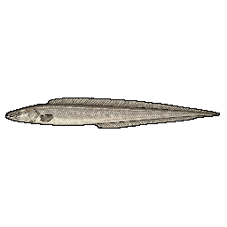 Aba aba | `aba_aba` | 148 g – 18.5 kg | 1.1 kg | 33–167 cm | river 1.3, lake 0.9, pond 0.5, swamp 0.4 | 24 |
| 109 | 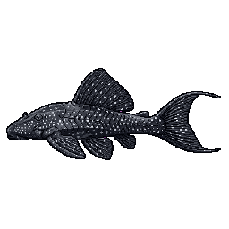 Adonis pleco | `adonis_pleco` | 96 g – 12 kg | 729 g | 20–100 cm | river 1.3, lake 0.9, pond 0.5, swamp 0.4 | 16 |
| 110 | 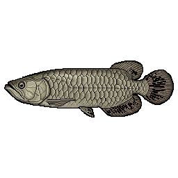 African arowana | `african_arowana` | 82 g – 10.2 kg | 620 g | 20–100 cm | swamp 1.4, pond 1.1, lake 0.8, river 0.8, puddle 0.2 | 18 |
| 111 | 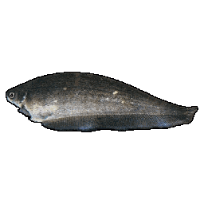 African knifefish | `african_knifefish` | 7 g – 250 g | 31 g | 9–30 cm | swamp 1.4, pond 1.1, lake 0.8, river 0.8, puddle 0.2 | 7 |
| 112 | 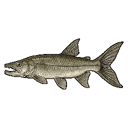 African pike | `african_pike_characin` | 12 g – 1.5 kg | 91 g | 10–52 cm | river 1.3, lake 0.9, pond 0.5, swamp 0.4 | 17 |
| 113 | 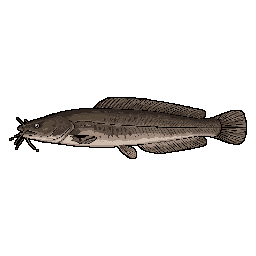 African sharptooth catfish | `african_sharptooth_catfish` | 480 g – 60 kg | 3.6 kg | 34–170 cm | swamp 1.4, pond 1.1, lake 0.8, river 0.8, puddle 0.2 | 29 |
| 114 | 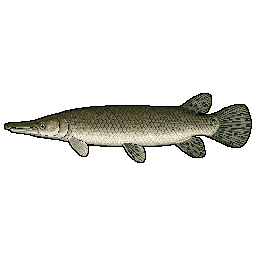 Alligator gar | `alligator_gar` | 1.2 kg – 148 kg | 9.0 kg | 61–305 cm | swamp 1.4, pond 1.1, lake 0.8, river 0.8, puddle 0.2 | 31 |
| 115 | 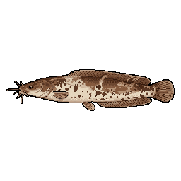 Angolian walking catfish | `angolan_clarias` | 3 g – 400 g | 24 g | 7–35 cm | swamp 1.4, pond 1.1, lake 0.8, river 0.8, puddle 0.2 | 11 |
| 116 | 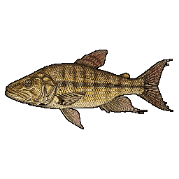 Ansorge's dwarf characin | `ansorges_dwarf_characin` | 0 g – 2 g | 1 g | 2–4 cm | puddle 1.4, pond 1.2, swamp 0.9, river 0.8, lake 0.7 | — |
| 117 | 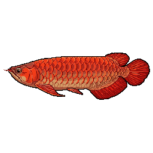 Asian arowana | `asian_arowana` | 60 g – 7.5 kg | 456 g | 18–90 cm | swamp 1.4, pond 1.1, lake 0.8, river 0.8, puddle 0.2 | 15 |
| 118 | 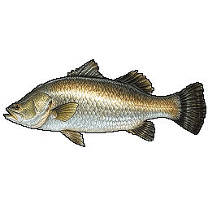 Barramundi | `barramundi` | 640 g – 80 kg | 4.9 kg | 40–200 cm | lake 1.2, river 1.1, sea 0.7, swamp 0.6, pond 0.4 | 29 |
| 119 | 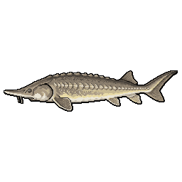 Bester | `bester_sturgeon` | 240 g – 30 kg | 1.8 kg | 36–180 cm | river 1.3, lake 0.9, pond 0.5, swamp 0.4 | 24 |
| 120 | 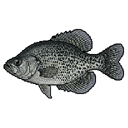 Black crappie | `black_crappie` | 22 g – 2.7 kg | 164 g | 9–49 cm | lake 1.3, pond 1, river 0.8, swamp 0.6 | 5 |
| 121 | 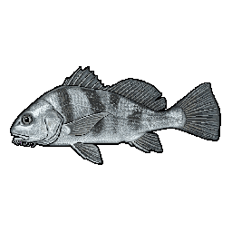 Black drum | `black_drum` | 410 g – 51.3 kg | 3.1 kg | 34–170 cm | sea 1.4, river 0.3, swamp 0.2 | 29 |
| 122 | 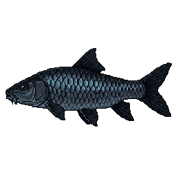 Black mahseer | `black_mahseer` | 128 g – 16 kg | 973 g | 20–100 cm | river 1.3, lake 0.9, pond 0.5, swamp 0.4 | 17 |
| 123 | 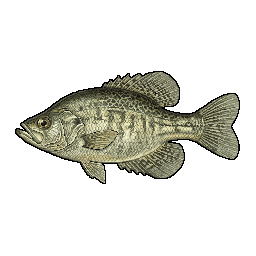 Hybrid crappie | `black_white_crappie_hybrid` | 17 g – 2.1 kg | 128 g | 10–50 cm | lake 1.3, pond 1, river 0.8, swamp 0.6 | 8 |
| 124 | 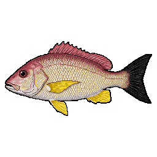 Blacktail snapper | `blacktail_snapper` | 12 g – 1.5 kg | 91 g | 8–40 cm | sea 1.4 | 12 |
| 125 | 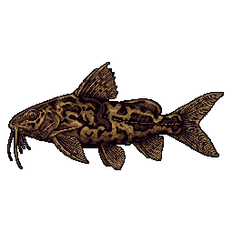 Blotched upsidedown catfish | `blotched_upsidedown_catfish` | 1 g – 12 g | 3 g | 4–9 cm | river 1.3, lake 0.9, pond 0.5, swamp 0.4 | — |
| 126 | 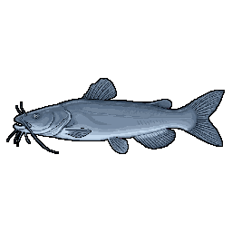 Blue catfish | `blue_catfish` | 544 g – 68 kg | 4.1 kg | 33–165 cm | river 1.3, lake 0.9, pond 0.5, swamp 0.4 | 29 |
| 127 | 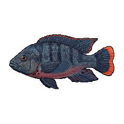 Hybrid tilapia (blue × Mozambique) | `blue_mozambique_tilapia_hybrid` | 24 g – 3 kg | 182 g | 10–50 cm | pond 1.3, lake 1.1, swamp 1, river 0.7, puddle 0.3 | 9 |
| 128 | 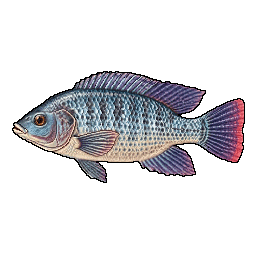 Blue tilapia | `blue_tilapia` | 16 g – 2 kg | 122 g | 9–45 cm | pond 1.3, lake 1.1, swamp 1, river 0.7, puddle 0.3 | 10 |
| 129 | 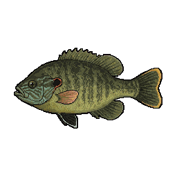 Greengill sunfish / Hybrid bluegill | `bluegill_green_sunfish_hybrid` | 27 g – 1 kg | 123 g | 9–32 cm | pond 1.3, lake 1.1, swamp 1, river 0.7, puddle 0.3 | 5 |
| 130 | 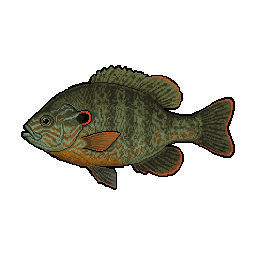 Pumpkingill (bluegill × pumpkinseed hybrid) | `bluegill_pumpkinseed_hybrid` | 19 g – 700 g | 86 g | 8–28 cm | pond 1.3, lake 1.1, swamp 1, river 0.7, puddle 0.3 | 3 |
| 131 | 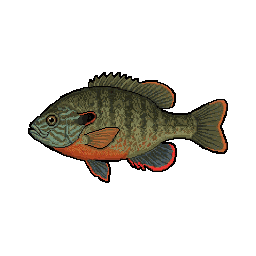 Bluegill × redbreast sunfish hybrid | `bluegill_redbreast_hybrid` | 16 g – 600 g | 74 g | 8–28 cm | pond 1.3, lake 1.1, swamp 1, river 0.7, puddle 0.3 | 8 |
| 132 | 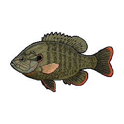 Bluegill × redear sunfish hybrid | `bluegill_redear_hybrid` | 10 g – 1.2 kg | 73 g | 7–35 cm | pond 1.3, lake 1.1, swamp 1, river 0.7, puddle 0.3 | 7 |
| 133 | 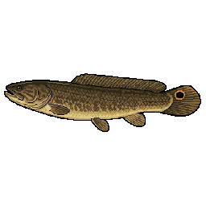 Bowfin | `bowfin` | 78 g – 9.8 kg | 596 g | 21–109 cm | swamp 1.4, pond 1.1, lake 0.8, river 0.8, puddle 0.2 | 17 |
| 134 | 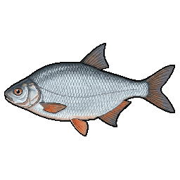 Bream × roach hybrid | `bream_roach_hybrid` | 24 g – 3 kg | 182 g | 11–55 cm | pond 1.3, lake 1.1, swamp 1, river 0.7, puddle 0.3 | 11 |
| 135 | 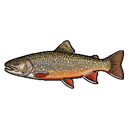 Brook trout × bull trout hybrid | `brook_bull_trout_hybrid` | 48 g – 6 kg | 365 g | 16–80 cm | river 1.3, lake 0.9, pond 0.5, swamp 0.4 | 20 |
| 136 | 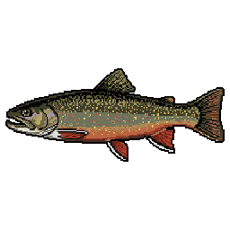 Brook trout | `brook_trout` | 75 g – 9.4 kg | 571 g | 17–86 cm | river 1.3, lake 0.9, pond 0.5, swamp 0.4 | 12 |
| 137 | 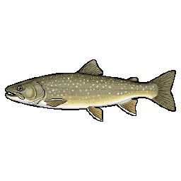 Bull trout | `bull_trout` | 116 g – 14.5 kg | 881 g | 20–103 cm | river 1.3, lake 0.9, pond 0.5, swamp 0.4 | 21 |
| 138 | 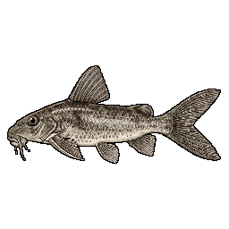 Cameroon suckermouth catfish | `cameroon_suckermouth_catfish` | 0 g – 4 g | 1 g | 3–6 cm | river 1.3, lake 0.9, pond 0.5, swamp 0.4 | — |
| 139 | 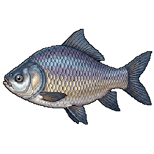 Catla | `catla` | 800 g – 100 kg | 6.1 kg | 36–182 cm | river 1.3, lake 0.9, pond 0.5, swamp 0.4 | 32 |
| 140 | 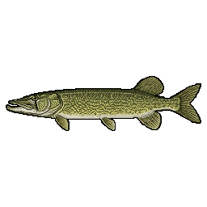 Chain pickerel | `chain_pickerel` | 34 g – 4.3 kg | 261 g | 19–99 cm | lake 1.3, pond 1, river 0.8, swamp 0.6 | 20 |
| 141 | 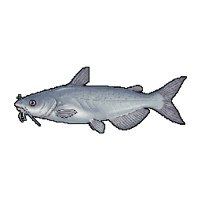 Hybrid catfish (channel × blue catfish) | `channel_blue_catfish_hybrid` | 170 g – 21.3 kg | 1.3 kg | 26–130 cm | river 1.3, lake 0.9, pond 0.5, swamp 0.4 | 24 |
| 142 | 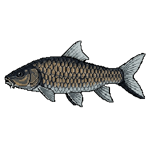 Chinese mahseer | `chinese_mahseer` | 12 g – 1.5 kg | 91 g | 8–40 cm | river 1.3, lake 0.9, pond 0.5, swamp 0.4 | 17 |
| 143 | 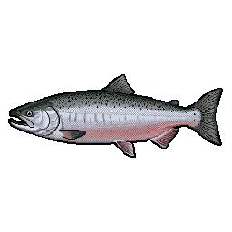 Chinook × coho salmon hybrid | `chinook_coho_hybrid` | 160 g – 20 kg | 1.2 kg | 22–110 cm | river 1.3, sea 1, lake 0.9, pond 0.2 | 22 |
| 144 | 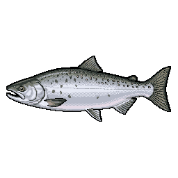 Chinook × pink salmon hybrid | `chinook_pink_hybrid` | 80 g – 10 kg | 608 g | 18–90 cm | river 1.3, sea 1, lake 0.9, pond 0.2 | 20 |
| 145 | 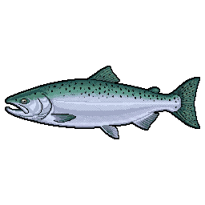 Chinook salmon | `chinook_salmon` | 491 g – 61.4 kg | 3.7 kg | 30–150 cm | river 1.3, sea 1, lake 0.9, pond 0.2 | 29 |
| 146 | 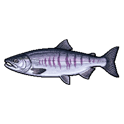 Chum salmon | `chum_salmon` | 127 g – 15.9 kg | 966 g | 20–100 cm | river 1.3, sea 1, lake 0.9, pond 0.2 | 17 |
| 147 | 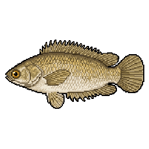 Climbing perch | `climbing_perch` | 8 g – 300 g | 37 g | 7–25 cm | swamp 1.4, pond 1.1, lake 0.8, river 0.8, puddle 0.2 | 3 |
| 148 | 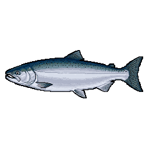 Coho salmon | `coho_salmon` | 122 g – 15.2 kg | 924 g | 21–108 cm | river 1.3, sea 1, lake 0.9, pond 0.2 | 17 |
| 149 | 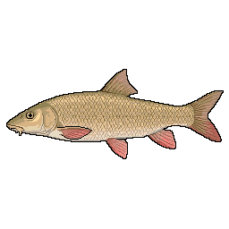 Common barbel | `common_barbel` | 136 g – 17 kg | 1.0 kg | 24–120 cm | river 1.3, lake 0.9, pond 0.5, swamp 0.4 | 26 |
| 150 | 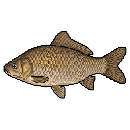 F1 hybrid carp | `common_carp_gibel_hybrid` | 64 g – 8 kg | 486 g | 14–70 cm | pond 1.3, lake 1.1, swamp 1, river 0.7, puddle 0.3 | 14 |
| 151 | 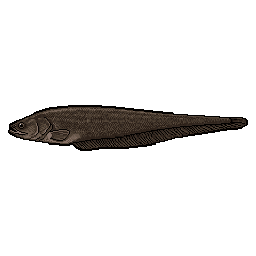 Congo knifefish | `congo_knifefish` | 14 g – 500 g | 62 g | 9–33 cm | swamp 1.4, pond 1.1, lake 0.8, river 0.8, puddle 0.2 | 11 |
| 152 | 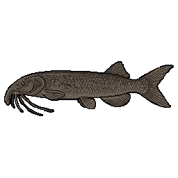 Cornish jack | `cornish_jack` | 120 g – 15 kg | 912 g | 30–150 cm | river 1.3, lake 0.9, pond 0.5, swamp 0.4 | 24 |
| 153 | 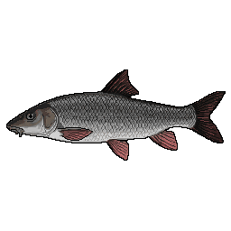 Crimean barbel | `crimean_barbel` | 36 g – 4.5 kg | 274 g | 14–70 cm | river 1.3, lake 0.9, pond 0.5, swamp 0.4 | 21 |
| 154 | 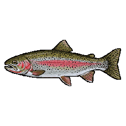 Cutbow | `cutbow` | 96 g – 12 kg | 729 g | 20–100 cm | river 1.3, sea 1, lake 0.9, pond 0.2 | 17 |
| 155 | 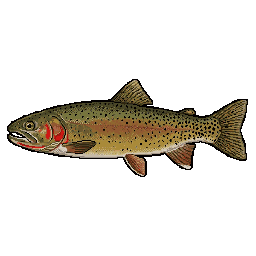 Cutthroat trout | `cutthroat_trout` | 149 g – 18.6 kg | 1.1 kg | 19–99 cm | river 1.3, sea 1, lake 0.9, pond 0.2 | 18 |
| 156 | 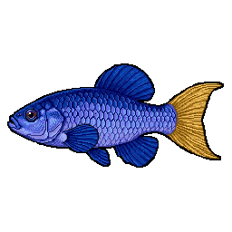 Desert pupfish | `desert_pupfish` | 1 g – 10 g | 2 g | 3–7 cm | puddle 1.4, pond 1.2, swamp 0.9, river 0.8, lake 0.7 | — |
| 157 | 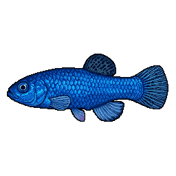 Devils Hole pupfish | `devils_hole_pupfish` | 0 g – 2 g | 1 g | 2–3 cm | puddle 1.4, pond 1.2, swamp 0.9, river 0.8, lake 0.7 | — |
| 158 |  Dolly Varden × bull trout hybrid | `dolly_bull_trout_hybrid` | 72 g – 9 kg | 547 g | 19–95 cm | river 1.3, lake 0.9, pond 0.5, swamp 0.4 | 12 |
| 159 |  Dolly Varden trout | `dolly_varden` | 146 g – 18.3 kg | 1.1 kg | 25–127 cm | river 1.3, lake 0.9, pond 0.5, swamp 0.4 | 24 |
| 160 |  Double-trunk elephant nose | `double_nose_elephantfish` | 2 g – 90 g | 11 g | 6–22 cm | river 1.3, lake 0.9, pond 0.5, swamp 0.4 | 1 |
| 161 |  Eastern happy | `eastern_happy` | 3 g – 120 g | 15 g | 5–18 cm | lake 1.3, pond 1, river 0.8, swamp 0.6 | 1 |
| 162 |  Electric catfish | `electric_catfish` | 160 g – 20 kg | 1.2 kg | 24–122 cm | swamp 1.4, pond 1.1, lake 0.8, river 0.8, puddle 0.2 | 21 |
| 163 |  Electric eel | `electric_eel` | 160 g – 20 kg | 1.2 kg | 50–250 cm | swamp 1.4, pond 1.1, lake 0.8, river 0.8, puddle 0.2 | 25 |
| 164 |  Elephantnose fish | `elephantnose_fish` | 3 g – 400 g | 24 g | 7–35 cm | river 1.3, lake 0.9, pond 0.5, swamp 0.4 | 11 |
| 165 |  Elongate lamprologus | `elongate_lamprologus` | 12 g – 450 g | 56 g | 9–32 cm | lake 1.3, pond 1, river 0.8, swamp 0.6 | 7 |
| 166 |  Fierce bathybates | `fierce_bathybates` | 7 g – 850 g | 52 g | 7–38 cm | lake 1.3, pond 1, river 0.8, swamp 0.6 | 11 |
| 167 |  Flathead catfish | `flathead_catfish` | 446 g – 55.8 kg | 3.4 kg | 31–155 cm | river 1.3, lake 0.9, pond 0.5, swamp 0.4 | 29 |
| 168 |  Flier | `flier` | 15 g – 570 g | 70 g | 8–29 cm | pond 1.3, lake 1.1, swamp 1, river 0.7, puddle 0.3 | 8 |
| 169 |  Florida gar | `florida_gar` | 77 g – 9.6 kg | 584 g | 26–132 cm | swamp 1.4, pond 1.1, lake 0.8, river 0.8, puddle 0.2 | 20 |
| 170 |  Frontosa cichlid | `frontosa_cichlid` | 32 g – 1.2 kg | 148 g | 9–33 cm | lake 1.3, pond 1, river 0.8, swamp 0.6 | 12 |
| 171 |  Giant cichlid | `giant_cichlid` | 36 g – 4.5 kg | 274 g | 16–80 cm | lake 1.3, pond 1, river 0.8, swamp 0.6 | 17 |
| 172 |  Giant featherback | `giant_featherback` | 120 g – 15 kg | 912 g | 30–150 cm | swamp 1.4, pond 1.1, lake 0.8, river 0.8, puddle 0.2 | 24 |
| 173 |  Giant freshwater stingray | `giant_freshwater_stingray` | 4.8 kg – 600 kg | 36.5 kg | 100–500 cm | river 1.3, lake 0.9, pond 0.5, swamp 0.4 | 40 |
| 174 |  Giant gourami | `giant_gourami` | 88 g – 11 kg | 669 g | 14–70 cm | swamp 1.4, pond 1.1, lake 0.8, river 0.8, puddle 0.2 | 14 |
| 175 |  Giant mottled eel | `giant_mottled_eel` | 164 g – 20.5 kg | 1.2 kg | 40–200 cm | river 1.3, sea 1, lake 0.9, pond 0.2 | 22 |
| 176 |  giant snakehead | `giant_snakehead` | 160 g – 20 kg | 1.2 kg | 26–130 cm | swamp 1.4, pond 1.1, lake 0.8, river 0.8, puddle 0.2 | 25 |
| 177 |  Goliath tigerfish | `goliath_tigerfish` | 400 g – 50 kg | 3.0 kg | 30–150 cm | river 1.3, lake 0.9, pond 0.5, swamp 0.4 | 29 |
| 178 |  Green sunfish | `green_sunfish` | 26 g – 960 g | 118 g | 9–31 cm | pond 1.3, lake 1.1, swamp 1, river 0.7, puddle 0.3 | 5 |
| 179 |  Helicopter Catfish | `helicopter_catfish` | 360 g – 45 kg | 2.7 kg | 40–200 cm | river 1.3, lake 0.9, pond 0.5, swamp 0.4 | 29 |
| 180 |  Himalayan mahseer | `himalayan_mahseer` | 1.7 kg – 210 kg | 12.8 kg | 55–275 cm | river 1.3, lake 0.9, pond 0.5, swamp 0.4 | 36 |
| 181 |  Iridescent shark | `iridescent_shark` | 352 g – 44 kg | 2.7 kg | 26–130 cm | river 1.3, lake 0.9, pond 0.5, swamp 0.4 | 29 |
| 182 |  Kaluga-sterlet hybrid | `kaluga_sterlet_hybrid` | 320 g – 40 kg | 2.4 kg | 40–200 cm | river 1.3, lake 0.9, pond 0.5, swamp 0.4 | 28 |
| 183 |  Kaluga sturgeon | `kaluga_sturgeon` | 8 kg – 1000 kg | 60.8 kg | 112–560 cm | river 1.3, lake 0.9, pond 0.5, swamp 0.4 | 42 |
| 184 |  Kuria labeo | `kuria_labeo` | 240 g – 30 kg | 1.8 kg | 30–150 cm | river 1.3, lake 0.9, pond 0.5, swamp 0.4 | 25 |
| 185 |  Kuria labeo × catla hybrid | `kuria_labeo_catla_hybrid` | 120 g – 15 kg | 912 g | 24–120 cm | river 1.3, lake 0.9, pond 0.5, swamp 0.4 | 24 |
| 186 |  Laced moray | `laced_moray` | 240 g – 30 kg | 1.8 kg | 60–300 cm | sea 1.4 | 25 |
| 187 |  Lake sturgeon | `lake_sturgeon` | 1 kg – 125 kg | 7.6 kg | 54–274 cm | river 1.3, lake 0.9, pond 0.5, swamp 0.4 | 31 |
| 188 |  Lake trout | `lake_trout` | 320 g – 40 kg | 2.4 kg | 30–150 cm | river 1.3, lake 0.9, pond 0.5, swamp 0.4 | 25 |
| 189 |  Largemouth × smallmouth bass hybrid | `largemouth_smallmouth_hybrid` | 40 g – 5 kg | 304 g | 13–65 cm | lake 1.3, pond 1, river 0.8, swamp 0.6 | 20 |
| 190 |  Largemouth yellowfish | `largemouth_yellowfish` | 178 g – 22.2 kg | 1.3 kg | 16–83 cm | river 1.3, lake 0.9, pond 0.5, swamp 0.4 | 26 |
| 191 |  Longnose × alligator gar hybrid | `longnose_alligator_gar_hybrid` | 440 g – 55 kg | 3.3 kg | 44–220 cm | swamp 1.4, pond 1.1, lake 0.8, river 0.8, puddle 0.2 | 29 |
| 192 |  Longnose gar | `longnose_gar` | 182 g – 22.8 kg | 1.4 kg | 40–200 cm | swamp 1.4, pond 1.1, lake 0.8, river 0.8, puddle 0.2 | 24 |
| 193 |  Longsnout distichodus | `longsnout_distichodus` | 9 g – 1.1 kg | 67 g | 7–38 cm | river 1.3, lake 0.9, pond 0.5, swamp 0.4 | 12 |
| 194 |  Lutefish | `lute_fish` | 56 g – 7 kg | 425 g | 14–70 cm | river 1.3, lake 0.9, pond 0.5, swamp 0.4 | 17 |
| 195 |  Lyre-tail pleco | `lyretail_pleco` | 80 g – 10 kg | 608 g | 20–100 cm | river 1.3, lake 0.9, pond 0.5, swamp 0.4 | 17 |
| 196 |  Malayan mahseer | `malayan_mahseer` | 128 g – 16 kg | 973 g | 20–100 cm | river 1.3, lake 0.9, pond 0.5, swamp 0.4 | 17 |
| 197 |  Map puffer | `map_puffer` | 36 g – 4.5 kg | 274 g | 13–65 cm | sea 1.4 | 14 |
| 198 |  Marbled lungfish | `marbled_lungfish` | 136 g – 17 kg | 1.0 kg | 40–200 cm | swamp 1.4, pond 1.1, lake 0.8, river 0.8, puddle 0.2 | 25 |
| 199 |  Mekong giant catfish | `mekong_giant_catfish` | 2.6 kg – 330 kg | 20.1 kg | 60–300 cm | river 1.3, lake 0.9, pond 0.5, swamp 0.4 | 35 |
| 200 |  Mozambique tilapia | `mozambique_tilapia` | 9 g – 1.1 kg | 67 g | 7–39 cm | pond 1.3, lake 1.1, swamp 1, river 0.7, puddle 0.3 | 11 |
| 201 |  Muskellunge | `muskellunge` | 256 g – 32 kg | 1.9 kg | 36–183 cm | lake 1.3, pond 1, river 0.8, swamp 0.6 | 28 |
| 202 |  Nile bichir | `nile_bichir` | 22 g – 2.7 kg | 164 g | 14–74 cm | swamp 1.4, pond 1.1, lake 0.8, river 0.8, puddle 0.2 | 9 |
| 203 |  Hybrid tilapia | `nile_blue_tilapia_hybrid` | 34 g – 4.3 kg | 261 g | 12–60 cm | pond 1.3, lake 1.1, swamp 1, river 0.7, puddle 0.3 | 14 |
| 204 |  Red tilapia / Hybrid tilapia (Nile × Mozambique) | `nile_mozambique_tilapia_hybrid` | 36 g – 4.5 kg | 274 g | 12–60 cm | pond 1.3, lake 1.1, swamp 1, river 0.7, puddle 0.3 | 14 |
| 205 |  Nile perch | `nile_perch` | 1.6 kg – 200 kg | 12.2 kg | 40–200 cm | lake 1.2, river 1.1, sea 0.7, swamp 0.6, pond 0.4 | 36 |
| 206 |  Nile tilapia | `nile_tilapia` | 34 g – 4.3 kg | 261 g | 12–60 cm | pond 1.3, lake 1.1, swamp 1, river 0.7, puddle 0.3 | 14 |
| 207 |  Northern pike | `northern_pike` | 227 g – 28.4 kg | 1.7 kg | 30–150 cm | lake 1.3, pond 1, river 0.8, swamp 0.6 | 26 |
| 208 |  Ocellaris clownfish | `ocellaris_clownfish` | 3 g – 30 g | 8 g | 5–11 cm | sea 1.4 | — |
| 209 |  Motoro stingray | `ocellate_river_stingray` | 274 g – 34.2 kg | 2.1 kg | 20–100 cm | river 1.3, lake 0.9, pond 0.5, swamp 0.4 | 24 |
| 210 |  American paddlefish | `paddlefish` | 726 g – 90.7 kg | 5.5 kg | 44–221 cm | river 1.3, lake 0.9, pond 0.5, swamp 0.4 | 32 |
| 211 |  Palette surgeonfish | `palette_surgeonfish` | 16 g – 600 g | 74 g | 9–31 cm | sea 1.4 | 5 |
| 212 |  Payara | `payara` | 142 g – 17.8 kg | 1.1 kg | 23–117 cm | river 1.3, lake 0.9, pond 0.5, swamp 0.4 | 17 |
| 213 |  Polka-dot squeaker | `polka_dot_squeaker` | 14 g – 1.8 kg | 109 g | 11–55 cm | river 1.3, lake 0.9, pond 0.5, swamp 0.4 | 11 |
| 214 |  Pumpkinseed | `pumpkinseed` | 5 g – 630 g | 38 g | 8–40 cm | pond 1.3, lake 1.1, swamp 1, river 0.7, puddle 0.3 | 8 |
| 215 |  Red drum | `red_drum` | 360 g – 45 kg | 2.7 kg | 31–155 cm | sea 1.4, river 0.3, swamp 0.2 | 28 |
| 216 |  Red-finned mahseer | `red_finned_mahseer` | 544 g – 68 kg | 4.1 kg | 30–150 cm | river 1.3, lake 0.9, pond 0.5, swamp 0.4 | 29 |
| 217 |  Redbreast sunfish | `redbreast_sunfish` | 22 g – 790 g | 98 g | 9–30 cm | pond 1.3, lake 1.1, swamp 1, river 0.7, puddle 0.3 | 5 |
| 218 |  Hybrid sunfish (redear × green sunfish) | `redear_green_sunfish_hybrid` | 10 g – 1.2 kg | 73 g | 7–35 cm | pond 1.3, lake 1.1, swamp 1, river 0.7, puddle 0.3 | 7 |
| 219 |  Redear sunfish | `redear_sunfish` | 22 g – 2.8 kg | 171 g | 8–43 cm | pond 1.3, lake 1.1, swamp 1, river 0.7, puddle 0.3 | 5 |
| 220 |  Redtail catfish | `redtail_catfish` | 640 g – 80 kg | 4.9 kg | 36–180 cm | river 1.3, lake 0.9, pond 0.5, swamp 0.4 | 29 |
| 221 |  Reedfish | `reedfish` | 2 g – 250 g | 15 g | 8–40 cm | swamp 1.4, pond 1.1, lake 0.8, river 0.8, puddle 0.2 | 8 |
| 222 |  Reticulate knifefish | `reticulate_knifefish` | 14 g – 1.8 kg | 109 g | 16–80 cm | swamp 1.4, pond 1.1, lake 0.8, river 0.8, puddle 0.2 | 12 |
| 223 |  Ripon barbel | `ripon_barbel` | 80 g – 10 kg | 608 g | 18–90 cm | river 1.3, lake 0.9, pond 0.5, swamp 0.4 | 18 |
| 224 |  Roach × rudd hybrid | `roach_rudd_hybrid` | 14 g – 1.8 kg | 109 g | 9–45 cm | pond 1.3, lake 1.1, swamp 1, river 0.7, puddle 0.3 | 14 |
| 225 |  Rock bass | `rock_bass` | 11 g – 1.4 kg | 85 g | 8–43 cm | pond 1.3, lake 1.1, swamp 1, river 0.7, puddle 0.3 | 8 |
| 226 |  Rohu | `rohu` | 760 g – 95 kg | 5.8 kg | 40–200 cm | river 1.3, lake 0.9, pond 0.5, swamp 0.4 | 32 |
| 227 |  Rohu × catla hybrid | `rohu_catla_hybrid` | 200 g – 25 kg | 1.5 kg | 30–150 cm | river 1.3, lake 0.9, pond 0.5, swamp 0.4 | 26 |
| 228 |  Rohu × kuria labeo hybrid | `rohu_kuria_labeo_hybrid` | 96 g – 12 kg | 729 g | 22–110 cm | river 1.3, lake 0.9, pond 0.5, swamp 0.4 | 21 |
| 229 |  Royal featherback | `royal_featherback` | 96 g – 12 kg | 729 g | 25–125 cm | swamp 1.4, pond 1.1, lake 0.8, river 0.8, puddle 0.2 | 17 |
| 230 |  Saddled bichir | `saddled_bichir` | 36 g – 4.5 kg | 274 g | 15–75 cm | swamp 1.4, pond 1.1, lake 0.8, river 0.8, puddle 0.2 | 17 |
| 231 |  Salt Creek pupfish | `salt_creek_pupfish` | 1 g – 8 g | 2 g | 3–7 cm | puddle 1.4, pond 1.2, swamp 0.9, river 0.8, lake 0.7 | — |
| 232 |  Sauger | `sauger` | 32 g – 4 kg | 243 g | 15–76 cm | lake 1.1, river 1.1, pond 0.8, swamp 0.6 | 20 |
| 233 |  Saugeye | `saugeye` | 51 g – 6.4 kg | 389 g | 16–80 cm | lake 1.1, river 1.1, pond 0.8, swamp 0.6 | 20 |
| 234 |  Semutundu | `semutundu` | 280 g – 35 kg | 2.1 kg | 25–127 cm | swamp 1.4, pond 1.1, lake 0.8, river 0.8, puddle 0.2 | 24 |
| 235 |  Senegal bichir | `senegal_bichir` | 10 g – 1.2 kg | 73 g | 14–70 cm | swamp 1.4, pond 1.1, lake 0.8, river 0.8, puddle 0.2 | 12 |
| 236 |  Short-tailed river stingray | `short_tailed_river_stingray` | 1.8 kg – 220 kg | 13.4 kg | 50–250 cm | river 1.3, lake 0.9, pond 0.5, swamp 0.4 | 36 |
| 237 |  Shovelnose sturgeon | `shovelnose_sturgeon` | 39 g – 4.9 kg | 298 g | 21–108 cm | river 1.3, lake 0.9, pond 0.5, swamp 0.4 | 20 |
| 238 |  Silver catfish | `silver_catfish` | 11 g – 1.4 kg | 85 g | 12–60 cm | swamp 1.4, pond 1.1, lake 0.8, river 0.8, puddle 0.2 | 18 |
| 239 |  Sixbar distichodus | `six_banded_distichodus` | 32 g – 4 kg | 243 g | 16–80 cm | river 1.3, lake 0.9, pond 0.5, swamp 0.4 | 20 |
| 240 |  Smallmouth bass | `smallmouth_bass` | 43 g – 5.4 kg | 328 g | 13–69 cm | lake 1.3, pond 1, river 0.8, swamp 0.6 | 20 |
| 241 |  Meanmouth bass | `smallmouth_spotted_bass_hybrid` | 32 g – 4 kg | 243 g | 12–60 cm | lake 1.3, pond 1, river 0.8, swamp 0.6 | 20 |
| 242 |  Sockeye salmon | `sockeye_salmon` | 62 g – 7.7 kg | 468 g | 16–84 cm | river 1.3, sea 1, lake 0.9, pond 0.2 | 20 |
| 243 |  Splake | `splake` | 75 g – 9.4 kg | 571 g | 20–100 cm | river 1.3, lake 0.9, pond 0.5, swamp 0.4 | 12 |
| 244 |  Spotted bass | `spotted_bass` | 38 g – 4.7 kg | 286 g | 12–63 cm | lake 1.3, pond 1, river 0.8, swamp 0.6 | 20 |
| 245 |  Spotted gar | `spotted_gar` | 35 g – 4.4 kg | 267 g | 30–150 cm | swamp 1.4, pond 1.1, lake 0.8, river 0.8, puddle 0.2 | 20 |
| 246 |  Spotted seatrout | `spotted_seatrout` | 63 g – 7.9 kg | 480 g | 20–100 cm | sea 1.4, river 0.3, swamp 0.2 | 17 |
| 247 |  Starry puffer | `starry_puffer` | 200 g – 25 kg | 1.5 kg | 24–120 cm | sea 1.4 | 32 |
| 248 |  Tambaqui | `tambaqui` | 320 g – 40 kg | 2.4 kg | 21–108 cm | river 1.3, lake 0.9, pond 0.5, swamp 0.4 | 26 |
| 249 |  Tapah Catfish | `tapah_catfish` | 760 g – 95 kg | 5.8 kg | 40–200 cm | river 1.3, lake 0.9, pond 0.5, swamp 0.4 | 31 |
| 250 |  Terek barbel | `terek_barbel` | 12 g – 1.5 kg | 91 g | 10–50 cm | river 1.3, lake 0.9, pond 0.5, swamp 0.4 | 12 |
| 251 |  Tiger muskellunge | `tiger_muskie` | 186 g – 23.2 kg | 1.4 kg | 26–130 cm | lake 1.3, pond 1, river 0.8, swamp 0.6 | 26 |
| 252 |  African tigerfish | `tigerfish` | 224 g – 28 kg | 1.7 kg | 21–105 cm | river 1.3, lake 0.9, pond 0.5, swamp 0.4 | 26 |
| 253 |  Trahira | `trahira` | 38 g – 4.8 kg | 292 g | 13–65 cm | river 1.3, lake 0.9, pond 0.5, swamp 0.4 | 20 |
| 254 |  Trout cichlid | `trout_cichlid` | 14 g – 500 g | 62 g | 9–32 cm | lake 1.3, pond 1, river 0.8, swamp 0.6 | 11 |
| 255 |  Vistula barbel | `vistula_barbel` | 12 g – 1.5 kg | 91 g | 9–45 cm | river 1.3, lake 0.9, pond 0.5, swamp 0.4 | 12 |
| 256 |  Vundu catfish | `vundu_catfish` | 440 g – 55 kg | 3.3 kg | 30–150 cm | swamp 1.4, pond 1.1, lake 0.8, river 0.8, puddle 0.2 | 29 |
| 257 |  Walleye | `walleye` | 90 g – 11.3 kg | 687 g | 21–107 cm | lake 1.1, river 1.1, pond 0.8, swamp 0.6 | 20 |
| 258 |  Warmouth | `warmouth` | 30 g – 1.1 kg | 135 g | 9–31 cm | pond 1.3, lake 1.1, swamp 1, river 0.7, puddle 0.3 | 7 |
| 259 |  West African lungfish | `west_african_lungfish` | 32 g – 4 kg | 243 g | 20–100 cm | swamp 1.4, pond 1.1, lake 0.8, river 0.8, puddle 0.2 | 20 |
| 260 |  White bass | `white_bass` | 25 g – 3.1 kg | 188 g | 9–45 cm | lake 1.1, river 1.1, pond 0.8, swamp 0.6 | 17 |
| 261 |  White crappie | `white_crappie` | 19 g – 2.4 kg | 146 g | 10–53 cm | lake 1.3, pond 1, river 0.8, swamp 0.6 | 3 |
| 262 |  White sturgeon | `white_sturgeon` | 6.5 kg – 816 kg | 49.6 kg | 122–610 cm | river 1.3, lake 0.9, pond 0.5, swamp 0.4 | 42 |
| 263 |  Turkey moray | `whitemargin_moray` | 40 g – 5 kg | 304 g | 24–120 cm | sea 1.4 | 20 |
| 264 |  White-spotted puffer | `whitespotted_puffer` | 16 g – 2 kg | 122 g | 10–50 cm | sea 1.4 | 10 |
| 265 |  Wiper (hybrid striped bass) | `wiper` | 99 g – 12.4 kg | 754 g | 20–100 cm | lake 1.1, river 1.1, pond 0.8, swamp 0.6 | 16 |
| 266 |  Yellow bass | `yellow_bass` | 10 g – 1.2 kg | 75 g | 9–46 cm | lake 1.1, river 1.1, pond 0.8, swamp 0.6 | 12 |
| 267 |  Yellow perch | `yellow_perch` | 15 g – 1.9 kg | 115 g | 10–50 cm | lake 1.1, river 1.1, pond 0.8, swamp 0.6 | 12 |

## Ideal tackle

Match these and the fish's bite weight climbs sharply — and the bigger the fish, the more sharply. See [the match coefficient](fishing-mechanics.md#match-coefficient-m--your-tackle).

| Species | Best baits (score) | Hook | Line | Groundbait (fraction / nutrition) | Leader |
|---|---|---|---|---|---|
| Aba aba | livebait 1, fish_strip 0.9, wobbler 0.9, jig 0.85, worm 0.55 | No.4 | fluoro 0.34 ±0.06 | 0.2 / 0.42 | **yes** |
| Adonis pleco | worm 1, dough 0.75, boilie 0.7, fish_strip 0.7, jig 0.6, fly_pellet 0.55, silicone 0.55 | No.4 | braid 0.22 ±0.06 | 0.7 / 0.75 | — |
| African arowana | dough 1, bread 0.9, corn 0.9, worm 0.85, pea 0.8, fly_pellet 0.7 | No.5 | braid 0.21 ±0.06 | 0.23 / 0.39 | — |
| African knifefish | worm 1, bloodworm 0.85, maggot 0.8, fish_strip 0.7, fly_nymph 0.6, jig 0.6, spinner 0.6, silicone 0.55, fly_streamer 0.5 | No.9 | braid 0.1 ±0.06 | 0.1 / 0.25 | — |
| African pike | livebait 1, fish_strip 0.9, wobbler 0.9, jig 0.85, spinner 0.85, fly_streamer 0.7 | No.6 | braid 0.15 ±0.06 | 0 / 0.07 | **yes** |
| African sharptooth catfish | worm 1, dough 0.75, boilie 0.7, chicken_liver 0.7, fish_strip 0.7, livebait 0.6, silicone 0.55, wobbler 0.55, spoon 0.5, swimbait 0.5 | No.2 | braid 0.31 ±0.06 | 0.7 / 0.8 | — |
| African tigerfish | livebait 1, fish_strip 0.9, wobbler 0.9, jig 0.85, spinner 0.85, spoon 0.8 | No.4 | braid 0.26 ±0.06 | 0 / 0.07 | **yes** |
| Alligator gar | livebait 1, fish_strip 0.9, wobbler 0.9, silicone 0.85, castmaster 0.8, crankbait 0.8, spoon 0.8, swimbait 0.8, giant_spoon 0.75, popper 0.75, chicken_liver 0.6 | No.1 | braid 0.37 ±0.06 | 0 / 0.03 | **yes** |
| American paddlefish | jig 1, castmaster 0.85, giant_spoon 0.7 | No.2 | braid 0.33 ±0.06 | 0 / 0 | — |
| Anglerfish | livebait 1.1, fish_strip 1 | No.1 | braid 0.3 ±0.08 | 0.72 / 0.8 | **yes** |
| Angolian walking catfish | worm 1, dough 0.75, chicken_liver 0.7, fish_strip 0.7, livebait 0.6 | No.5 | braid 0.11 ±0.06 | 0.7 / 0.8 | — |
| Ansorge's dwarf characin | bloodworm 1, maggot 0.95, worm 0.9, fly_nymph 0.85 | No.16 | mono 0.06 ±0.06 | 0.5 / 0.6 | — |
| Arapaima | livebait 1, fish_strip 0.9, giant_spoon 0.85, swimbait 0.85, wobbler 0.75, silicone 0.6 | No.1 | braid 0.45 ±0.08 | 0.95 / 0.8 | **yes** |
| Arctic char | spinner 1, castmaster 0.9, spoon 0.9, wobbler 0.7, worm 0.6 | No.8 | fluoro 0.2 ±0.05 | 0.59 / 0.7 | — |
| Asian arowana | livebait 1, fish_strip 0.9, wobbler 0.9, silicone 0.85, popper 0.75, fly_streamer 0.7, wacky_worm 0.55, fly_dry_fly 0.4 | No.5 | braid 0.2 ±0.06 | 0.1 / 0.24 | — |
| Asp | spoon 1, castmaster 0.9, wobbler 0.9, popper 0.85, spinnerbait 0.85, spinner 0.8, bladebait 0.7, crankbait 0.7, swimbait 0.7, wacky_worm 0.5 | No.6 | braid 0.12 ±0.04 | 0.66 / 0.5 | — |
| Atlantic salmon | spoon 1, wobbler 0.9, spinner 0.8, fish_strip 0.5 | No.4 | braid 0.25 ±0.06 | 0.77 / 0.75 | — |
| Barracuda | giant_spoon 1.1, swimbait 1.05, wobbler 1, octopus_jig 0.9, silicone 0.9, spinner 0.7, spinnerbait 0.7, fish_strip 0.6 | No.2 | braid 0.3 ±0.08 | 0.79 / 0.75 | **yes** |
| Barramundi | livebait 1, fish_strip 0.9, wobbler 0.9, silicone 0.85, castmaster 0.8, crankbait 0.8, spoon 0.8, swimbait 0.8, popper 0.75, spinnerbait 0.75 | No.2 | braid 0.32 ±0.06 | 0.03 / 0.14 | **yes** |
| Beluga sturgeon | livebait 1, fish_strip 0.9, chicken_liver 0.85, worm 0.5 | No.1 | braid 0.55 ±0.1 | 0.98 / 0.82 | **yes** |
| Bester | worm 1, bloodworm 0.85, dough 0.75, fish_strip 0.7, fly_pellet 0.55 | No.2 | braid 0.27 ±0.06 | 0.55 / 0.65 | — |
| Bitterling | bloodworm 1, maggot 1, bread 0.8, dough 0.7 | No.16 | mono 0.1 ±0.03 | 0.1 / 0.4 | — |
| Black crappie | livebait 1, fish_strip 0.9, wobbler 0.9, jig 0.85, silicone 0.85, spinner 0.85, castmaster 0.8, crankbait 0.8, spoon 0.8, fly_streamer 0.7, worm 0.55, mormyshka 0.45, bloodworm 0.35, maggot 0.3 | No.12 | mono 0.22 ±0.06 | 0.17 / 0.32 | — |
| Black drum | livebait 1, fish_strip 0.9, silicone 0.85, castmaster 0.8, spoon 0.8, chicken_liver 0.6, worm 0.55 | No.3 | braid 0.3 ±0.06 | 0.15 / 0.39 | — |
| Black mahseer | worm 1, dough 0.75, boilie 0.7, fish_strip 0.7, livebait 0.6, spinner 0.6, wobbler 0.55, crankbait 0.5, fly_streamer 0.5, spoon 0.5 | No.4 | braid 0.24 ±0.06 | 0.65 / 0.8 | — |
| Black marlin | giant_spoon 1.05, octopus_jig 1, swimbait 0.95, fish_strip 0.9, wobbler 0.9, silicone 0.5 | No.1 | braid 0.45 ±0.06 | 1 / 0.75 | **yes** |
| Blacktail snapper | livebait 1, fish_strip 0.9, wobbler 0.9, silicone 0.85, castmaster 0.8, spoon 0.8 | No.12 | fluoro 0.2 ±0.06 | 0.1 / 0.28 | — |
| Bleak | maggot 1, bread 0.9, dough 0.8, mormyshka 0.8, bloodworm 0.7 | No.16 | mono 0.14 ±0.04 | 0.14 / 0.46 | — |
| Blobfish | fish_strip 0.9, worm 0.8, bloodworm 0.7, chicken_liver 0.5 | No.6 | braid 0.25 ±0.08 | 0.55 / 0.45 | — |
| Blotched upsidedown catfish | bloodworm 1, maggot 0.95, worm 0.9, fly_nymph 0.85 | No.16 | mono 0.07 ±0.06 | 0.6 / 0.7 | — |
| Blue bream | bloodworm 1, maggot 0.85, worm 0.7, pearl_barley 0.5 | No.12 | mono 0.14 ±0.05 | 0.44 / 0.55 | — |
| Blue catfish | worm 1, dough 0.75, chicken_liver 0.7, fish_strip 0.7, livebait 0.6 | No.2 | braid 0.31 ±0.06 | 0.75 / 0.8 | — |
| Blue marlin | fish_strip 1.1, octopus_jig 1, wobbler 1, giant_spoon 0.95, silicone 0.6 | No.1 | braid 0.4 ±0.06 | 1 / 0.75 | — |
| Blue tilapia | dough 1, bread 0.9, corn 0.9, worm 0.85, pea 0.8, pearl_barley 0.8, bloodworm 0.7, maggot 0.7, fish_strip 0.3, jig 0.25 | No.10 | mono 0.21 ±0.06 | 0.8 / 0.83 | — |
| Bluefin tuna | livebait 1.1, giant_spoon 1, swimbait 1, fish_strip 0.9, octopus_jig 0.9, castmaster 0.8, silicone 0.6 | No.1 | braid 0.4 ±0.06 | 1 / 0.85 | — |
| Bluefish | giant_spoon 1.2, spoon 1.2, castmaster 1.15, fish_strip 1.1, swimbait 1.1, wobbler 1, livebait 0.9, silicone 0.9 | No.2 | braid 0.28 ±0.07 | 0.66 / 0.75 | **yes** |
| Bluegill | worm 1, maggot 0.9, bloodworm 0.8, corn 0.5 | No.12 | mono 0.12 ±0.05 | 0.34 / 0.61 | — |
| Bluegill × redbreast sunfish hybrid | worm 1, maggot 0.8, bread 0.7, jig 0.6, silicone 0.55 | No.15 | mono 0.16 ±0.06 | 0.45 / 0.55 | — |
| Bluegill × redear sunfish hybrid | corn 1, bread 0.95, worm 0.9, maggot 0.75, jig 0.25 | No.14 | mono 0.19 ±0.06 | 0.52 / 0.61 | — |
| Bowfin | livebait 1, fish_strip 0.9, wobbler 0.9, silicone 0.85, crankbait 0.8, spoon 0.8, swimbait 0.8, spinnerbait 0.75, fly_streamer 0.7, chicken_liver 0.6, wacky_worm 0.55, worm 0.55 | No.5 | braid 0.21 ±0.06 | 0.03 / 0.14 | **yes** |
| Bream | maggot 1, worm 0.9, pearl_barley 0.8, mormyshka 0.7, corn 0.6, bread 0.4, boilie 0.3 | No.10 | braid 0.1 ±0.04 | 0.56 / 0.68 | — |
| Bream × roach hybrid | dough 1, bread 0.9, corn 0.9, worm 0.85, pearl_barley 0.8, maggot 0.7 | No.10 | mono 0.22 ±0.06 | 0.98 / 0.88 | — |
| Brook trout | worm 1, fly_nymph 0.6, spinner 0.6, wobbler 0.55, fly_streamer 0.5, spoon 0.5 | No.7 | fluoro 0.3 ±0.06 | 0.05 / 0.25 | — |
| Brook trout × bull trout hybrid | worm 1, fly_nymph 0.6, spinner 0.6, fly_streamer 0.5, spoon 0.5 | No.7 | fluoro 0.27 ±0.06 | 0.05 / 0.25 | — |
| Bull shark | fish_strip 1, livebait 1, swimbait 0.9, octopus_jig 0.75, giant_spoon 0.7 | No.1 | braid 0.5 ±0.08 | 1 / 0.76 | **yes** |
| Bull trout | fish_strip 1, wobbler 1, jig 0.95, spinner 0.95, spoon 0.9, fly_streamer 0.8 | No.6 | fluoro 0.32 ±0.06 | 0.03 / 0.17 | — |
| Bullseye snakehead | livebait 1.2, silicone 1.05, popper 1, spinnerbait 1, swimbait 0.95, wobbler 0.95, jig 0.85, worm 0.6 | No.2 | braid 0.22 ±0.06 | 0.62 / 0.7 | — |
| Burbot | livebait 1, chicken_liver 0.9, worm 0.9, bladebait 0.8, jig 0.75, swimbait 0.6 | No.6 | mono 0.3 ±0.08 | 0.62 / 0.75 | — |
| Cameroon suckermouth catfish | bloodworm 1, maggot 0.95, worm 0.9, fly_nymph 0.85 | No.16 | mono 0.06 ±0.06 | 0.6 / 0.7 | — |
| Carp | boilie 1, corn 0.8, pea 0.6, pearl_barley 0.5 | No.6 | mono 0.3 ±0.08 | 0.73 / 0.85 | — |
| Catfish | chicken_liver 1, livebait 1, swimbait 0.9, jig 0.85, worm 0.7, boilie 0.6 | No.4 | braid 0.18 ±0.04 | 0.81 / 0.81 | — |
| Catla | dough 1, bread 0.9, corn 0.9, boilie 0.85, worm 0.85, fly_pellet 0.7, fly_dry_fly 0.45 | No.4 | mono 0.45 ±0.06 | 0.98 / 0.94 | — |
| Chain pickerel | livebait 1, wobbler 0.9, jig 0.85, silicone 0.85, spinner 0.85, spoon 0.8 | No.3 | braid 0.18 ±0.06 | 0 / 0 | **yes** |
| Channel catfish | livebait 1.1, chicken_liver 1, worm 0.8, swimbait 0.7, maggot 0.6, boilie 0.5 | No.2 | mono 0.35 ±0.08 | 0.73 / 0.77 | — |
| Chinese mahseer | livebait 1, wobbler 0.9, jig 0.85, spinner 0.85, spoon 0.8, fly_streamer 0.7, worm 0.55, fly_nymph 0.4 | No.7 | braid 0.15 ±0.06 | 0.33 / 0.56 | — |
| Chinook salmon | fish_strip 1, wobbler 1, spinner 0.95, spoon 0.9, fly_streamer 0.8 | No.4 | braid 0.31 ±0.06 | 0 / 0.07 | — |
| Chinook × coho salmon hybrid | fish_strip 1, wobbler 1, spinner 0.95, spoon 0.9, fly_streamer 0.8 | No.5 | braid 0.25 ±0.06 | 0 / 0.07 | — |
| Chinook × pink salmon hybrid | jig 1, spinner 1, wobbler 0.95, spoon 0.9, fly_streamer 0.85 | No.6 | braid 0.21 ±0.06 | 0 / 0.1 | — |
| Chub | popper 1, wobbler 0.9, bread 0.8, spinner 0.8, crankbait 0.75, castmaster 0.7, spinnerbait 0.7, worm 0.7, bladebait 0.6, wacky_worm 0.6, corn 0.5 | No.8 | mono 0.16 ±0.05 | 0.53 / 0.56 | — |
| Chum salmon | jig 1, spinner 1, wobbler 0.95, spoon 0.9, fly_streamer 0.85 | No.6 | braid 0.23 ±0.06 | 0 / 0.1 | — |
| Climbing perch | worm 1, bloodworm 0.85, maggot 0.8, fish_strip 0.7, fly_nymph 0.6, jig 0.6, silicone 0.55, fly_ant 0.5, fly_dry_fly 0.5 | No.12 | mono 0.14 ±0.06 | 0.65 / 0.75 | — |
| Cod | fish_strip 1, octopus_jig 1, jig 0.95, livebait 0.9, bladebait 0.85, giant_spoon 0.8, swimbait 0.8, silicone 0.7 | No.2 | braid 0.3 ±0.08 | 0.79 / 0.75 | — |
| Coho salmon | fish_strip 1, wobbler 1, spinner 0.95, spoon 0.9, fly_streamer 0.8 | No.5 | braid 0.23 ±0.06 | 0 / 0.07 | — |
| Common barbel | dough 1, bread 0.9, corn 0.9, boilie 0.85, worm 0.85, pea 0.8, pearl_barley 0.8, bloodworm 0.7, maggot 0.7, fish_strip 0.3, silicone 0.2 | No.5 | mono 0.32 ±0.06 | 0.92 / 0.88 | — |
| Common dace | maggot 1, worm 0.9, bread 0.7, bloodworm 0.65, dough 0.6, spinner 0.4 | No.14 | mono 0.14 ±0.04 | 0.34 / 0.52 | — |
| Conger eel | fish_strip 1, livebait 1, worm 0.4 | No.1 | mono 0.5 ±0.1 | 0.84 / 0.74 | **yes** |
| Congo knifefish | livebait 1, fish_strip 0.9, jig 0.85, worm 0.55, bloodworm 0.35 | No.9 | braid 0.12 ±0.06 | 0.05 / 0.17 | — |
| Cornish jack | livebait 1, fish_strip 0.9, jig 0.85, worm 0.55, bloodworm 0.35 | No.5 | fluoro 0.32 ±0.06 | 0.2 / 0.42 | **yes** |
| Crimean barbel | worm 1, bloodworm 0.85, maggot 0.8, dough 0.75, bread 0.7, fly_nymph 0.6, jig 0.6, fly_ant 0.5 | No.7 | mono 0.24 ±0.06 | 0.8 / 0.8 | — |
| Crucian Carp | worm 1, dough 0.9, maggot 0.8, corn 0.6, bread 0.5 | No.12 | mono 0.18 ±0.06 | 0.4 / 0.63 | — |
| Cutbow | worm 1, fly_nymph 0.6, spinner 0.6, fly_dry_fly 0.5, spoon 0.5 | No.6 | braid 0.22 ±0.06 | 0 / 0.1 | — |
| Cutthroat trout | worm 1, fly_nymph 0.6, spinner 0.6, fly_dry_fly 0.5, fly_streamer 0.5, spoon 0.5 | No.6 | braid 0.24 ±0.06 | 0 / 0.1 | — |
| Desert pupfish | bloodworm 1, maggot 0.95, worm 0.9, fly_nymph 0.85 | No.16 | mono 0.07 ±0.06 | 0.4 / 0.5 | — |
| Devils Hole pupfish | bloodworm 1, maggot 0.95, worm 0.9, fly_nymph 0.85 | No.16 | mono 0.06 ±0.06 | 0.4 / 0.5 | — |
| Dolly Varden trout | fish_strip 1, wobbler 1, spinner 0.95, spoon 0.9, fly_streamer 0.8, worm 0.6 | No.6 | fluoro 0.34 ±0.06 | 0.03 / 0.17 | — |
| Dolly Varden × bull trout hybrid | fish_strip 1, spinner 0.95, spoon 0.9, fly_streamer 0.8, worm 0.6 | No.7 | fluoro 0.29 ±0.06 | 0.03 / 0.17 | — |
| Double-trunk elephant nose | bloodworm 1, maggot 0.95, worm 0.9, fly_nymph 0.85 | No.11 | fluoro 0.12 ±0.06 | 0.4 / 0.6 | — |
| Eastern happy | bloodworm 1, maggot 0.95, worm 0.9, fly_nymph 0.85, silicone 0.5 | No.13 | fluoro 0.12 ±0.06 | 0.25 / 0.45 | — |
| Eel | worm 1, livebait 0.8, chicken_liver 0.7, jig 0.7 | No.8 | mono 0.25 ±0.06 | 0.56 / 0.74 | — |
| Electric catfish | worm 1, dough 0.75, chicken_liver 0.7, fish_strip 0.7, livebait 0.6 | No.3 | braid 0.25 ±0.06 | 0.7 / 0.8 | — |
| Electric eel | livebait 1, fish_strip 0.9, jig 0.85, worm 0.55 | No.2 | braid 0.25 ±0.06 | 0.05 / 0.21 | **yes** |
| Elephantnose fish | bloodworm 1, maggot 0.95, worm 0.9, fly_nymph 0.85 | No.10 | fluoro 0.16 ±0.06 | 0.4 / 0.6 | — |
| Elongate lamprologus | livebait 1, fish_strip 0.9, jig 0.85, silicone 0.85, spinner 0.85, fly_streamer 0.7 | No.11 | fluoro 0.16 ±0.06 | 0.12 / 0.32 | — |
| F1 hybrid carp | dough 1, bread 0.9, corn 0.9, boilie 0.85, worm 0.85, pearl_barley 0.8 | No.9 | mono 0.27 ±0.06 | 0.98 / 0.88 | — |
| Fierce bathybates | livebait 1, fish_strip 0.9, wobbler 0.9, jig 0.85, spinner 0.85, fly_streamer 0.7 | No.10 | fluoro 0.18 ±0.06 | 0.12 / 0.32 | — |
| Flathead catfish | livebait 1, fish_strip 0.9, jig 0.85, chicken_liver 0.6, worm 0.55 | No.3 | braid 0.3 ±0.06 | 0.38 / 0.56 | — |
| Flier | worm 1, bloodworm 0.85, maggot 0.8, dough 0.75, bread 0.7, fish_strip 0.7, fly_nymph 0.6, jig 0.6, spinner 0.6, mormyshka 0.55, silicone 0.55, fly_ant 0.5, fly_dry_fly 0.5, fly_streamer 0.5 | No.15 | mono 0.16 ±0.06 | 0.45 / 0.55 | — |
| Florida gar | livebait 1, fish_strip 0.9, jig 0.85, spinner 0.85, worm 0.55 | No.3 | braid 0.21 ±0.06 | 0 / 0.03 | **yes** |
| Flounder | fish_strip 1, worm 0.9, maggot 0.5 | No.6 | mono 0.3 ±0.08 | 0.56 / 0.71 | — |
| Frilled shark | fish_strip 1, octopus_jig 0.95, livebait 0.85 | No.1 | braid 0.4 ±0.08 | 0.9 / 0.7 | **yes** |
| Frontosa cichlid | livebait 1, fish_strip 0.9, jig 0.85, worm 0.55, bloodworm 0.35 | No.11 | fluoro 0.2 ±0.06 | 0.12 / 0.32 | — |
| Garfish | fish_strip 1, castmaster 0.7, spinner 0.7, silicone 0.5 | No.8 | mono 0.2 ±0.06 | 0.51 / 0.75 | — |
| Giant cichlid | livebait 1, fish_strip 0.9, wobbler 0.9, jig 0.85, spinner 0.85, worm 0.55 | No.7 | fluoro 0.26 ±0.06 | 0.12 / 0.32 | — |
| Giant featherback | livebait 1, fish_strip 0.9, wobbler 0.9, jig 0.85, spinner 0.85 | No.4 | braid 0.23 ±0.06 | 0.05 / 0.17 | — |
| Giant freshwater stingray | livebait 1, fish_strip 0.9, chicken_liver 0.6, worm 0.55 | No.1 | braid 0.49 ±0.06 | 0.28 / 0.49 | **yes** |
| Giant gourami | dough 1, bread 0.9, corn 0.9, worm 0.85, pea 0.8, maggot 0.7, fly_ant 0.45, fly_dry_fly 0.45, fish_strip 0.3 | No.8 | mono 0.29 ±0.06 | 0.75 / 0.83 | — |
| Giant mottled eel | livebait 1, fish_strip 0.9, chicken_liver 0.6, worm 0.55, bloodworm 0.35 | No.3 | braid 0.25 ±0.06 | 0.23 / 0.45 | **yes** |
| giant snakehead | livebait 1, fish_strip 0.9, wobbler 0.9, silicone 0.85, castmaster 0.8, crankbait 0.8, spoon 0.8, swimbait 0.8, popper 0.75, spinnerbait 0.75, chicken_liver 0.6, wacky_worm 0.55 | No.4 | braid 0.25 ±0.06 | 0 / 0.03 | **yes** |
| Golden crucian | worm 1, bread 0.9, dough 0.9, maggot 0.85, corn 0.7, pearl_barley 0.6 | No.12 | mono 0.18 ±0.05 | 0.35 / 0.6 | — |
| Golden dorado | wobbler 1, swimbait 0.95, spinner 0.9, spinnerbait 0.9, spoon 0.9, popper 0.85, crankbait 0.8, silicone 0.8, livebait 0.7 | No.2 | braid 0.28 ±0.06 | 0.6 / 0.7 | **yes** |
| Goliath grouper | livebait 1, fish_strip 0.95, octopus_jig 0.8, swimbait 0.8, giant_spoon 0.5 | No.1 | braid 0.55 ±0.1 | 0.97 / 0.78 | **yes** |
| Goliath tigerfish | livebait 1, fish_strip 0.9, wobbler 0.9, jig 0.85, spoon 0.8, swimbait 0.8 | No.3 | braid 0.3 ±0.06 | 0 / 0.07 | **yes** |
| Grass Carp | corn 1, bread 0.9, dough 0.8, pea 0.7, boilie 0.5 | No.6 | mono 0.3 ±0.08 | 0.77 / 0.66 | — |
| Grayling | spinner 0.95, worm 0.9, castmaster 0.8, maggot 0.8, bloodworm 0.7, crankbait 0.6 | No.12 | mono 0.16 ±0.04 | 0.49 / 0.57 | — |
| Green sunfish | worm 1, maggot 0.8, bread 0.7, jig 0.6, silicone 0.55 | No.14 | mono 0.18 ±0.06 | 0.45 / 0.55 | — |
| Greengill sunfish / Hybrid bluegill | corn 1, bread 0.95, worm 0.9, maggot 0.75, jig 0.25, silicone 0.25 | No.14 | mono 0.18 ±0.06 | 0.52 / 0.61 | — |
| Gudgeon | bloodworm 1, mormyshka 0.9, worm 0.9, maggot 0.8 | No.16 | mono 0.14 ±0.04 | 0.22 / 0.54 | — |
| Halibut | fish_strip 1, octopus_jig 1, livebait 0.9, swimbait 0.9, silicone 0.8, giant_spoon 0.7, jig 0.7 | No.1 | braid 0.5 ±0.1 | 0.93 / 0.75 | — |
| Helicopter Catfish | livebait 1, fish_strip 0.9, wobbler 0.9, silicone 0.85, spoon 0.8, swimbait 0.8, chicken_liver 0.6 | No.2 | braid 0.29 ±0.06 | 0.33 / 0.56 | **yes** |
| Herring | fish_strip 0.8, bloodworm 0.7, maggot 0.6, castmaster 0.5 | No.10 | mono 0.18 ±0.06 | 0.4 / 0.57 | — |
| Himalayan mahseer | dough 1, boilie 0.95, fish_strip 0.95, livebait 0.85, spinner 0.75, wobbler 0.75, spoon 0.7, castmaster 0.65, crankbait 0.65, fly_streamer 0.65, swimbait 0.65, bladebait 0.55 | No.2 | braid 0.39 ±0.06 | 0.65 / 0.8 | — |
| Hybrid catfish (channel × blue catfish) | worm 1, dough 0.75, chicken_liver 0.7, fish_strip 0.7, livebait 0.6 | No.3 | braid 0.25 ±0.06 | 0.75 / 0.8 | — |
| Hybrid crappie | livebait 1, jig 0.85, silicone 0.85, spinner 0.85, worm 0.55 | No.11 | mono 0.21 ±0.06 | 0.17 / 0.32 | — |
| Hybrid sunfish (redear × green sunfish) | worm 1, maggot 0.8, bread 0.7, jig 0.6, silicone 0.55 | No.14 | mono 0.19 ±0.06 | 0.45 / 0.55 | — |
| Hybrid tilapia | dough 1, bread 0.9, corn 0.9, worm 0.85, pea 0.8, pearl_barley 0.8 | No.9 | mono 0.24 ±0.06 | 0.8 / 0.83 | — |
| Hybrid tilapia (blue × Mozambique) | dough 1, bread 0.9, corn 0.9, worm 0.85, pea 0.8, fly_pellet 0.7 | No.10 | mono 0.22 ±0.06 | 0.8 / 0.83 | — |
| Ide | worm 1, popper 0.9, corn 0.8, maggot 0.8, bread 0.7, crankbait 0.7, bladebait 0.6, pea 0.6, spinnerbait 0.6, wacky_worm 0.6 | No.10 | mono 0.18 ±0.05 | 0.54 / 0.66 | — |
| Iridescent shark | dough 1, bread 0.9, corn 0.9, worm 0.85, fly_pellet 0.7, fish_strip 0.3 | No.2 | braid 0.29 ±0.06 | 0.75 / 0.88 | — |
| Jack crevalle | popper 1.25, giant_spoon 1.15, castmaster 1.1, spoon 1.1, swimbait 1.1, livebait 1, silicone 1, wobbler 0.95, spinnerbait 0.8 | No.1 | braid 0.35 ±0.08 | 0.76 / 0.5 | — |
| Kaluga sturgeon | livebait 1, fish_strip 0.9, wobbler 0.9, silicone 0.85, spoon 0.8, swimbait 0.8, giant_spoon 0.75, chicken_liver 0.6 | No.1 | braid 0.54 ±0.06 | 0.28 / 0.45 | — |
| Kaluga-sterlet hybrid | worm 1, bloodworm 0.85, dough 0.75, chicken_liver 0.7, fish_strip 0.7 | No.2 | braid 0.28 ±0.06 | 0.55 / 0.65 | — |
| Koi Asagi | boilie 1, corn 0.8, bread 0.6, pea 0.6 | No.6 | mono 0.3 ±0.08 | 0.69 / 0.75 | — |
| Koi Bekko | boilie 1, corn 0.8, bread 0.6, pea 0.6 | No.6 | mono 0.3 ±0.08 | 0.69 / 0.75 | — |
| Koi carp | boilie 1, corn 0.8, bread 0.6, pea 0.6 | No.6 | mono 0.3 ±0.08 | 0.69 / 0.75 | — |
| Koi Kohaku | boilie 1, corn 0.8, bread 0.6, pea 0.6 | No.6 | mono 0.3 ±0.08 | 0.69 / 0.75 | — |
| Koi Showa Sanke | boilie 1, corn 0.8, bread 0.6, pea 0.6 | No.6 | mono 0.3 ±0.08 | 0.69 / 0.75 | — |
| Koi Tancho Sanke | boilie 1, corn 0.8, bread 0.6, pea 0.6 | No.6 | mono 0.3 ±0.08 | 0.69 / 0.75 | — |
| Kuria labeo | dough 1, bread 0.9, corn 0.9, worm 0.85, pearl_barley 0.8, bloodworm 0.7, maggot 0.7, jig 0.25 | No.4 | mono 0.36 ±0.06 | 0.98 / 0.94 | — |
| Kuria labeo × catla hybrid | dough 1, corn 0.9, worm 0.85, fly_pellet 0.7 | No.5 | mono 0.31 ±0.06 | 0.98 / 0.94 | — |
| Kutum | worm 1, bloodworm 0.9, maggot 0.8, fish_strip 0.5, pea 0.4 | No.8 | mono 0.25 ±0.06 | 0.6 / 0.7 | — |
| Laced moray | livebait 1, fish_strip 0.9, jig 0.85, octopus_jig 0.7 | No.2 | braid 0.27 ±0.06 | 0.07 / 0.28 | **yes** |
| Lake sturgeon | worm 1, bloodworm 0.85, dough 0.75, chicken_liver 0.7, fish_strip 0.7 | No.1 | braid 0.35 ±0.06 | 0.55 / 0.65 | — |
| Lake trout | livebait 1, fish_strip 0.9, wobbler 0.9, silicone 0.85, spinner 0.85, castmaster 0.8, spoon 0.8, swimbait 0.8, giant_spoon 0.75, bladebait 0.7, fly_streamer 0.7, mormyshka 0.45 | No.5 | fluoro 0.4 ±0.06 | 0.03 / 0.17 | — |
| Largemouth bass | popper 1.2, spinnerbait 1.1, wacky_worm 1.05, swimbait 1, wobbler 1, silicone 0.95, crankbait 0.9, jig 0.9, livebait 0.8, spinner 0.7 | No.4 | braid 0.16 ±0.05 | 0.62 / 0.5 | — |
| Largemouth yellowfish | worm 1, corn 0.7, fish_strip 0.7, livebait 0.6, spinner 0.6, fly_streamer 0.5 | No.5 | braid 0.25 ±0.06 | 0.65 / 0.8 | — |
| Largemouth × smallmouth bass hybrid | jig 1, silicone 0.95, crankbait 0.85, swimbait 0.85, wacky_worm 0.85, spinnerbait 0.7 | No.7 | fluoro 0.26 ±0.06 | 0.05 / 0.2 | — |
| Lenok | wobbler 1, spinner 0.9, spoon 0.9, crankbait 0.8, worm 0.5 | No.6 | braid 0.14 ±0.05 | 0.62 / 0.7 | — |
| Linear carp | boilie 1, corn 0.8, pea 0.6, pearl_barley 0.5 | No.6 | mono 0.3 ±0.08 | 0.72 / 0.85 | — |
| Loach | bloodworm 1.1, worm 1, maggot 0.8, mormyshka 0.6, dough 0.4 | No.16 | mono 0.12 ±0.04 | 0.2 / 0.5 | — |
| Longnose gar | livebait 1, fish_strip 0.9, wobbler 0.9, spinner 0.85 | No.2 | braid 0.25 ±0.06 | 0 / 0.03 | **yes** |
| Longnose × alligator gar hybrid | livebait 1, fish_strip 0.9, wobbler 0.9, jig 0.85, fly_streamer 0.7 | No.2 | braid 0.3 ±0.06 | 0 / 0.03 | **yes** |
| Longsnout distichodus | dough 1, bread 0.9, corn 0.9, pea 0.8, fly_pellet 0.7 | No.8 | mono 0.18 ±0.06 | 0.92 / 0.94 | — |
| Lutefish | dough 1, bread 0.9, corn 0.9, pea 0.8, fly_pellet 0.7 | No.7 | mono 0.27 ±0.06 | 0.92 / 0.94 | — |
| Lyre-tail pleco | dough 1, corn 0.9, worm 0.85, pea 0.8, fly_pellet 0.7 | No.4 | braid 0.21 ±0.06 | 0.8 / 0.83 | — |
| Mackerel | castmaster 1, spinner 0.9, silicone 0.8, fish_strip 0.6 | No.6 | braid 0.2 ±0.06 | 0.51 / 0.75 | — |
| Mahi-mahi | livebait 1.05, giant_spoon 1, octopus_jig 1, swimbait 1, wobbler 1, popper 0.9, silicone 0.8, fish_strip 0.6 | No.2 | braid 0.3 ±0.08 | 0.77 / 0.75 | — |
| Mako shark | giant_spoon 1, livebait 1, octopus_jig 0.95, swimbait 0.95, fish_strip 0.9, wobbler 0.7 | No.1 | braid 0.4 ±0.06 | 1 / 0.75 | **yes** |
| Malayan mahseer | dough 1, boilie 0.95, fish_strip 0.95, livebait 0.85, fly_nymph 0.75, spinner 0.75, wobbler 0.75, fly_dry_fly 0.7, spoon 0.7, crankbait 0.65, fly_streamer 0.65 | No.4 | braid 0.24 ±0.06 | 0.65 / 0.8 | — |
| Map puffer | fish_strip 1, jig 0.95, silicone 0.9, worm 0.6 | No.8 | fluoro 0.26 ±0.06 | 0.12 / 0.32 | **yes** |
| Marbled lungfish | worm 1, dough 0.75, chicken_liver 0.7, fish_strip 0.7, livebait 0.6 | No.3 | braid 0.24 ±0.06 | 0.35 / 0.6 | **yes** |
| Mayan cichlid | worm 1.2, bloodworm 1, maggot 1, wacky_worm 0.9, silicone 0.8, bread 0.7 | No.10 | mono 0.14 ±0.04 | 0.42 / 0.5 | — |
| Meanmouth bass | jig 1, silicone 0.95, crankbait 0.85, wacky_worm 0.85, spinnerbait 0.7 | No.8 | fluoro 0.25 ±0.06 | 0.05 / 0.2 | — |
| Mekong giant catfish | dough 1, bread 0.9, corn 0.9, boilie 0.85, pea 0.8, pearl_barley 0.8 | No.1 | braid 0.43 ±0.06 | 0.75 / 0.88 | — |
| Mirror Carp | boilie 1, corn 0.8, pea 0.6, pearl_barley 0.5 | No.6 | mono 0.3 ±0.08 | 0.72 / 0.85 | — |
| Motoro stingray | livebait 1, fish_strip 0.9, silicone 0.85, spoon 0.8, chicken_liver 0.6, worm 0.55 | No.3 | braid 0.27 ±0.06 | 0.28 / 0.49 | **yes** |
| Mozambique tilapia | dough 1, bread 0.9, corn 0.9, worm 0.85, pea 0.8, pearl_barley 0.8, bloodworm 0.7, maggot 0.7, fish_strip 0.3, jig 0.25 | No.11 | mono 0.18 ±0.06 | 0.8 / 0.83 | — |
| Mullet | bread 1, dough 0.95, maggot 0.7, worm 0.6, corn 0.4, pea 0.3 | No.12 | mono 0.18 ±0.05 | 0.45 / 0.55 | — |
| Muskellunge | livebait 1, fish_strip 0.9, wobbler 0.9, silicone 0.85, spinner 0.85, castmaster 0.8, crankbait 0.8, spoon 0.8, swimbait 0.8, giant_spoon 0.75, popper 0.75, spinnerbait 0.75, bladebait 0.7, fly_streamer 0.7 | No.2 | braid 0.27 ±0.06 | 0 / 0 | **yes** |
| Naked Carp | boilie 1, corn 0.85, pea 0.6, pearl_barley 0.55, dough 0.5 | No.4 | mono 0.35 ±0.08 | 0.75 / 0.88 | — |
| Nase | maggot 1, bloodworm 0.8, worm 0.8, pearl_barley 0.7 | No.12 | mono 0.16 ±0.05 | 0.46 / 0.59 | — |
| Nelma | spoon 1.1, spinner 1, castmaster 0.95, livebait 0.95, swimbait 0.85, wobbler 0.85, jig 0.7, silicone 0.7 | No.4 | braid 0.2 ±0.05 | 0.7 / 0.6 | — |
| Nile bichir | livebait 1, fish_strip 0.9, jig 0.85, chicken_liver 0.6, worm 0.55 | No.7 | mono 0.22 ±0.06 | 0.15 / 0.39 | — |
| Nile perch | livebait 1, fish_strip 0.9, wobbler 0.9, jig 0.85, swimbait 0.8, giant_spoon 0.75 | No.2 | braid 0.39 ±0.06 | 0.03 / 0.14 | **yes** |
| Nile tilapia | dough 1, bread 0.9, corn 0.9, worm 0.85, pea 0.8, pearl_barley 0.8, bloodworm 0.7, maggot 0.7, fly_nymph 0.45, fish_strip 0.3, jig 0.25 | No.9 | mono 0.24 ±0.06 | 0.8 / 0.83 | — |
| Northern pike | livebait 1, wobbler 0.9, jig 0.85, silicone 0.85, spinner 0.85, spoon 0.8 | No.3 | braid 0.26 ±0.06 | 0 / 0 | **yes** |
| Ocean sunfish | octopus_jig 1, silicone 0.85, fish_strip 0.6, livebait 0.35 | No.2 | braid 0.4 ±0.1 | 0.9 / 0.5 | — |
| Ocellaris clownfish | bloodworm 1, maggot 0.95, worm 0.9, fly_shrimp 0.6 | No.16 | fluoro 0.09 ±0.06 | 0.2 / 0.4 | — |
| Oscar | worm 1.2, livebait 1.1, wacky_worm 1, maggot 0.9, silicone 0.9, jig 0.8 | No.8 | mono 0.16 ±0.04 | 0.47 / 0.68 | — |
| Palette surgeonfish | bloodworm 1, maggot 0.95, worm 0.9, fly_shrimp 0.6 | No.13 | fluoro 0.17 ±0.06 | 0.2 / 0.4 | — |
| Payara | livebait 1, fish_strip 0.9, wobbler 0.9, jig 0.85, spoon 0.8 | No.4 | braid 0.24 ±0.06 | 0 / 0.07 | **yes** |
| Peacock bass | wobbler 1.2, popper 1.15, swimbait 1.05, crankbait 1, silicone 0.95, spinner 0.9, spinnerbait 0.9, wacky_worm 0.9, livebait 0.85, jig 0.8 | No.4 | braid 0.2 ±0.05 | 0.64 / 0.5 | — |
| Perch | crankbait 1, bladebait 0.95, silicone 0.95, livebait 0.9, mormyshka 0.9, spinner 0.9, wacky_worm 0.85, jig 0.8, popper 0.7, spinnerbait 0.7, worm 0.6 | No.8 | braid 0.1 ±0.04 | 0.4 / 0.7 | — |
| Pike | swimbait 1, wobbler 1, spoon 0.95, crankbait 0.9, livebait 0.9, spinner 0.9, spinnerbait 0.9, jig 0.85, bladebait 0.7, popper 0.7 | No.4 | braid 0.14 ±0.04 | 0.66 / 0.5 | **yes** |
| Pink salmon | spoon 1, spinner 0.9, castmaster 0.8, fish_strip 0.5 | No.6 | braid 0.18 ±0.05 | 0.61 / 0.75 | — |
| Piraiba | livebait 1, fish_strip 0.95, chicken_liver 0.85, swimbait 0.7, worm 0.5 | No.1 | braid 0.5 ±0.08 | 0.96 / 0.8 | **yes** |
| Polka-dot squeaker | worm 1, bloodworm 0.85, dough 0.75, chicken_liver 0.7, fish_strip 0.7 | No.12 | mono 0.2 ±0.06 | 0.6 / 0.7 | — |
| Pollock | jig 1.05, livebait 1, fish_strip 0.95, bladebait 0.85, octopus_jig 0.85, silicone 0.85, castmaster 0.8, swimbait 0.75, giant_spoon 0.7 | No.4 | braid 0.22 ±0.06 | 0.7 / 0.7 | — |
| Pumpkingill (bluegill × pumpkinseed hybrid) | corn 1, bread 0.95, worm 0.9, maggot 0.75, jig 0.25, silicone 0.25 | No.15 | mono 0.17 ±0.06 | 0.52 / 0.61 | — |
| Pumpkinseed | worm 1, bloodworm 0.85, maggot 0.8, dough 0.75, bread 0.7, corn 0.7, fish_strip 0.7, fly_nymph 0.6, jig 0.6, spinner 0.6, mormyshka 0.55, silicone 0.55, fly_ant 0.5, fly_dry_fly 0.5, fly_streamer 0.5 | No.13 | mono 0.16 ±0.06 | 0.45 / 0.55 | — |
| Rainbow trout | spinner 1, castmaster 0.95, wobbler 0.85, crankbait 0.8, silicone 0.7, worm 0.6 | No.8 | fluoro 0.18 ±0.05 | 0.58 / 0.7 | — |
| Ray | fish_strip 1, worm 0.7, livebait 0.6 | No.2 | mono 0.5 ±0.1 | 0.83 / 0.73 | — |
| Red drum | livebait 1, wobbler 0.9, jig 0.85, silicone 0.85, spoon 0.8, worm 0.55 | No.3 | braid 0.29 ±0.06 | 0.15 / 0.39 | — |
| Red piranha | fish_strip 1.1, chicken_liver 1, livebait 0.95, worm 0.7, silicone 0.6, spinner 0.5 | No.8 | mono 0.2 ±0.06 | 0.55 / 0.85 | **yes** |
| Red tilapia / Hybrid tilapia (Nile × Mozambique) | dough 1, bread 0.9, corn 0.9, worm 0.85, pea 0.8, fly_pellet 0.7 | No.9 | mono 0.24 ±0.06 | 0.8 / 0.83 | — |
| Red-finned mahseer | worm 1, dough 0.75, boilie 0.7, fish_strip 0.7, livebait 0.6, spinner 0.6, wobbler 0.55, castmaster 0.5, crankbait 0.5, fly_streamer 0.5, spoon 0.5 | No.3 | braid 0.31 ±0.06 | 0.65 / 0.8 | — |
| Redbreast sunfish | bloodworm 1, maggot 0.95, worm 0.9, fly_nymph 0.85, jig 0.55 | No.15 | mono 0.17 ±0.06 | 0.45 / 0.55 | — |
| Redear sunfish | worm 1, bloodworm 0.85, maggot 0.8, corn 0.7, jig 0.6 | No.13 | mono 0.22 ±0.06 | 0.45 / 0.55 | — |
| Redtail catfish | livebait 1, fish_strip 0.9, wobbler 0.9, silicone 0.85, spoon 0.8, swimbait 0.8, giant_spoon 0.75, chicken_liver 0.6 | No.2 | braid 0.32 ±0.06 | 0.28 / 0.52 | — |
| Reedfish | worm 1, bloodworm 0.85, maggot 0.8, fish_strip 0.7, jig 0.6, silicone 0.55, fly_streamer 0.5 | No.9 | mono 0.14 ±0.06 | 0.3 / 0.55 | — |
| Reticulate knifefish | livebait 1, fish_strip 0.9, wobbler 0.9, silicone 0.85, spinner 0.85, spoon 0.8, fly_streamer 0.7, worm 0.55 | No.6 | braid 0.15 ±0.06 | 0.05 / 0.17 | — |
| Ripon barbel | worm 1, maggot 0.8, dough 0.75, boilie 0.7, corn 0.7, fish_strip 0.7, spinner 0.6, spoon 0.5 | No.6 | mono 0.29 ±0.06 | 0.8 / 0.8 | — |
| Roach | maggot 1, bloodworm 0.9, mormyshka 0.9, dough 0.7, bread 0.5 | No.14 | mono 0.14 ±0.04 | 0.31 / 0.47 | — |
| Roach × rudd hybrid | dough 1, bread 0.9, corn 0.9, worm 0.85, maggot 0.7 | No.10 | mono 0.2 ±0.06 | 0.98 / 0.88 | — |
| Rock bass | livebait 1, jig 0.85, silicone 0.85, spinner 0.85, worm 0.55 | No.13 | mono 0.19 ±0.06 | 0.23 / 0.39 | — |
| Rohu | dough 1, bread 0.9, corn 0.9, boilie 0.85, worm 0.85, pea 0.8, pearl_barley 0.8, bloodworm 0.7, fly_pellet 0.7 | No.3 | mono 0.45 ±0.06 | 0.98 / 0.94 | — |
| Rohu × catla hybrid | dough 1, corn 0.9, worm 0.85, fly_pellet 0.7 | No.4 | mono 0.34 ±0.06 | 0.98 / 0.94 | — |
| Rohu × kuria labeo hybrid | dough 1, corn 0.9, worm 0.85, fly_pellet 0.7 | No.5 | mono 0.3 ±0.06 | 0.98 / 0.94 | — |
| Rotan | worm 1, bloodworm 0.9, maggot 0.8, livebait 0.7, chicken_liver 0.6, silicone 0.6 | No.12 | mono 0.18 ±0.08 | 0.27 / 0.6 | — |
| Round goby | worm 1, fish_strip 0.9, bloodworm 0.7, maggot 0.6, silicone 0.5 | No.8 | mono 0.2 ±0.06 | 0.29 / 0.62 | — |
| Royal featherback | livebait 1, fish_strip 0.9, wobbler 0.9, jig 0.85, swimbait 0.8 | No.5 | braid 0.22 ±0.06 | 0.05 / 0.17 | — |
| Rudd | bread 1, dough 0.9, maggot 0.8 | No.14 | mono 0.14 ±0.04 | 0.3 / 0.49 | — |
| Ruffe | bloodworm 1, mormyshka 1, worm 1, maggot 0.7 | No.14 | mono 0.14 ±0.04 | 0.22 / 0.54 | — |
| Sabrefish | castmaster 1, maggot 0.9, spinner 0.8, worm 0.8, bloodworm 0.7, silicone 0.6 | No.10 | mono 0.16 ±0.05 | 0.46 / 0.56 | — |
| Saddled bichir | livebait 1, fish_strip 0.9, wobbler 0.9, silicone 0.85, spoon 0.8, chicken_liver 0.6, worm 0.55 | No.7 | mono 0.24 ±0.06 | 0.15 / 0.39 | — |
| Sailfish | livebait 1.1, octopus_jig 1, wobbler 1, giant_spoon 0.95, popper 0.8, silicone 0.7 | No.1 | braid 0.3 ±0.08 | 1 / 0.5 | — |
| Saithe | jig 1, octopus_jig 0.95, giant_spoon 0.9, bladebait 0.8, silicone 0.8, swimbait 0.8, castmaster 0.7, fish_strip 0.7 | No.4 | braid 0.25 ±0.06 | 0.71 / 0.75 | — |
| Salt Creek pupfish | bloodworm 1, maggot 0.95, worm 0.9, fly_nymph 0.85 | No.16 | mono 0.07 ±0.06 | 0.4 / 0.5 | — |
| Sauger | livebait 1, jig 0.85, silicone 0.85, crankbait 0.8, worm 0.55 | No.6 | fluoro 0.25 ±0.06 | 0.05 / 0.21 | **yes** |
| Saugeye | livebait 1, jig 0.85, silicone 0.85, crankbait 0.8, bladebait 0.7, worm 0.55 | No.6 | fluoro 0.27 ±0.06 | 0.05 / 0.21 | **yes** |
| Sculpin | worm 1, bloodworm 0.9, maggot 0.8, livebait 0.3 | No.14 | mono 0.14 ±0.04 | 0.12 / 0.5 | — |
| Sea bass | wobbler 1, silicone 0.95, livebait 0.9, popper 0.8, swimbait 0.8, fish_strip 0.7 | No.4 | braid 0.25 ±0.06 | 0.62 / 0.75 | — |
| Semutundu | livebait 1, fish_strip 0.9, jig 0.85, chicken_liver 0.6, worm 0.55 | No.3 | braid 0.27 ±0.06 | 0.35 / 0.56 | — |
| Senegal bichir | livebait 1, fish_strip 0.9, worm 0.55, bloodworm 0.35 | No.7 | mono 0.19 ±0.06 | 0.15 / 0.39 | — |
| Short-tailed river stingray | livebait 1, fish_strip 0.9, chicken_liver 0.6, worm 0.55 | No.1 | braid 0.4 ±0.06 | 0.28 / 0.49 | **yes** |
| Shovelnose sturgeon | worm 1, bloodworm 0.85, dough 0.75, chicken_liver 0.7, fish_strip 0.7 | No.3 | braid 0.19 ±0.06 | 0.55 / 0.65 | — |
| Silver carp | pearl_barley 0.5, corn 0.4, boilie 0.3 | No.6 | mono 0.4 ±0.08 | 0.79 / 0.81 | — |
| Silver catfish | livebait 1, fish_strip 0.9, spinner 0.85, worm 0.55, bloodworm 0.35 | No.4 | braid 0.14 ±0.06 | 0.35 / 0.56 | — |
| Sixbar distichodus | dough 1, bread 0.9, corn 0.9, worm 0.85, pea 0.8, fly_pellet 0.7 | No.6 | mono 0.24 ±0.06 | 0.92 / 0.94 | — |
| Smallmouth bass | worm 1, jig 0.6, spinner 0.6, silicone 0.55, crankbait 0.5, wacky_worm 0.5 | No.7 | fluoro 0.26 ±0.06 | 0.05 / 0.2 | — |
| Smelt | bloodworm 1, mormyshka 0.9, fish_strip 0.8, worm 0.7 | No.16 | mono 0.12 ±0.05 | 0.22 / 0.56 | — |
| Snook | livebait 1.25, swimbait 1.15, silicone 1.1, wobbler 1.05, popper 1, jig 0.9, fish_strip 0.85, spinnerbait 0.8 | No.2 | braid 0.3 ±0.08 | 0.73 / 0.75 | — |
| Sockeye salmon | livebait 1, fish_strip 0.9, wobbler 0.9, silicone 0.85, spinner 0.85, castmaster 0.8, spoon 0.8, swimbait 0.8, fly_streamer 0.7, worm 0.55, fly_nymph 0.4 | No.6 | braid 0.2 ±0.06 | 0 / 0.07 | — |
| Splake | worm 1, jig 0.6, spinner 0.6, fly_streamer 0.5, spoon 0.5 | No.7 | fluoro 0.3 ±0.06 | 0.05 / 0.25 | — |
| Spotted bass | livebait 1, wobbler 0.9, jig 0.85, silicone 0.85, crankbait 0.8, spinnerbait 0.75 | No.8 | fluoro 0.26 ±0.06 | 0.03 / 0.14 | — |
| Spotted gar | livebait 1, fish_strip 0.9, wobbler 0.9, silicone 0.85, spoon 0.8, swimbait 0.8, spinnerbait 0.75, fly_streamer 0.7, worm 0.55 | No.3 | braid 0.18 ±0.06 | 0 / 0.03 | **yes** |
| Spotted seatrout | livebait 1, fish_strip 0.9, wobbler 0.9, jig 0.85, silicone 0.85, popper 0.75 | No.4 | braid 0.2 ±0.06 | 0.15 / 0.39 | — |
| Starry puffer | fish_strip 1, jig 0.95, octopus_jig 0.8, fly_shrimp 0.6 | No.6 | fluoro 0.36 ±0.06 | 0.12 / 0.32 | **yes** |
| Sterlet | worm 1, bloodworm 0.7, maggot 0.5 | No.6 | braid 0.14 ±0.04 | 0.71 / 0.56 | — |
| Striped bass | livebait 1.2, swimbait 1.15, fish_strip 1.1, giant_spoon 1.05, bladebait 1, wobbler 1, silicone 0.95, spoon 0.9, jig 0.85 | No.2 | braid 0.3 ±0.08 | 0.74 / 0.75 | — |
| Sturgeon | chicken_liver 1, worm 0.9, livebait 0.7, boilie 0.5 | No.1 | braid 0.45 ±0.1 | 0.95 / 0.79 | — |
| Sunbleak | maggot 1, bread 0.95, bloodworm 0.85, dough 0.8 | No.16 | mono 0.1 ±0.03 | 0.08 / 0.38 | — |
| Swordfish | livebait 1, octopus_jig 1, fish_strip 0.9, giant_spoon 0.85, wobbler 0.6 | No.1 | braid 0.45 ±0.08 | 1 / 0.75 | — |
| Taimen | wobbler 1, swimbait 0.95, spoon 0.9, popper 0.85, crankbait 0.8, livebait 0.8 | No.2 | braid 0.35 ±0.08 | 0.87 / 0.5 | **yes** |
| Tambaqui | dough 1, bread 0.9, corn 0.9, boilie 0.85, worm 0.85 | No.5 | mono 0.38 ±0.06 | 0.92 / 0.94 | — |
| Tapah Catfish | livebait 1, fish_strip 0.9, silicone 0.85, spoon 0.8, swimbait 0.8, giant_spoon 0.75, chicken_liver 0.6 | No.2 | braid 0.34 ±0.06 | 0.33 / 0.56 | **yes** |
| Tarpon | livebait 1.3, fish_strip 1.1, swimbait 1.1, popper 1, silicone 1, jig 0.9, giant_spoon 0.85 | No.1 | braid 0.45 ±0.1 | 0.99 / 0.75 | — |
| Tench | worm 1, dough 0.8, corn 0.7, bread 0.6, maggot 0.6 | No.10 | mono 0.2 ±0.05 | 0.54 / 0.63 | — |
| Terek barbel | worm 1, bloodworm 0.85, maggot 0.8, dough 0.75, bread 0.7, fly_nymph 0.6, jig 0.6, fly_ant 0.5 | No.8 | mono 0.2 ±0.06 | 0.8 / 0.8 | — |
| Tiger muskellunge | livebait 1, wobbler 0.9, spoon 0.8, swimbait 0.8, giant_spoon 0.75, spinnerbait 0.75 | No.3 | braid 0.25 ±0.06 | 0 / 0 | **yes** |
| Tiger shark | fish_strip 1.15, livebait 1.1, swimbait 0.9, chicken_liver 0.85, octopus_jig 0.7, giant_spoon 0.6 | No.1 | braid 0.45 ±0.08 | 1 / 0.95 | **yes** |
| Trahira | livebait 1, fish_strip 0.9, wobbler 0.9, silicone 0.85, crankbait 0.8, spoon 0.8, swimbait 0.8, popper 0.75, spinnerbait 0.75, fly_streamer 0.7 | No.5 | braid 0.18 ±0.06 | 0 / 0.07 | **yes** |
| Trout | castmaster 1, spinner 0.95, wobbler 0.9, crankbait 0.85, silicone 0.7, worm 0.6 | No.8 | fluoro 0.2 ±0.05 | 0.57 / 0.7 | — |
| Trout cichlid | livebait 1, fish_strip 0.9, wobbler 0.9, jig 0.85, spinner 0.85, fly_streamer 0.7 | No.11 | fluoro 0.16 ±0.06 | 0.12 / 0.32 | — |
| Tubenose goby | worm 1, bloodworm 0.95, maggot 0.9, fish_strip 0.4 | No.16 | mono 0.12 ±0.04 | 0.12 / 0.5 | — |
| Turkey moray | livebait 1, fish_strip 0.9, silicone 0.85, spoon 0.8, chicken_liver 0.6 | No.4 | braid 0.19 ±0.06 | 0.07 / 0.28 | **yes** |
| Vimba bream | worm 1, maggot 0.9, bloodworm 0.8, pea 0.5 | No.10 | mono 0.2 ±0.05 | 0.53 / 0.6 | — |
| Vistula barbel | worm 1, bloodworm 0.85, maggot 0.8, dough 0.75, bread 0.7, fly_nymph 0.6, jig 0.6, fly_ant 0.5 | No.8 | mono 0.2 ±0.06 | 0.8 / 0.8 | — |
| Volga zander | silicone 1, bladebait 0.95, jig 0.95, livebait 0.9, worm 0.7, crankbait 0.6, wobbler 0.55 | No.6 | braid 0.1 ±0.04 | 0.47 / 0.7 | — |
| Vundu catfish | worm 1, dough 0.75, chicken_liver 0.7, fish_strip 0.7, jig 0.6, livebait 0.6 | No.3 | braid 0.3 ±0.06 | 0.7 / 0.8 | — |
| Wahoo | giant_spoon 1.15, octopus_jig 1, swimbait 1, wobbler 1, castmaster 0.8, silicone 0.7 | No.1 | braid 0.4 ±0.08 | 0.88 / 0.5 | **yes** |
| Walleye | livebait 1, wobbler 0.9, jig 0.85, silicone 0.85, spinner 0.85, worm 0.55 | No.5 | fluoro 0.31 ±0.06 | 0.05 / 0.21 | **yes** |
| Warmouth | livebait 1, jig 0.85, silicone 0.85, worm 0.55, maggot 0.3 | No.14 | mono 0.18 ±0.06 | 0.23 / 0.39 | — |
| West African lungfish | livebait 1, fish_strip 0.9, chicken_liver 0.6, worm 0.55 | No.4 | braid 0.18 ±0.06 | 0.17 / 0.42 | **yes** |
| Whale shark | fish_strip 0.35, livebait 0.3 | No.1 | braid 0.6 ±0.05 | 1 / 1 | — |
| White bass | livebait 1, jig 0.85, silicone 0.85, spinner 0.85, castmaster 0.8, spoon 0.8 | No.9 | braid 0.17 ±0.06 | 0.03 / 0.14 | — |
| White Bream | maggot 1, worm 0.9, bloodworm 0.7 | No.12 | braid 0.1 ±0.04 | 0.42 / 0.57 | — |
| White crappie | livebait 1, jig 0.85, silicone 0.85, spinner 0.85, worm 0.55, bloodworm 0.35 | No.11 | mono 0.21 ±0.06 | 0.17 / 0.32 | — |
| White sturgeon | livebait 1, fish_strip 0.9, chicken_liver 0.6, worm 0.55, bloodworm 0.35 | No.1 | braid 0.52 ±0.06 | 0.28 / 0.45 | — |
| White-eye bream | worm 1, maggot 0.95, bloodworm 0.85, pearl_barley 0.5, corn 0.4 | No.12 | mono 0.18 ±0.05 | 0.42 / 0.61 | — |
| White-spotted puffer | fish_strip 1, jig 0.95, octopus_jig 0.8, fly_shrimp 0.6 | No.9 | fluoro 0.22 ±0.06 | 0.12 / 0.32 | **yes** |
| Whitefish | bloodworm 1, mormyshka 0.9, maggot 0.8, worm 0.6 | No.10 | fluoro 0.18 ±0.05 | 0.57 / 0.52 | — |
| Wild Carp | boilie 1, corn 0.85, pea 0.7, pearl_barley 0.55 | No.4 | mono 0.3 ±0.07 | 0.75 / 0.84 | — |
| Wiper (hybrid striped bass) | livebait 1, jig 0.85, silicone 0.85, castmaster 0.8, crankbait 0.8, spoon 0.8 | No.6 | braid 0.22 ±0.06 | 0.03 / 0.14 | — |
| Yellow bass | livebait 1, jig 0.85, silicone 0.85, spinner 0.85, worm 0.55 | No.9 | braid 0.14 ±0.06 | 0.03 / 0.14 | — |
| Yellow perch | livebait 1, jig 0.85, silicone 0.85, worm 0.55, mormyshka 0.45, bloodworm 0.35 | No.8 | fluoro 0.21 ±0.06 | 0.05 / 0.21 | — |
| Yellowfin tuna | giant_spoon 1.05, octopus_jig 1, swimbait 1, livebait 0.9, wobbler 0.9, fish_strip 0.8, silicone 0.7 | No.1 | braid 0.4 ±0.08 | 0.99 / 0.75 | — |
| Zander | bladebait 1, silicone 1, jig 0.95, livebait 0.95, crankbait 0.85, swimbait 0.8, wobbler 0.8, spinnerbait 0.6 | No.4 | braid 0.12 ±0.04 | 0.62 / 0.5 | **yes** |

## Per-species notes

### The five koi

Koi Kohaku, Koi Tancho Sanke, Koi Showa Sanke, Koi Asagi and Koi Bekko are a **hidden collectible**, not a normal fish. Their profile `base` is **0.0**, so they can never be drawn from the ordinary bite pool.

Instead, whenever you land a **carp, mirror carp or wild carp on a Carp Rig**, the catch has a chance to turn out to be a koi:

- **0.5 %** anywhere
- **35 %** in a cherry-blossom biome

Their only listed biome group is `cherry`, so a cherry-grove pond is the only place they belong at all. All five share identical statistics (800 g – 8 kg, median 2.5 kg, 25–90 cm, burst fighter, level 3).

Koi are **excluded from the species count** used by the tiered "N species" advancements and by *The Full Bestiary* — they have their own *A Living Jewel* and *Koi Collector* challenges. Filleting one is possible, announces your name in server chat with *"you seriously filleted it?"*, and grants the *Heartless Cook* advancement.

### Legendary specimens

Eight species hide one named, one-per-server specimen. Full mechanics in [Fishing mechanics](fishing-mechanics.md#legendary-fish).

| Species | Name | Weight | Chance |
|---|---|---|---|
| Pike | Queen of the Snags | 14 kg | 0.6 % |
| Wild Carp | Grandfather Sazan | 17.5 kg | 0.6 % |
| Catfish | Master of the Pit | 150 kg | 0.5 % |
| Yellowfin tuna | Old Ridgeback | 140 kg | 0.6 % |
| Blue marlin | The Leviathan | 380 kg | 0.8 % |
| Sturgeon | The Tsar-Fish | 145 kg | 0.4 % |
| Mako shark | The Megalodon | 390 kg | 0.4 % |
| Halibut | The Abyssal Demon | 250 kg | 0.4 % |
| Arapaima | — | 175 kg | 0.4 % |
| Beluga sturgeon | — | 580 kg | 0.3 % |
| Piraiba | — | 155 kg | 0.4 % |
| Goliath grouper | — | 310 kg | 0.4 % |
| Bull shark | — | 225 kg | 0.4 % |
| Frilled shark | — | 48 kg | 0.3 % |

Four of these are **heavier than their species' normal maximum**: the pike (14 kg vs a 10 kg ceiling), the catfish (150 kg vs 120 kg), the halibut (250 kg vs 200 kg) and especially the mako (390 kg vs 200 kg). A legendary is genuinely outside the size range you can otherwise reach.

### Unusual profiles

**Silver carp** — a plankton filter-feeder, and the only species whose *best* bait scores just **0.5** (pearl barley). Because bite speed scales directly with the bait score, silver carp are permanently slow to take no matter what you do; powder groundbait and a thin line are what decide it. Level 6, and a relentless 25 kg fighter.

**Rotan** and **Smelt** — the only two species whose ideal `reel_size` is **0**: they actively prefer a reel-less rod. Fishing them with a reel scores 0.6 on the reel component instead of 1.0. Rotan is also the only species with a real **puddle** presence (1.0) — it genuinely lives in any ditch, which is why it is every angler's first fish. Smelt carries the mod's only **level 1** gate.

**Burbot** — the most tightly gated fish in the mod: `summer: 0.0` **and** `day: 0.0`. It exists only on cold nights, peaking in winter (1.6) and at night (1.5). Its own advancement, *King of the Winter Night*, exists because of this.

**Bleak** and **Gudgeon** — `night: 0.0`. They stop biting completely after dark.

**Ray** — two runs, the `active_then_passive` pattern, and aggression 0.2, but strength 0.95 across a 2–50 kg range. It doesn't fight; it is simply heavy. The profile describes it as lifting a slab of the seabed.

**Seventeen species** have a bait score above 1.0 — a favourite bait earns a small bonus beyond a perfect match, and the engine caps that bonus at 1.3. **Tarpon** (livebait 1.3) sits at the ceiling, then **Jack crevalle** (popper 1.25) and **Snook** (livebait 1.25).

**Chub, Asp, Sterlet** live in **rivers only** (`river` 1.2 and every other water at 0). Nothing you do in a lake will produce one.

**Round goby** is the only species equally at home in salt and fresh water — `sea` 1.1 and `river` 1.0, plus lake 0.6 and pond 0.2.

**Brackish and migratory** — fourteen species carry a non-zero `sea` factor alongside fresh water: Vimba bream (0.2), Smelt (1.2 sea / 0.3 river), Arctic char (0.2), Atlantic salmon (1.1 river / 1.0 sea), Pink salmon (1.1 sea / 1.0 river), Sturgeon (0.3), Beluga sturgeon (1.0 sea / 1.0 river), Bull shark (1.1 sea / 0.6 river), Jack crevalle (1.2 sea / 0.5 river), Round goby (1.1 sea / 1.0 river), Snook (1.2 sea / 0.5 river), Striped bass (1.2 sea / 0.5 river), Tarpon (1.2 sea / 0.5 river) and Tubenose goby (0.5 sea / 1.1 river). Salmon and pink salmon are the true run fish — salmon peaks in autumn (1.4), pink salmon in summer (1.5).

**Grass Carp** — a vegetarian giant: corn 1.0, bread 0.9, dough 0.8, and the only "carp" that is `mid`-water rather than bottom. `relentless` pattern, so it fights just as hard at the net as at the strike.

**Winter-rod species** — only **Smelt** and **Whitefish** list the winter rod as ideal tackle, and only they list the winter rig. Everything else caught through the ice is caught on a rod it doesn't strictly want.

**Stick-rod species** — Gudgeon, Bleak, Rotan, Common dace, Bluegill, Bitterling, Golden crucian, Sculpin, Sunbleak and Tubenose goby are the ten fish that list the humblest blank as ideal. **Bamboo** appears for only three, Bluegill, Blue bream and Golden crucian.

**Zero-winter species** — Crucian Carp, Rudd, Bleak, Chub, Tench, Catfish, Eel, Bitterling and Sunbleak all have `winter: 0.0`; Grass Carp, Carp, Mirror Carp, Wild Carp and Silver carp are effectively shut down too (0.02–0.05). Winter is a genuinely different game.

## See also

- [Species reference](species-reference.md) — habitat gates, condition tables, fight statistics
- [Water and conditions](water-and-conditions.md) · [Fishing mechanics](fishing-mechanics.md)
- [Sea fishing](sea-fishing.md) · [Ice fishing](ice-fishing.md)
- [Villager](villager.md) — which species the fisherman buys, and for how much
