# Види риб

Дев’яносто один вид. Кожне число на цій сторінці взяте з профілю цього виду в `data/riverfishing/fish_profiles/`, а профіль повністю перевизначається датапаком — схему описано в [`docs/FISH_PROFILES.md`](../../FISH_PROFILES.md).

Парна сторінка: **[Довідник видів](species-reference.md)** — там жорсткі умови проживання, таблиці сезону / часу / погоди і статистика виважування.

## Як це читати

- **Вага (мін. – макс.)** — увесь можливий розкид виду. **Медіанний улов** — це `mean` із профілю, і це справді медіана: половина твоїх риб цього виду виявиться легшою. Див. [розрахунок ваги](fishing-mechanics.md#вага).
- **Водойми** — усі типи, у яких вид живе, з коефіцієнтом присутності. У типу, якого немає в списку, коефіцієнт 0, і риби там **ніколи** не буде.
- **Рівень** — це `min_angler_level`. Обмеження м'яке: кожен недобраний рівень множить вагу поклівки цієї риби на 0.6, але не нижче 3 %. Новачок може випадково витягнути трофей — з правильною снастю і в правильному місці, просто рідко.
- **Найкращі наживки** оцінюються від 0 до 1.3. Рушій бере з оснастки одну наживку — з найкращою оцінкою. Наживка, якої немає в списку, отримує 0, і **якщо в оснастці немає жодної з перелічених, риба не візьме взагалі**.
- Ідентифікатори наживок відповідають предметам так, як розписано на сторінці [Оснастки і наживки](rigs-and-baits.md#натуральні-наживки): `pearl_barley` = Перлівка, `bread` = Хлібний м'якуш, `silicone` = Силіконова приманка, `jig` = Джиг, `mormyshka` = Мормишка, `fish_strip` = Сире філе, `livebait` = Живець.

## Родини

Кожен вид віднесено до однієї з семи родин. Це поле `group` у профілі, і саме за ним розкладає
свій список [електровудка](electrofisher.md#екран) — дев'яносто одне ім'я одним списком — це список,
якого ніхто не читає. Вид із датапака, який не назвав родини, потрапляє в **Інші**: видний й
доступний, але не приписаний мовчки куди попало.

Родина — це твердження про рибу, а не ярлик, виведений з її цифр: жерех полює як хижак,
але він короповий і бере коропову [прикормку](groundbait.md).

| Родина | Види |
|---|---|
| **Коропові** (27) | Білизна, Білий амур, В'язь, Верхівка, Верховодка, Гірчак, Голий короп, Головень, Дзеркальний короп, Золотий карась, Карась, Клепець, Короп, Краснопірка, Кутум, Лин, Лящ, Підуст, Пічкур, Плітка, Плоскирка, Рибець, Сазан, Синець, Товстолобик, Чехоня, Ялець |
| **Хижаки** (19) | Астронотус, Бабець, Берш, Блюгіл, Великоротий бас, Вугор, Золотий дорадо, Йорж, Канальний сомик, Минь, Окунь, Павлиній окунь, Пірайба, Плямистий змієголов, Ротань, Сом, Судак, Цихлазома майя, Щука |
| **Лососеві** (10) | Атлантичний лосось, Горбуша, Корюшка, Ленок, Палія арктична, Райдужна форель, Сиг, Таймень, Форель, Харіус |
| **Осетрові** (3) | Білуга, Осетер, Стерлядь |
| **Кої** (5) | Кої Асагі, Кої Бекко, Кої Кохаку, Кої Сьова Санке, Кої Танчо Санке |
| **Морські** (16) | Барракуда, Бичок-кругляк, Бичок-цуцик, Камбала, Каранкс, Лаврак, Луфар, Морський вугор, Оселедець, Сайда, Сарган, Скат, Скумбрія, Смугастий лаврак, Снук, Тріска |
| **Велика гра** (13) | Акула-мако, Арапайма, Ваху, Вітрильник, Голіафовий групер, Жовтоперий тунець, Махі-махі, Палтус, Плащоносна акула, Риба-меч, Синій марлін, Тарпон, Тупорила акула |

## Усі види

| # | Вид | ID предмета | Вага (мін. – макс.) | Медіанний улов | Довжина | Водойми (коефіцієнт присутності) | Рівень |
|---|---|---|---|---|---|---|---|
| 1 |  Лящ | `bream` | 300 г – 4 кг | 900 г | 25–55 см | озеро 1.1, річка 1.0, ставок 0.9, болото 0.4 | — |
| 2 |  Карась | `crucian_carp` | 50 г – 1.5 кг | 250 г | 10–38 см | ставок 1.2, болото 1.1, озеро 1.0, річка 0.5, калюжа 0.3 | — |
| 3 |  Плітка | `roach` | 50 г – 1 кг | 120 г | 10–40 см | річка 1.0, озеро 1.0, ставок 0.7, болото 0.4 | — |
| 4 |  Краснопірка | `rudd` | 50 г – 1 кг | 110 г | 10–40 см | озеро 1.1, болото 1.0, ставок 0.9, річка 0.6 | — |
| 5 |  Плоскирка | `white_bream` | 100 г – 1.2 кг | 300 г | 12–35 см | річка 1.0, озеро 1.0, ставок 0.6, болото 0.3 | — |
| 6 |  Короп | `carp` | 1 кг – 15 кг | 3.5 кг | 35–100 см | озеро 1.2, ставок 1.1, річка 0.6, болото 0.4 | 3 |
| 7 |  Сом | `catfish` | 2 кг – 120 кг | 7 кг | 60–260 см | річка 1.1, озеро 1.0, болото 0.3, ставок 0.2 | 6 |
| 8 |  Окунь | `perch` | 50 г – 2 кг | 250 г | 10–45 см | озеро 1.1, річка 1.0, ставок 0.8, болото 0.5 | — |
| 9 |  Щука | `pike` | 500 г – 10 кг | 2 кг | 35–120 см | озеро 1.1, річка 1.0, болото 0.7, ставок 0.6 | 4 |
| 10 |  Судак | `zander` | 500 г – 6 кг | 1.5 кг | 35–90 см | річка 1.1, озеро 1.0, ставок 0.3, болото 0.2 | 4 |
| 11 |  Пічкур | `gudgeon` | 20 г – 150 г | 60 г | 8–20 см | річка 1.2, озеро 0.3, ставок 0.2 | — |
| 12 |  Йорж | `ruffe` | 20 г – 150 г | 60 г | 8–20 см | озеро 1.1, річка 1.0, ставок 0.4, болото 0.2 | — |
| 13 |  Верховодка | `bleak` | 10 г – 100 г | 30 г | 6–18 см | річка 1.1, озеро 1.0, ставок 0.5 | — |
| 14 |  В'язь | `ide` | 300 г – 3 кг | 800 г | 25–60 см | річка 1.2, озеро 0.7, ставок 0.2, болото 0.1 | 2 |
| 15 |  Головень | `chub` | 200 г – 4 кг | 700 г | 20–60 см | річка 1.2 | 3 |
| 16 |  Білизна | `asp` | 500 г – 8 кг | 2 кг | 30–90 см | річка 1.2 | 5 |
| 17 |  Лин | `tench` | 300 г – 3.5 кг | 800 г | 20–60 см | ставок 1.2, болото 1.2, озеро 1.0, річка 0.2 | 2 |
| 18 |  Минь | `burbot` | 500 г – 8 кг | 1.5 кг | 30–100 см | річка 1.1, озеро 0.9, ставок 0.1 | 4 |
| 19 |  Вугор | `eel` | 300 г – 4 кг | 900 г | 40–130 см | озеро 1.1, річка 0.9, ставок 0.6, болото 0.4 | 5 |
| 20 |  Харіус | `grayling` | 150 г – 2.5 кг | 500 г | 18–55 см | річка 1.3, озеро 0.4 | 3 |
| 21 |  Форель | `trout` | 300 г – 5 кг | 1 кг | 25–80 см | річка 1.2, озеро 0.8, ставок 0.2 | 5 |
| 22 |  Стерлядь | `sterlet` | 1 кг – 16 кг | 3 кг | 40–125 см | річка 1.2 | 8 |
| 23 |  Сазан | `wild_carp` | 1.5 кг – 18 кг | 4.2 кг | 40–110 см | річка 1.3, озеро 0.9, ставок 0.5, болото 0.3 | 4 |
| 24 |  Дзеркальний короп | `mirror_carp` | 1 кг – 14 кг | 3.2 кг | 33–95 см | озеро 1.2, ставок 1.2, річка 0.5, болото 0.4 | 3 |
| 25 |  Білий амур | `grass_carp` | 1.5 кг – 25 кг | 5 кг | 40–120 см | озеро 1.3, ставок 1.2, річка 0.7, болото 0.6 | 4 |
| 26 |  Кої Кохаку | `carp_koi_kohaku` | 800 г – 8 кг | 2.5 кг | 25–90 см | ставок 1.0, озеро 1.0, річка 0.4 | 3 |
| 27 |  Кої Танчо Санке | `carp_koi_tancho_sanke` | 800 г – 8 кг | 2.5 кг | 25–90 см | ставок 1.0, озеро 1.0, річка 0.4 | 3 |
| 28 |  Кої Сьова Санке | `carp_koi_showa_sanke` | 800 г – 8 кг | 2.5 кг | 25–90 см | ставок 1.0, озеро 1.0, річка 0.4 | 3 |
| 29 |  Кої Асагі | `carp_koi_asagi` | 800 г – 8 кг | 2.5 кг | 25–90 см | ставок 1.0, озеро 1.0, річка 0.4 | 3 |
| 30 |  Кої Бекко | `carp_koi_bekko` | 800 г – 8 кг | 2.5 кг | 25–90 см | ставок 1.0, озеро 1.0, річка 0.4 | 3 |
| 31 |  Блюгіл | `bluegill` | 40 г – 800 г | 150 г | 8–35 см | ставок 1.3, озеро 1.2, річка 0.6, болото 0.4 | — |
| 32 |  Великоротий бас | `largemouth_bass` | 400 г – 8 кг | 1.5 кг | 25–75 см | озеро 1.3, ставок 1.1, болото 0.8, річка 0.7 | 3 |
| 33 |  Райдужна форель | `rainbow_trout` | 300 г – 6 кг | 1.1 кг | 25–85 см | річка 1.3, озеро 0.9, ставок 0.2 | 4 |
| 34 |  Канальний сомик | `channel_catfish` | 800 г – 18 кг | 3.5 кг | 35–110 см | річка 1.2, озеро 1.0, ставок 0.6, болото 0.5 | 5 |
| 35 |  Товстолобик | `silver_carp` | 2 кг – 25 кг | 6 кг | 50–120 см | озеро 1.3, ставок 0.9, річка 0.8, болото 0.2 | 6 |
| 36 |  Чехоня | `sabrefish` | 150 г – 1.5 кг | 400 г | 20–60 см | річка 1.3, озеро 0.8, ставок 0.1 | 2 |
| 37 |  Синець | `blue_bream` | 150 г – 800 г | 350 г | 15–45 см | річка 1.1, озеро 1.0, ставок 0.3, болото 0.2 | 2 |
| 38 |  Скумбрія | `mackerel` | 300 г – 2 кг | 600 г | 25–60 см | море 1.2 | 4 |
| 39 |  Оселедець | `herring` | 100 г – 600 г | 250 г | 15–40 см | море 1.3 | 4 |
| 40 |  Сарган | `garfish` | 300 г – 1.5 кг | 600 г | 40–95 см | море 1.1 | 4 |
| 41 |  Лаврак | `seabass` | 500 г – 8 кг | 1.5 кг | 30–90 см | море 1.2 | 5 |
| 42 |  Камбала | `flounder` | 300 г – 4 кг | 900 г | 20–60 см | море 1.2 | 4 |
| 43 |  Тріска | `cod` | 2 кг – 40 кг | 6 кг | 50–150 см | море 1.2 | 6 |
| 44 |  Сайда | `saithe` | 1 кг – 15 кг | 3 кг | 40–110 см | море 1.1 | 5 |
| 45 |  Морський вугор | `conger` | 3 кг – 60 кг | 9 кг | 80–250 см | море 1.1 | 7 |
| 46 |  Скат | `ray` | 2 кг – 50 кг | 8 кг | 40–180 см | море 1.1 | 6 |
| 47 |  Махі-махі | `mahi` | 2 кг – 20 кг | 5 кг | 50–160 см | море 1.1 | 7 |
| 48 |  Ваху | `wahoo` | 5 кг – 40 кг | 12 кг | 80–210 см | море 1.0 | 7 |
| 49 |  Жовтоперий тунець | `yellowfin_tuna` | 10 кг – 150 кг | 30 кг | 90–220 см | море 1.0 | 7 |
| 50 |  Барракуда | `barracuda` | 2 кг – 20 кг | 6 кг | 60–180 см | море 1.1 | 6 |
| 51 |  Синій марлін | `blue_marlin` | 50 кг – 400 кг | 110 кг | 200–450 см | море 1.0 | 7 |
| 52 |  Вітрильник | `sailfish` | 20 кг – 80 кг | 35 кг | 150–320 см | море 1.0 | 7 |
| 53 |  Риба-меч | `swordfish` | 30 кг – 300 кг | 80 кг | 150–400 см | море 1.0 | 7 |
| 54 |  Акула-мако | `mako` | 20 кг – 200 кг | 60 кг | 150–380 см | море 1.0 | 7 |
| 55 |  Ротань | `rotan` | 20 г – 600 г | 90 г | 8–35 см | ставок 1.3, болото 1.3, калюжа 1.0, озеро 0.4, річка 0.2 | — |
| 56 |  Підуст | `nase` | 100 г – 1 кг | 400 г | 15–45 см | річка 1.3, озеро 0.1 | 2 |
| 57 |  Рибець | `vimba` | 200 г – 1.5 кг | 700 г | 20–50 см | річка 1.2, озеро 0.3, море 0.2 | 3 |
| 58 |  Корюшка | `smelt` | 20 г – 250 г | 60 г | 10–30 см | море 1.2, річка 0.3, озеро 0.2 | 1 |
| 59 |  Сиг | `whitefish` | 300 г – 4 кг | 1 кг | 25–70 см | озеро 1.3, річка 0.5, ставок 0.1 | 4 |
| 60 |  Палія арктична | `char` | 300 г – 6 кг | 1.2 кг | 25–85 см | озеро 1.1, річка 1.0, море 0.2, ставок 0.1 | 5 |
| 61 |  Ленок | `lenok` | 500 г – 6 кг | 1.5 кг | 30–90 см | річка 1.2, озеро 0.4 | 5 |
| 62 |  Таймень | `taimen` | 3 кг – 60 кг | 11 кг | 60–180 см | річка 1.3, озеро 0.4 | 8 |
| 63 |  Атлантичний лосось | `salmon` | 1.5 кг – 25 кг | 5 кг | 50–130 см | річка 1.1, море 1.0, озеро 0.2 | 6 |
| 64 |  Горбуша | `pink_salmon` | 800 г – 3.5 кг | 1.4 кг | 35–70 см | море 1.1, річка 1.0, озеро 0.1 | 3 |
| 65 |  Осетер | `sturgeon` | 5 кг – 150 кг | 22 кг | 80–250 см | річка 1.2, озеро 0.6, море 0.3 | 9 |
| 66 |  Палтус | `halibut` | 2 кг – 200 кг | 18 кг | 50–250 см | море 1.2 | 9 |
| 67 |  Ялець | `common_dace` | 20 г – 1 кг | 150 г | 15–40 см | річка 1.3, озеро 0.2 | — |
| 68 |  Берш | `volga_zander` | 100 г – 2 кг | 450 г | 20–40 см | річка 1.3, озеро 0.6 | 3 |
| 69 |  Клепець | `white_eye_bream` | 50 г – 1.3 кг | 300 г | 15–35 см | річка 1.3, озеро 0.3 | 2 |
| 70 |  Бичок-кругляк | `round_goby` | 10 г – 380 г | 100 г | 10–35 см | море 1.1, річка 1.0, озеро 0.6, ставок 0.2 | — |
| 71 |  Луфар | `bluefish` | 400 г – 14 кг | 2 кг | 30–110 см | море 1.2 | 6 |
| 72 |  Плямистий змієголов | `bullseye_snakehead` | 400 г – 8 кг | 1.5 кг | 30–90 см | озеро 1.2, ставок 1.1, річка 1, болото 0.9 | 5 |
| 73 |  Каранкс | `jack_crevalle` | 800 г – 30 кг | 4.5 кг | 35–120 см | море 1.2, річка 0.5, болото 0.3 | 7 |
| 74 |  Цихлазома майя | `mayan_cichlid` | 80 г – 1.2 кг | 300 г | 12–35 см | озеро 1.2, ставок 1.1, річка 1, болото 0.9 | 3 |
| 75 |  Астронотус | `oscar` | 150 г – 1.6 кг | 450 г | 15–40 см | озеро 1.2, ставок 1.1, річка 1, болото 0.9 | 3 |
| 76 |  Павлиній окунь | `peacock_bass` | 300 г – 12 кг | 1.8 кг | 25–75 см | озеро 1.2, ставок 1.1, річка 1, болото 0.9 | 5 |
| 77 |  Снук | `snook` | 700 г – 25 кг | 3.5 кг | 35–140 см | море 1.2, річка 0.5, болото 0.3 | 7 |
| 78 |  Смугастий лаврак | `striped_bass` | 500 г – 35 кг | 4 кг | 30–130 см | море 1.2, річка 0.5, болото 0.3 | 6 |
| 79 |  Тарпон | `tarpon` | 5 кг – 130 кг | 30 кг | 90–250 см | море 1.2, річка 0.5, болото 0.3 | 9 |
| 80 | 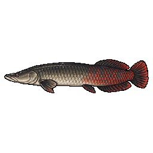 Арапайма | `arapaima` | 20 кг – 180 кг | 45 кг | 120–300 см | річка 1.2, озеро 1.0, болото 0.9, став 0.3 | 10 |
| 81 | 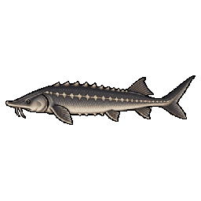 Білуга | `beluga` | 40 кг – 600 кг | 90 кг | 150–500 см | річка 1.0, море 1.0, озеро 0.3 | 12 |
| 82 | 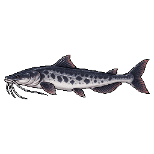 Пірайба | `piraiba` | 15 кг – 160 кг | 32 кг | 100–280 см | річка 1.3, озеро 0.5, болото 0.4, став 0.1 | 10 |
| 83 | 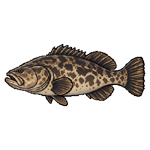 Голіафовий групер | `goliath_grouper` | 20 кг – 320 кг | 55 кг | 100–250 см | море 1.2 | 10 |
| 84 | 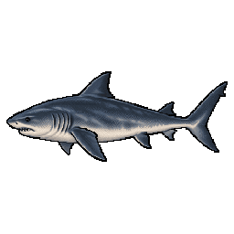 Тупорила акула | `bull_shark` | 30 кг – 230 кг | 65 кг | 150–350 см | море 1.1, річка 0.6, озеро 0.25 | 9 |
| 85 | 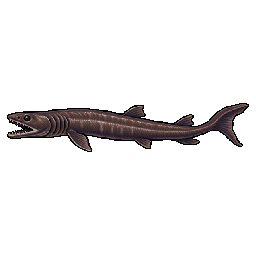 Плащоносна акула | `frilled_shark` | 8 кг – 50 кг | 16 кг | 90–200 см | море 1.0 | 11 |
| 86 | 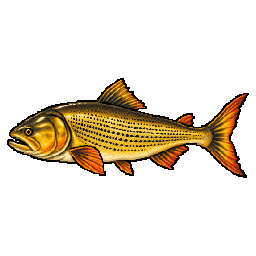 Золотий дорадо | `golden_dorado` | 1.5 кг – 30 кг | 5.5 кг | 40–120 см | річка 1.3, озеро 0.6, болото 0.3, став 0.2 | 6 |
| 87 | 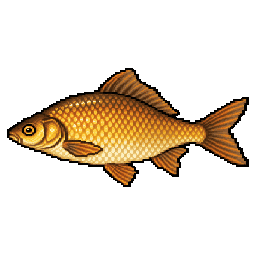 Золотий карась | `golden_crucian` | 60 г – 3 кг | 350 г | 12–45 см | став 1.4, болото 1.3, озеро 0.9, калюжа 0.5, річка 0.3 | 2 |
| 88 | 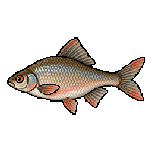 Гірчак | `gorchak` | 3 г – 30 г | 9 г | 3–9 см | став 1.2, озеро 1.0, річка 0.9, болото 0.8, калюжа 0.4 | — |
| 89 | 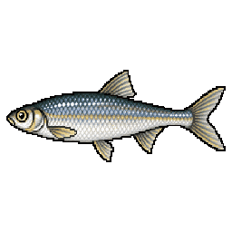 Верхівка | `verkhovka` | 2 г – 18 г | 6 г | 3–8 см | став 1.4, озеро 1.0, болото 0.9, калюжа 0.9, річка 0.4 | — |
| 90 | 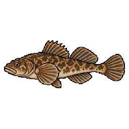 Бабець | `sculpin` | 5 г – 90 г | 25 г | 5–16 см | річка 1.3, озеро 0.4, став 0.1 | — |
| 91 | 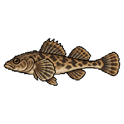 Бичок-цуцик | `tubenose_goby` | 3 г – 30 г | 10 г | 4–11 см | річка 1.1, озеро 0.7, став 0.5, море 0.5, болото 0.4 | — |
| 92 | 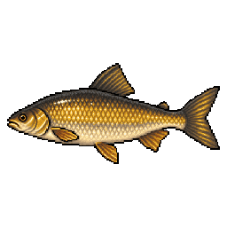 Кутум | `kutum` | 500 г – 8 кг | 1.4 кг | 30–70 см | річка 1.1, море 1.0, озеро 0.4 | 4 |
| 93 | 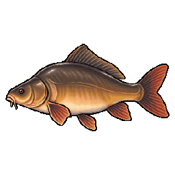 Голий короп | `naked_carp` | 2 кг – 20 кг | 4.5 кг | 40–105 см | озеро 1.2, став 1.1, річка 0.6, болото 0.4 | 5 |

## Ідеальна снасть

Збіглося — і вага поклівки різко йде вгору; що більша риба, то різкіше. Див. [коефіцієнт відповідності](fishing-mechanics.md#коефіцієнт-відповідності-m--твоя-снасть).

| Вид | Найкращі наживки (оцінка) | Ідеальні вудилища | Ідеальні оснастки | Гачок | Котушка | Волосінь | Прикормка (фракція / поживність) | Повідець |
|---|---|---|---|---|---|---|---|---|
| Лящ | maggot 1.0, worm 0.9, pearl_barley 0.8, mormyshka 0.7, corn 0.6, bread 0.4, boilie 0.3 | bottom, feeder | feeder, flat_feeder, float | №10 ±2 | 4000 ±1000 | braid 0.1 ±0.04 | 0.56 / 0.68 | — |
| Карась | worm 1.0, dough 0.9, maggot 0.8, corn 0.6, bread 0.5 | feeder, pole | feeder, float | №12 ±2 | 2000 ±1000 | mono 0.18 ±0.06 | 0.4 / 0.63 | — |
| Плітка | maggot 1.0, mormyshka 0.9, bloodworm 0.9, dough 0.7, bread 0.5 | pole, ultralight | float | №14 ±2 | 2000 ±1000 | mono 0.14 ±0.04 | 0.31 / 0.47 | — |
| Краснопірка | bread 1.0, dough 0.9, maggot 0.8 | pole | float | №14 ±2 | 1000 ±1000 | mono 0.14 ±0.04 | 0.3 / 0.49 | — |
| Плоскирка | maggot 1.0, worm 0.9, bloodworm 0.7 | feeder | feeder, float | №12 ±2 | 3000 ±1000 | braid 0.1 ±0.04 | 0.42 / 0.57 | — |
| Короп | boilie 1.0, corn 0.8, pea 0.6, pearl_barley 0.5 | carp | carp, flat_feeder | №6 ±2 | 6000 ±1000 | mono 0.3 ±0.08 | 0.73 / 0.85 | — |
| Сом | livebait 1.0, chicken_liver 1.0, jig 0.85, worm 0.7, boilie 0.6 | bottom | catfish, grusha | №4 ±2 | 7000 ±1000 | braid 0.18 ±0.04 | 0.81 / 0.81 | — |
| Окунь | crankbait 1.0, silicone 0.95, mormyshka 0.9, livebait 0.9, spinner 0.9, jig 0.8, popper 0.7, worm 0.6 | spinning, ultralight | predator | №8 ±3 | 3000 ±1000 | braid 0.1 ±0.04 | 0.4 / 0.7 | — |
| Щука | wobbler 1.0, spoon 0.95, livebait 0.9, crankbait 0.9, spinner 0.9, jig 0.85, popper 0.7 | spinning | predator | №4 ±2 | 3000 ±1000 | braid 0.14 ±0.04 | 0.66 / 0.5 | **так** |
| Судак | silicone 1.0, livebait 0.95, jig 0.95, crankbait 0.85, wobbler 0.8 | spinning | predator | №4 ±2 | 3000 ±1000 | braid 0.12 ±0.04 | 0.62 / 0.5 | **так** |
| Пічкур | bloodworm 1.0, mormyshka 0.9, worm 0.9, maggot 0.8 | pole, stick, ultralight | float, primitive | №16 ±2 | 1000 ±1000 | mono 0.14 ±0.04 | 0.22 / 0.54 | — |
| Йорж | mormyshka 1.0, worm 1.0, bloodworm 1.0, maggot 0.7 | feeder, pole | feeder, float | №14 ±2 | 2000 ±1000 | mono 0.14 ±0.04 | 0.22 / 0.54 | — |
| Верховодка | maggot 1.0, bread 0.9, mormyshka 0.8, dough 0.8, bloodworm 0.7 | pole, stick, ultralight | float, primitive | №16 ±2 | 1000 ±1000 | mono 0.14 ±0.04 | 0.14 / 0.46 | — |
| В'язь | worm 1.0, popper 0.9, maggot 0.8, corn 0.8, bread 0.7, crankbait 0.7, pea 0.6 | feeder, pole, ultralight | feeder, float | №10 ±2 | 3000 ±1000 | mono 0.18 ±0.05 | 0.54 / 0.66 | — |
| Головень | popper 1.0, wobbler 0.9, bread 0.8, spinner 0.8, crankbait 0.75, worm 0.7, castmaster 0.7, corn 0.5 | pole, spinning, ultralight | float, predator | №8 ±3 | 2000 ±1000 | mono 0.16 ±0.05 | 0.53 / 0.56 | — |
| Білизна | spoon 1.0, castmaster 0.9, wobbler 0.9, popper 0.85, spinner 0.8, crankbait 0.7 | spinning | predator | №6 ±2 | 4000 ±1000 | braid 0.12 ±0.04 | 0.66 / 0.5 | — |
| Лин | worm 1.0, dough 0.8, corn 0.7, bread 0.6, maggot 0.6 | feeder, pole | feeder, float | №10 ±2 | 3000 ±1000 | mono 0.2 ±0.05 | 0.54 / 0.63 | — |
| Минь | livebait 1.0, worm 0.9, chicken_liver 0.9, jig 0.75 | bottom, feeder | feeder, ground | №6 ±2 | 4000 ±1000 | mono 0.3 ±0.08 | 0.62 / 0.75 | — |
| Вугор | worm 1.0, livebait 0.8, chicken_liver 0.7, jig 0.7 | bottom, feeder | feeder, ground | №8 ±2 | 4000 ±1000 | mono 0.25 ±0.06 | 0.56 / 0.74 | — |
| Харіус | spinner 0.95, worm 0.9, maggot 0.8, castmaster 0.8, bloodworm 0.7, crankbait 0.6 | ultralight | float, predator | №12 ±2 | 2000 ±1000 | mono 0.16 ±0.04 | 0.49 / 0.57 | — |
| Форель | castmaster 1.0, spinner 0.95, wobbler 0.9, crankbait 0.85, silicone 0.7, worm 0.6 | spinning, ultralight | float, predator | №8 ±2 | 2000 ±1000 | fluoro 0.2 ±0.05 | 0.57 / 0.7 | — |
| Стерлядь | worm 1.0, bloodworm 0.7, maggot 0.5 | bottom, carp | catfish, ground | №6 ±2 | 6000 ±1000 | braid 0.14 ±0.04 | 0.71 / 0.56 | — |
| Сазан | boilie 1.0, corn 0.85, pea 0.7, pearl_barley 0.55 | bottom, carp | carp, flat_feeder | №4 ±2 | 6000 ±1000 | mono 0.3 ±0.07 | 0.75 / 0.84 | — |
| Дзеркальний короп | boilie 1.0, corn 0.8, pea 0.6, pearl_barley 0.5 | carp | carp, flat_feeder | №6 ±2 | 6000 ±1000 | mono 0.3 ±0.08 | 0.72 / 0.85 | — |
| Білий амур | corn 1.0, bread 0.9, dough 0.8, pea 0.7, boilie 0.5 | carp, feeder | carp, flat_feeder | №6 ±2 | 6000 ±1000 | mono 0.3 ±0.08 | 0.77 / 0.66 | — |
| Кої Кохаку | boilie 1.0, corn 0.8, pea 0.6, bread 0.6 | carp | carp | №6 ±2 | 6000 ±1000 | mono 0.3 ±0.08 | 0.69 / 0.75 | — |
| Кої Танчо Санке | boilie 1.0, corn 0.8, pea 0.6, bread 0.6 | carp | carp | №6 ±2 | 6000 ±1000 | mono 0.3 ±0.08 | 0.69 / 0.75 | — |
| Кої Сьова Санке | boilie 1.0, corn 0.8, pea 0.6, bread 0.6 | carp | carp | №6 ±2 | 6000 ±1000 | mono 0.3 ±0.08 | 0.69 / 0.75 | — |
| Кої Асагі | boilie 1.0, corn 0.8, pea 0.6, bread 0.6 | carp | carp | №6 ±2 | 6000 ±1000 | mono 0.3 ±0.08 | 0.69 / 0.75 | — |
| Кої Бекко | boilie 1.0, corn 0.8, pea 0.6, bread 0.6 | carp | carp | №6 ±2 | 6000 ±1000 | mono 0.3 ±0.08 | 0.69 / 0.75 | — |
| Блюгіл | worm 1.0, maggot 0.9, bloodworm 0.8, corn 0.5 | bamboo, pole, stick, ultralight | float | №12 ±3 | 1000 ±1000 | mono 0.12 ±0.05 | 0.34 / 0.61 | — |
| Великоротий бас | popper 1.2, wobbler 1.0, silicone 0.95, jig 0.9, crankbait 0.9, livebait 0.8, spinner 0.7 | spinning, ultralight | predator | №4 ±3 | 3000 ±1000 | braid 0.16 ±0.05 | 0.62 / 0.5 | — |
| Райдужна форель | spinner 1.0, castmaster 0.95, wobbler 0.85, crankbait 0.8, silicone 0.7, worm 0.6 | spinning, ultralight | float, predator | №8 ±2 | 2000 ±1000 | fluoro 0.18 ±0.05 | 0.58 / 0.7 | — |
| Канальний сомик | livebait 1.1, chicken_liver 1.0, worm 0.8, maggot 0.6, boilie 0.5 | bottom, carp, feeder | catfish, grusha | №2 ±2 | 5000 ±1000 | mono 0.35 ±0.08 | 0.73 / 0.77 | — |
| Товстолобик | pearl_barley 0.5, corn 0.4, boilie 0.3 | bottom, carp | carp, flat_feeder | №6 ±2 | 6000 ±1000 | mono 0.4 ±0.08 | 0.79 / 0.81 | — |
| Чехоня | castmaster 1.0, maggot 0.9, worm 0.8, spinner 0.8, bloodworm 0.7, silicone 0.6 | feeder, spinning, ultralight | float, predator | №10 ±3 | 3000 ±1000 | mono 0.16 ±0.05 | 0.46 / 0.56 | — |
| Синець | bloodworm 1.0, maggot 0.85, worm 0.7, pearl_barley 0.5 | bamboo, feeder, pole | flat_feeder, float | №12 ±3 | 3000 ±1000 | mono 0.14 ±0.05 | 0.44 / 0.55 | — |
| Скумбрія | castmaster 1.0, spinner 0.9, silicone 0.8, fish_strip 0.6 | sea_spin, spinning | predator | №6 ±3 | 5000 ±2000 | braid 0.2 ±0.06 | 0.51 / 0.75 | — |
| Оселедець | fish_strip 0.8, bloodworm 0.7, maggot 0.6, castmaster 0.5 | sea_spin, spinning, surf | float, predator | №10 ±3 | 5000 ±2000 | mono 0.18 ±0.06 | 0.4 / 0.57 | — |
| Сарган | fish_strip 1.0, spinner 0.7, castmaster 0.7, silicone 0.5 | sea_spin | predator | №8 ±3 | 5000 ±2000 | mono 0.2 ±0.06 | 0.51 / 0.75 | — |
| Лаврак | wobbler 1.0, silicone 0.95, livebait 0.9, popper 0.8, fish_strip 0.7 | sea_spin, surf | predator | №4 ±2 | 6000 ±2000 | braid 0.25 ±0.06 | 0.62 / 0.75 | — |
| Камбала | fish_strip 1.0, worm 0.9, maggot 0.5 | boat, bottom, surf | catfish, grusha | №6 ±2 | 8000 ±2000 | mono 0.3 ±0.08 | 0.56 / 0.71 | — |
| Тріска | fish_strip 1.0, octopus_jig 1.0, jig 0.95, livebait 0.9, giant_spoon 0.8, silicone 0.7 | boat, surf | catfish, grusha | №2 ±2 | 10000 ±2000 | braid 0.3 ±0.08 | 0.79 / 0.75 | — |
| Сайда | jig 1.0, octopus_jig 0.95, giant_spoon 0.9, silicone 0.8, fish_strip 0.7, castmaster 0.7 | boat, sea_spin | predator | №4 ±2 | 10000 ±2000 | braid 0.25 ±0.06 | 0.71 / 0.75 | — |
| Морський вугор | fish_strip 1.0, livebait 1.0, worm 0.4 | boat, surf | catfish | №1 ±2 | 12000 ±2000 | mono 0.5 ±0.1 | 0.84 / 0.74 | **так** |
| Скат | fish_strip 1.0, worm 0.7, livebait 0.6 | boat, surf | catfish, grusha | №2 ±2 | 12000 ±2000 | mono 0.5 ±0.1 | 0.83 / 0.73 | — |
| Махі-махі | livebait 1.05, wobbler 1.0, octopus_jig 1.0, giant_spoon 1.0, popper 0.9, silicone 0.8, fish_strip 0.6 | sea_spin, trolling | predator | №2 ±2 | 10000 ±2000 | braid 0.3 ±0.08 | 0.77 / 0.75 | — |
| Ваху | giant_spoon 1.15, wobbler 1.0, octopus_jig 1.0, castmaster 0.8, silicone 0.7 | trolling | predator | №1 ±2 | 12000 ±2000 | braid 0.4 ±0.08 | 0.88 / 0.5 | **так** |
| Жовтоперий тунець | giant_spoon 1.05, octopus_jig 1.0, wobbler 0.9, livebait 0.9, fish_strip 0.8, silicone 0.7 | boat, trolling | predator | №1 ±1 | 14000 ±2000 | braid 0.4 ±0.08 | 0.99 / 0.75 | — |
| Барракуда | giant_spoon 1.1, wobbler 1.0, silicone 0.9, octopus_jig 0.9, spinner 0.7, fish_strip 0.6 | sea_spin, trolling | predator | №2 ±2 | 9000 ±2000 | braid 0.3 ±0.08 | 0.79 / 0.75 | **так** |
| Синій марлін | fish_strip 1.1, wobbler 1.0, octopus_jig 1.0, giant_spoon 0.95, silicone 0.6 | trolling | predator | №1 ±1 | 14000 ±1000 | braid 0.4 ±0.06 | 1.0 / 0.75 | — |
| Вітрильник | livebait 1.1, wobbler 1.0, octopus_jig 1.0, giant_spoon 0.95, popper 0.8, silicone 0.7 | sea_spin, trolling | predator | №1 ±2 | 12000 ±2000 | braid 0.3 ±0.08 | 1.0 / 0.5 | — |
| Риба-меч | livebait 1.0, octopus_jig 1.0, fish_strip 0.9, giant_spoon 0.85, wobbler 0.6 | boat, trolling | catfish, predator | №1 ±1 | 14000 ±1000 | braid 0.45 ±0.08 | 1.0 / 0.75 | — |
| Акула-мако | livebait 1.0, giant_spoon 1.0, octopus_jig 0.95, fish_strip 0.9, wobbler 0.7 | boat, trolling | catfish, predator | №1 ±1 | 14000 ±1000 | braid 0.4 ±0.06 | 1.0 / 0.75 | **так** |
| Ротань | worm 1.0, bloodworm 0.9, maggot 0.8, livebait 0.7, silicone 0.6, chicken_liver 0.6 | pole, stick, ultralight | float, primitive | №12 ±4 | без котушки | mono 0.18 ±0.08 | 0.27 / 0.6 | — |
| Підуст | maggot 1.0, worm 0.8, bloodworm 0.8, pearl_barley 0.7 | feeder, pole | feeder, float | №12 ±3 | 2500 ±1500 | mono 0.16 ±0.05 | 0.46 / 0.59 | — |
| Рибець | worm 1.0, maggot 0.9, bloodworm 0.8, pea 0.5 | bottom, feeder | feeder, float | №10 ±3 | 3500 ±1500 | mono 0.2 ±0.05 | 0.53 / 0.6 | — |
| Корюшка | bloodworm 1.0, mormyshka 0.9, fish_strip 0.8, worm 0.7 | pole, ultralight, winter | float, winter | №16 ±4 | без котушки | mono 0.12 ±0.05 | 0.22 / 0.56 | — |
| Сиг | bloodworm 1.0, mormyshka 0.9, maggot 0.8, worm 0.6 | feeder, ultralight, winter | feeder, float, winter | №10 ±3 | 2500 ±1500 | fluoro 0.18 ±0.05 | 0.57 / 0.52 | — |
| Палія арктична | spinner 1.0, spoon 0.9, castmaster 0.9, wobbler 0.7, worm 0.6 | spinning, ultralight | predator | №8 ±2 | 2500 ±1000 | fluoro 0.2 ±0.05 | 0.59 / 0.7 | — |
| Ленок | wobbler 1.0, spinner 0.9, spoon 0.9, crankbait 0.8, worm 0.5 | spinning, ultralight | predator | №6 ±2 | 3000 ±1000 | braid 0.14 ±0.05 | 0.62 / 0.7 | — |
| Таймень | wobbler 1.0, spoon 0.9, popper 0.85, livebait 0.8, crankbait 0.8 | spinning, trolling | predator | №2 ±2 | 6000 ±2000 | braid 0.35 ±0.08 | 0.87 / 0.5 | **так** |
| Атлантичний лосось | spoon 1.0, wobbler 0.9, spinner 0.8, fish_strip 0.5 | sea_spin, spinning | predator | №4 ±2 | 5000 ±2000 | braid 0.25 ±0.06 | 0.77 / 0.75 | — |
| Горбуша | spoon 1.0, spinner 0.9, castmaster 0.8, fish_strip 0.5 | sea_spin, spinning, ultralight | predator | №6 ±2 | 3500 ±1500 | braid 0.18 ±0.05 | 0.61 / 0.75 | — |
| Осетер | chicken_liver 1.0, worm 0.9, livebait 0.7, boilie 0.5 | bottom, carp | catfish, grusha | №1 ±2 | 9000 ±3000 | braid 0.45 ±0.1 | 0.95 / 0.79 | — |
| Палтус | fish_strip 1.0, octopus_jig 1.0, livebait 0.9, silicone 0.8, jig 0.7, giant_spoon 0.7 | boat, surf | catfish, predator | №1 ±3 | 11000 ±3000 | braid 0.5 ±0.1 | 0.93 / 0.75 | — |
| Ялець | maggot 1.0, worm 0.9, bread 0.7, bloodworm 0.65, dough 0.6, spinner 0.4 | pole, stick, ultralight | float, primitive | №14 ±2 | 1000 ±1000 | mono 0.14 ±0.04 | 0.34 / 0.52 | — |
| Берш | silicone 1.0, jig 0.95, livebait 0.9, worm 0.7, crankbait 0.6, wobbler 0.55 | spinning, ultralight | predator | №6 ±2 | 2000 ±1000 | braid 0.1 ±0.04 | 0.47 / 0.7 | — |
| Клепець | worm 1.0, maggot 0.95, bloodworm 0.85, pearl_barley 0.5, corn 0.4 | bottom, feeder | feeder, float | №12 ±3 | 3500 ±1500 | mono 0.18 ±0.05 | 0.42 / 0.61 | — |
| Бичок-кругляк | worm 1.0, fish_strip 0.9, bloodworm 0.7, maggot 0.6, silicone 0.5 | bottom, feeder, ultralight | feeder, primitive | №8 ±3 | 3000 ±2000 | mono 0.2 ±0.06 | 0.29 / 0.62 | — |
| Павлиній окунь | wobbler 1.2, popper 1.15, crankbait 1, silicone 0.95, spinner 0.9, livebait 0.85, jig 0.8 | spinning, ultralight | predator | №4 ±3 | 3000 ±1000 | braid 0.2 ±0.05 | 0.64 / 0.5 | — |
| Плямистий змієголов | livebait 1.2, silicone 1.05, popper 1, wobbler 0.95, jig 0.85, worm 0.6 | spinning | predator | №2 ±3 | 3000 ±1000 | braid 0.22 ±0.06 | 0.62 / 0.7 | — |
| Цихлазома майя | worm 1.2, bloodworm 1, maggot 1, silicone 0.8, bread 0.7 | pole, ultralight | float, predator | №10 ±3 | 1500 ±1000 | mono 0.14 ±0.04 | 0.42 / 0.5 | — |
| Астронотус | worm 1.2, livebait 1.1, maggot 0.9, silicone 0.9, jig 0.8 | spinning, ultralight | float, predator | №8 ±3 | 2000 ±1000 | mono 0.16 ±0.04 | 0.47 / 0.68 | — |
| Смугастий лаврак | livebait 1.2, fish_strip 1.1, giant_spoon 1.05, wobbler 1, silicone 0.95, spoon 0.9, jig 0.85 | boat, sea_spin, surf | ground, predator | №2 ±2 | 7000 ±2000 | braid 0.3 ±0.08 | 0.74 / 0.75 | — |
| Луфар | spoon 1.2, giant_spoon 1.2, castmaster 1.15, fish_strip 1.1, wobbler 1, livebait 0.9, silicone 0.9 | boat, sea_spin, surf | predator | №2 ±2 | 6000 ±2000 | braid 0.28 ±0.07 | 0.66 / 0.75 | **yes** |
| Каранкс | popper 1.25, giant_spoon 1.15, castmaster 1.1, spoon 1.1, livebait 1, silicone 1, wobbler 0.95 | boat, sea_spin, surf | predator | №1 ±2 | 8000 ±2000 | braid 0.35 ±0.08 | 0.76 / 0.5 | — |
| Тарпон | livebait 1.3, fish_strip 1.1, popper 1, silicone 1, jig 0.9, giant_spoon 0.85 | boat, sea_spin, surf | catfish, predator | №1 ±2 | 10000 ±3000 | braid 0.45 ±0.1 | 0.99 / 0.75 | — |
| Снук | livebait 1.25, silicone 1.1, wobbler 1.05, popper 1, jig 0.9, fish_strip 0.85 | sea_spin, spinning, surf | predator | №2 ±2 | 6000 ±2000 | braid 0.3 ±0.08 | 0.73 / 0.75 | — |
| Арапайма | livebait 1.0, fish_strip 0.9, giant_spoon 0.85, wobbler 0.75, silicone 0.6 | boat, sea_spin | predator, catfish | №1 ±2 | 10000 ±2000 | braid 0.45 ±0.08 | 0.95 / 0.8 | + |
| Білуга | livebait 1.0, fish_strip 0.9, chicken_liver 0.85, worm 0.5 | boat, bottom | catfish, grusha | №1 ±1 | 14000 ±2000 | braid 0.55 ±0.1 | 0.98 / 0.82 | + |
| Пірайба | livebait 1.0, fish_strip 0.95, chicken_liver 0.85, worm 0.5 | bottom, carp, boat | catfish, grusha | №1 ±2 | 10000 ±2000 | braid 0.5 ±0.08 | 0.96 / 0.8 | + |
| Голіафовий групер | livebait 1.0, fish_strip 0.95, octopus_jig 0.8, giant_spoon 0.5 | boat, surf | catfish, predator | №1 ±1 | 12000 ±2000 | braid 0.55 ±0.1 | 0.97 / 0.78 | + |
| Тупорила акула | livebait 1.0, fish_strip 1.0, octopus_jig 0.75, giant_spoon 0.7 | boat, surf, trolling | predator, catfish | №1 ±1 | 12000 ±2000 | braid 0.5 ±0.08 | 1.0 / 0.76 | + |
| Плащоносна акула | fish_strip 1.0, octopus_jig 0.95, livebait 0.85 | boat | catfish, predator | №1 ±2 | 10000 ±2000 | braid 0.4 ±0.08 | 0.9 / 0.7 | + |
| Золотий дорадо | wobbler 1.0, spoon 0.9, spinner 0.9, popper 0.85, crankbait 0.8, silicone 0.8, livebait 0.7 | spinning, sea_spin | predator | №2 ±2 | 4000 ±1000 | braid 0.28 ±0.06 | 0.6 / 0.7 | + |
| Золотий карась | worm 1.0, bread 0.9, dough 0.9, maggot 0.85, corn 0.7, pearl_barley 0.6 | pole, stick, bamboo, feeder | float, primitive, feeder | №12 ±2 | 2000 ±1000 | mono 0.18 ±0.05 | 0.35 / 0.6 | — |
| Гірчак | bloodworm 1.0, maggot 1.0, bread 0.8, dough 0.7 | pole, stick, ultralight | float, primitive | №16 ±1 | 1000 ±1000 | mono 0.1 ±0.03 | 0.1 / 0.4 | — |
| Верхівка | maggot 1.0, bread 0.95, bloodworm 0.85, dough 0.8 | pole, stick, ultralight | float, primitive | №16 ±1 | 1000 ±1000 | mono 0.1 ±0.03 | 0.08 / 0.38 | — |
| Бабець | worm 1.0, bloodworm 0.9, maggot 0.8, livebait 0.3 | ultralight, pole, stick | primitive, float | №14 ±2 | 1000 ±1000 | mono 0.14 ±0.04 | 0.12 / 0.5 | — |
| Бичок-цуцик | worm 1.0, bloodworm 0.95, maggot 0.9, fish_strip 0.4 | ultralight, pole, stick | primitive, float | №16 ±2 | 1000 ±1000 | mono 0.12 ±0.04 | 0.12 / 0.5 | — |
| Кутум | worm 1.0, bloodworm 0.9, maggot 0.8, fish_strip 0.5, pea 0.4 | feeder, bottom | feeder, float | №8 ±3 | 4000 ±1500 | mono 0.25 ±0.06 | 0.6 / 0.7 | — |
| Голий короп | boilie 1.0, corn 0.85, pea 0.6, pearl_barley 0.55, dough 0.5 | carp | carp, flat_feeder | №4 ±2 | 7000 ±1000 | mono 0.35 ±0.08 | 0.75 / 0.88 | — |

## Нотатки за видами

### П'ятеро кої

Кої Кохаку, Кої Танчо Санке, Кої Сьова Санке, Кої Асагі та Кої Бекко — це **прихована колекція**, а не звичайна риба. У їхньому профілі `base` дорівнює **0.0**, тож зі звичайного пулу поклівок вони не випадають ніколи.

Натомість щоразу, коли ти береш **коропа, дзеркального коропа чи сазана на коропову оснастку**, є шанс, що улов виявиться кої:

- **0.5 %** будь-де
- **35 %** у біомі вишневого гаю

Єдина вказана в них група біомів — `cherry`, тож ставок у вишневому гаю — єдине місце, де їм узагалі належить бути. У всіх п'ятьох характеристики однакові (800 г – 8 кг, медіана 2.5 кг, 25–90 см, манера бою `burst`, рівень 3).

Кої **не йдуть у залік за кількістю видів**: ні в східчастих досягненнях на «N видів», ні в *Повному бестіарії* — у них свої випробування, *Жива коштовність* і *Колекціонер кої*. Пустити кої на філе можна: твоє ім'я піде в чат сервера з підписом *«ти серйозно пустив її на філе?»*, а слідом прийде досягнення *Безсердечний кухар*.

### Легендарні екземпляри

У восьми видів захований один іменний екземпляр — один на весь сервер. Уся механіка — в [Механіці риболовлі](fishing-mechanics.md#легендарні-риби).

| Вид | Ім'я | Вага | Шанс |
|---|---|---|---|
| Щука | Цариця Корчів | 14 кг | 0.6 % |
| Сазан | Дід Сазан | 17.5 кг | 0.6 % |
| Сом | Хазяїн Ями | 150 кг | 0.5 % |
| Жовтоперий тунець | Старий Хребет | 140 кг | 0.6 % |
| Синій марлін | Левіафан | 380 кг | 0.8 % |
| Осетер | Цар-риба | 145 кг | 0.4 % |
| Акула-мако | Мегалодон | 390 кг | 0.4 % |
| Палтус | Демон Безодні | 250 кг | 0.4 % |
| Арапайма | — | 175 кг | 0.4 % |
| Білуга | — | 580 кг | 0.3 % |
| Пірайба | — | 155 кг | 0.4 % |
| Голіафовий групер | — | 310 кг | 0.4 % |
| Тупорила акула | — | 225 кг | 0.4 % |
| Плащоносна акула | — | 48 кг | 0.3 % |

Четверо з них **важчі за звичайний максимум свого виду**: щука (14 кг проти стелі в 10 кг), сом (150 кг проти 120 кг), палтус (250 кг проти 200 кг) і особливо мако (390 кг проти 200 кг). Легендарна риба справді виходить за той розмір, до якого інакше не дістатися.

### Незвичайні профілі

**Товстолобик** — планктонофаг-фільтратор і єдиний вид, у якого *найкраща* наживка оцінена лише в **0.5** (перлівка). Швидкість поклівки прямо залежить від оцінки наживки, тож товстолобик бере повільно завжди, хоч би що ти робив; вирішують сипка прикормка і тонка волосінь. Рівень 6 і невтомний боєць на 25 кг.

**Ротань** і **Корюшка** — єдині два види, у яких ідеальний `reel_size` дорівнює **0**: вони прямо віддають перевагу вудці без котушки. З котушкою відповідний компонент дає 0.6 замість 1.0. Ротань до того ж єдиний вид зі справжньою присутністю в **калюжі** (1.0) — він і справді живе в будь-якій канаві, тому з нього всі й починають. У корюшки — єдиний у моді поріг у **1 рівень**.

**Минь** — найзатисненіша умовами риба в моді: `summer: 0.0` **і** `day: 0.0`. Він існує лише холодними ночами, з піком узимку (1.6) і вночі (1.5). Власне досягнення *Король зимової ночі* з'явилося саме через це.

**Верховодка** і **Пічкур** — `night: 0.0`. З темрявою вони перестають клювати повністю.

**Скат** — два ривки, манера `active_then_passive` й агресія 0.2, але сила 0.95 на діапазоні 2–50 кг. Він не бореться, він просто важкий. У профілі це описано як підйом плити морського дна.

**У сімнадцяти видів** оцінка наживки вище 1.0: улюблена наживка дає невеликий бонус понад ідеальний збіг, і рушій ставить цьому бонусу стелю 1.3. На самій стелі — **Тарпон** (livebait 1.3), слідом **Каранкс** (popper 1.25) і **Снук** (livebait 1.25).

**Головень, Білизна, Стерлядь** живуть **лише в річці** (`river` 1.2, решта водойм — 0). В озері їх не буде, хоч би що ти робив.

**Бичок-кругляк** — єдиний вид, якому однаково добре в солоній і в прісній воді: `sea` 1.1 і `river` 1.0, плюс озеро 0.6 і ставок 0.2.

**Напівпрохідні та прохідні** — у чотирнадцяти видів поряд із прісною водою стоїть ненульовий коефіцієнт `sea`: Рибець (0.2), Корюшка (1.2 море / 0.3 річка), Палія арктична (0.2), Атлантичний лосось (1.1 річка / 1.0 море), Горбуша (1.1 море / 1.0 річка), Осетер (0.3), Білуга (1.0 море / 1.0 річка), Тупорила акула (1.1 море / 0.6 річка), Каранкс (1.2 море / 0.5 річка), Бичок-кругляк (1.1 море / 1.0 річка), Снук (1.2 море / 0.5 річка), Смугастий лаврак (1.2 море / 0.5 річка), Тарпон (1.2 море / 0.5 річка) і Бичок-цуцик (0.5 море / 1.1 річка). Справжні ходові риби тут — лосось і горбуша: у лосося пік восени (1.4), у горбуші влітку (1.5).

**Білий амур** — гігант-вегетаріанець: corn 1.0, bread 0.9, dough 0.8, і єдиний «короп», який тримається `mid` — у півводи, а не біля дна. Манера `relentless`: біля підсака він упирається так само, як на підсічці.

**Види під зимову вудку** — зимова вудка стоїть в ідеальній снасті лише в **Корюшки** і **Сига**, і тільки в них указана зимова оснастка. Усе інше, що беруть з-під льоду, беруть на снасть, якої риба, строго кажучи, не просила.

**Види під вудку з палиці** — Пічкур, Верховодка, Ротань, Ялець, Блюгіл, Гірчак, Золотий карась, Бабець, Верхівка і Бичок-цуцик: десять риб, у яких найпростіший бланк указано як ідеальний. **Бамбукова вудка** трапляється лише у трьох — у Блюгіла, Синця і Золотого карася.

**Види з нульовою зимою** — у Карася, Краснопірки, Верховодки, Головня, Лина, Сома, Вугра, Гірчака і Верхівки стоїть `winter: 0.0`; Білий амур, Короп, Дзеркальний короп, Сазан і Товстолобик закриті фактично теж (0.02–0.05). Зима — це справді інша гра.

## Дивись також

- [Довідник видів](species-reference.md) — жорсткі умови проживання, таблиці умов, статистика виважування
- [Вода та умови](water-and-conditions.md) · [Механіка риболовлі](fishing-mechanics.md)
- [Морська риболовля](sea-fishing.md) · [Підлідна риболовля](ice-fishing.md)
- [Житель](villager.md) — які види купує рибак і за скільки
